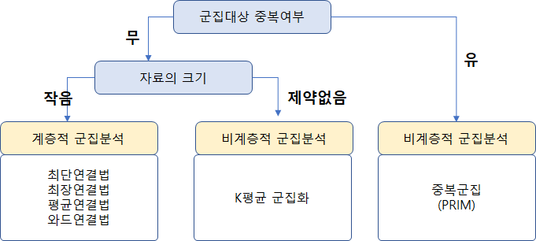
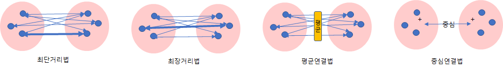
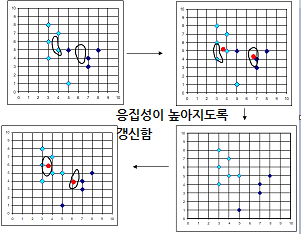
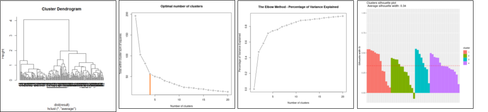

대상을 분류 함에 있어 여러 질적변수로 분류 하는 것은 쉽지만, 양적변수로 분류 하는 것은 쉽지 않다.
이러한  상황에서 자유 이용되는 기법이 군집분석이라 할 수 있다.

### 특징 및 적용
* Cluster(군집) : data 의 집합이다.
* Cluster analysis
  * cluster내 data 집합으로 Grouping 하는것
* Clustering 은 **unsupervised classification** : 분류에 대한 개념이 없다.
* Data 분포로 부터 특징을 얻기 위해 **stand-alone tool** 로 사용
* 다른 알고리즘을  위한 **preporcessing step** 으로 사용
* 군집분석의 응용 분야
  * Pattern Recognition, Spatial Data Analysis, Image Processing, Economic Science, 웹 로그 분석 등
  
### 좋은 군집이란 ?
* high intra-class similarity (군집 내부 유사도는 높고)
* low inter-class similarity  (군집 상호간의 유사도는 낮고)

### Similarity(유사도) and Dissimilarity(비유사도)의 Distnace
* 두 data 객체 사이에 유사도과 비유사도을 측정하는 것은 일반적으로 거리로 측정한다.
* 몇가지 거리 측정 도구
  
  두점 $P$와 $Q$가 각각 $P=(p_1,p_2,...,p_n) , Q=(q_1,q_2,...,q_n)$ 일때,

  1) 유클리드 거리 와 제곱유클리드 거리 , R코드 : distance(data, method="eculidean")

     $$\sqrt{ \sum_{i=1}^{n} (p_i - q_i)^2  }$$
   
   
※ 제곱 유클리드 거리 : 거리에 비해 대상간에 차이가 큰 차원이 강하게 영향을 미침

  2) 맨하튼 거리 , R코드 : distance(data, method="manhattan")
   
     * 동일 차원에 있는 값 차이의 절대값을 차원별로 더한것
   
     $$ \sum_{i=1}^{n} \left| p_i - q_i\right|  $$

  3) 체비셰프 거리 , R코드 : distance(data, method="chebyshev")
   
     * 동일 차원에 있는 값 차이의 절대값을 전체 차원에서 비교할 때 가장 큰값으로 정의
  
     $$MAX( \left| p_i - q_i\right| )$$   

  4) 민코프스키 거리 , R코드 : distance(data, method="minkowski", p=m )
        
     $$ \left ( \sum_{i=1}^{n} \left| p_i - q_i\right|^m \right )^{1/m}$$        
   

   
※ m은 차수를 의미, m=1이면 맨해튼, m=2이면 유클리드, m이 한없이 크면 체비셰프

   

### 군집분석 유형 ( Major Clustering Approaches )
 

<!-- -->

* 분리형(비계층적) 군집화(Partitioning Clusterting)
  
  * 사전에 군집의 수를 정해주어 대상들이 군집에 할당되도록 하는 것
  * 1 중심기반(Center-based clustering) : K-means algorithm
  * 2 밀도기반(Density-based clustering) : DBSCAN algoritm
  * 장점 : 쉽다
  * 단점 : outlier 와 noisy data 처리가 어렵다.
  
 
* 계층적군집분석
  * 군집의 개수가 정해지지 않을때 사용하기 때문에 몇개 군집으로 나눠야 할 지에도 사용된다.
  * 계층적 군집의 목적은 일반적으로 먼저 수행하고, 데이터의 군집형성이 어떤지를 확인 하는 목적으로 수행하는 경우가 많다.
  * 관측치들의 거리계산은 유클리드 거리 계산식을 이용
    
  
  |종류|방법|
  |-|-|
  |와드법|1. 최기단계에서 각 개별관찰 값을 개별 군집으로 보고 시작(이때 오차제곱합=0) 2.n개의 군집 중 2개를 묶을때, ESS(error sum of squares) 증가가 작아지는 군집을 첫번째 군집으로 묶은다 3. 새로운 군집 중심 centroid 방법으로 변경 4. 새로운 군집과 나머지 군집을 묶었다고 가정할 때의 ESS의 증가분이 군집간의 거리로 업데이트 한다. |
  |최단연결법|1.두 군집 사이의 모든 거리들 중에서 가장 짧은 것을 병합한다 2.병합 후 거리 매트릭스를 업데이트할 때, 여러 개의 거리 값 중에서 가장 가까운 거리의 것을 새로운 거리로 업데이트한다.|
  |최장연결법|1. 두 군집 사이의 모든 거리들 중에서 가장 짧은 것을 병합한다. 2. 단 병합 후 거리 매트릭스를 업데이트할 때, 여러 개의 거리 값 중에서 가장 먼 거리의 것을 새로운 거리를 업데이트한다.|  
  |평균연결법|1. 두 군집 사이의 모든 거리들 중에서 가장 짧은 것을 병합한다. 2. 단 병합 후 거리 매트릭스를 업데이트할 때 여러 개 거리 값 중에서 군집과 군집 사이의 관찰 값의 평균 거리를 새로운 거리로 업데이트한다.|    
  |중심연결법|1. 두 군집 사이의 모든 거리들 중에서 가장 짧은 것을 병합한다. 2. 군집이 형성되고 나면 형성된 군집의 중심을 계산해서 이를 새로운 좌표로 업데이트한다. 군집들의 중심을 계산해야 하기 때문에 시간이 오래 걸린다.|      

  <!-- -->

### 군집분석 유형 중 K-Means Clustering Method

k-means 알고리즘은 4단계로 수행된다.

* Step 1 : 군집의 개수(K) 설정
* Setp 2 : 군집의 초기의 중심점을 계산한다. 중심점은 군집의 평균을 의미한다.
* Setp 3 : 가장 가까운 점에 데이터를 군집에 할당(배정)
* Setp 4 : 중심점 재설정(갱신)
* Step 5 : 데이터를 군집에 재할당(배정)

  <!-- -->

 

### 군집수 결정방법
* 계층적 군집분석의 덴드로그램 시각화를 이용한 군집의 개수 결정 (Hierarchical Clustering: Dendrogram)
* 팔꿈치 방법을 이용한 군집의 개수 결정 (The Elbow Method)
* 실루엣 방법을 이용한 군집의 개수 결정 (The Silhouette Method)

  <!-- -->

### 군집분석의 타당성 지표
* 실루엣(Silhouette)
  * 군집 내의 응집도와 군집 간 분리도를 이용한 지표
  * -1 ~ 1 사이의 값, (1에 가까울수록->완벽한 군집화, -1에 가까울수록 -> 전혀 군집화가 안됨)
  * 실루엣 스코어 수식

$$ s(i) =  \frac{ b(i)-a(i) } { max[ a(i),b(i) ] } \quad -1 <= s(i) <= 1$$

* Dunn Index
  * 군집간 거리의 최소값 ÷ 군집간 거리의 최대값
  * Dunn Index값이 클수록 군집이 잘 형성된 것