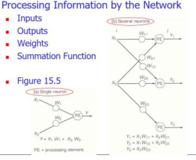

### 개요

* 인간의 뇌를 Simulation한 것이고, 뉴런과 뉴런을 연결하는 선으로 구성된다.
  
  |인간|Simulation|
  |-|-|
  |Neurons|Nodes|
  |Connection Between Neurons|Weight|  

### 목적 및 사용

  * 목적 : 결과예측, 분류, 데이터 패턴 찾기
  * 사용예 :
    * 인사 ,경영 - 채용관련 , 경영관리
    * Marketing - 판매예측, Target Marketing
    * 운영 - Job Scheduling

### 이론

  * 인간의 두뇌 기능을 모방하려는 문제 해결 방법론
  * 머신러닝과 인공지능을 대표하는 기법

### 생물적 유추

<table>
<thead>
<tr><th>Biological</th><th>그림</th><th>Artificial</th><th>그림</th></tr>
</thead>
<tbody>
<tr><td>Soma</td><td rowspan=4></td><td>Node</td><td rowspan=4></td></tr>
<tr><td>Dendrites</td><td>Input</td></tr>
<tr><td>Axon</td><td>Output</td></tr>
<tr><td>Synapse</td><td>Weight</td></tr>
</tbody>
</table>

### 인공신경망 기본모형 ( Layers, Nodes and Weights )

### 인공신경망 구성

### 인공신경망에서 정보처리 방법

* 입력 변수(x1,x2)과 weight가 곱해지면서 노드에 정보가 전달되고 이의 합산은 다시 tresh hold를 통과 하게 되면 다른 weight를 타고 node로 타고 흘러 들어간다.
  

### NN Architecture(기본알고리즘)

|구분|내용|사례|
|-|-|-|
|Feedforword|node가 앞으로만 전진하면서 Learning|부도예측 등|
|Recurrent|node가 앞으로, 뒤로도 가면서 Learning|Time Series, 주가모델, 수요예측 등|
|Hopfield|상호작용을 통해 Learning||

#### Feedforword

* 보통 3개의 Layer로 구성됨
* Topology(모양새)
  

* 학습방법
  
  * Weight를 조절해서 Delta =Z-Y (Z : 목적값 , Y: 오류값) 차이를 줄여 나가는 것
  * 간단 사례로 알아보는 Learning
    * representing input (4) and output(8) relationship ( ex: 4 * X = 8 ) 
      (*Try with x= 1, x= 2, x=3, …… When x=4, it solve the problem.)
    * 여기서 x가 증가하는 것이 증폭-learing ratio라고 한다
    * learing ratio가 크면 빨리 찾지만 , 나중에 오차가 커지게 된다. ( 반대이면, 속도는 떨어지나 정확도는 올라간다)
  
    

  * 아래와 같이 4개의 샘플에 대해 2개변수 1개의 out-put 있는 경우
    

    * 만일 위 그림에서 0.7, 0.7이 들어온다면, 1.4
    * treshhold 값, weight 등은 Backpropagation 등의 알고리즘으로 풀어낸다.

* Training data 와 test data 의 비율에 대한 고민
  * 데이터가 많은 경우 예시 : Training set (50%), Testing set (50%)
  * 데이터가 적은 경우 예시 : Training set (90%), Testing set (10%)
  * Validation Data : Training Data를 체크 하기 위해서 Validation Data 를 사용하기도 한다
  

### ANN Development Tools

* E-Miner, Braincel (Excel Add-in), SPSS Neural Connector ...

### 왜 인공신경명 예측을 사용하나 ?

* Non-linear model leads to better performance (비선형 모델에서 예측력이 높다-regression 비교)
* data size가 적을때, noises, missing 데이터가 많을때 예측력이 높다
* 빠른 의사결정을 만들때

  

### 인공지능의 한계

* 모델 자체가 Black Box이다. ( 사람의 머리를 알수 없듯이 ... )
* 설명의 메커니즘을 찾을 수 없다.
* Training 타임이 길다.
  
### 인공지능 사례정리

* 부도기업 적용 사례
* 결측치가 많은 데이터를 이용한 개인 신용예측 사례
  * 결측치를 제외 하면 99% 이상의 데이터가 소실되는 경우