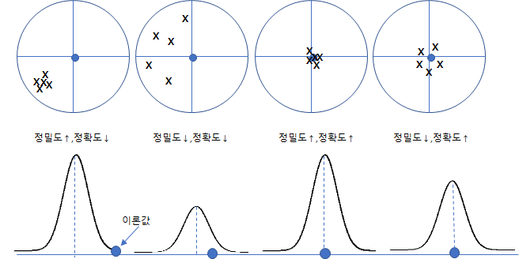

통계 용어중 정확도(Accuracy)와 정밀도(Precision)에 대해서 알아보자

### 정확도 (正確度, accuracy) - 오차로 평가
* 통계분야에서 측정되거나 계산된 양이 실제값(이론상 값)과 얼만큼 가까운지를 나타내는 기준
* 관측의 정교함과는 무관하다
* 따라서 정확도의 측정은 참값과의 차이로 표기하게 된다.
  * 절대오차 : $\varepsilon = \mu - X$ 
  * 상대오차 : $\frac {\|\varepsilon\|}{X} \times {100}$
  
### 정밀도 (精密度, precision) - 편차로 평가
* 여러 번 측정하거나 계산하여 그 결과가 서로 얼만큼 가까운지를 나타내는 기준
* 관측의 균질성을 나타내며, 관측된 값의 편차가 적을수록 정밀하다.
* 관측장비와 관측법에 따라 크게 영향을 받음
* 즉, 측정할때 마다 값이 달라지게 되면 정밀도가 문제가 있다 라고 할 수있다.
* 정밀도의 측정은 주로 퍼짐 정도(산포)를 나타내는 것으로 많이 표현한다.
  * Range, 표준편차 등

이 둘(**정확도,정밀도**)의 차이로 영점사격의 그림으로 많이 설명한다.

 

### 표준오차 (SEM : Standard Errror of Mean )
* 개념
  * 실제 이론상 모집단의 참값을 모르기 때문에, 여러 다양한 표본의 평균을 참값으로 간주하게된다.
  * 이 경우 여러 **표본 평균들이 어느 정도 흩어져 있는가의 척도가 표준오차의 개념**이다.
  
* 정의
  * 따라서 표준오차는 표본이 n개 인경우 각 표본의 평균 $$\bar{X}_{1} , \bar{X}_{2} , ... , \bar{X}_{n}$$인경우 각 표본평균의 평균에서 흩어진 정도 **표본평균의 표준편차**로 표현된다.
  
    $$SEM = \sqrt{Var[\bar{X}]}$$

  * 위 식을 일반화 하게 되면, 
  
  $$SEM = \sqrt{Var[\bar{X}]} = \sqrt{ \frac{1}{n}Var[{X}]} = \sqrt{ \frac{ \sum_{}^{}{(x-\mu)^2}  }{n \times n}} = \frac{\sigma}{\sqrt{n}}$$

  * 여기서 모집단의 표준편차를 어떻게 구하느냐 인데, 이 또한 모집단 표준평차 $\sigma$의 추정치 표본의 표준편차 $s$를 사용해서 아래와 같이 표현이 된다.
  
  $$SEM =  \frac{s}{\sqrt{n}}$$

* 특징
  * SEM은 표본평균의 측정치에 대한 불확실 정도를 수치화 한개념으로 **표준편차 보다 항상 값이 작다**

### 신뢰수준

* 개념
  * 통계는 모수값이 아닌 표본의 값이기 때문에, 알수 없는 모수의 값을 표현 할 때 모수는 얼마부터 얼마사이의 값을 가질 확률이 OO%이다 라고 이야기 한다.
  * 이 때 **얼마부터 얼마사이의 구간이 신뢰구간**이 되고 **신뢰구간내에 있을 확률이 신뢰수준**이라 한다.

* 산식
  
$$CI = \bar{x} \pm Z_{\alpha/2} \times {\frac{\sigma}{\sqrt{(n)}}} $$

  
* 특성
  * 신뢰구간이 좁을수록, 모집단 평균 추정치가 정확해진다.
    * 즉, 신뢰수준이 낮을수록 오차범위(표본오차)는 감소 하게 된다.
    * 반대로 신뢰구간을 넓게 잡게 되면, 모수가 구간에 들어갈 확률이 커지는 대신에 오차범위(표본오차)가 증가한다고 이야기 할 수 있다.
  * 일반적으로 Sample size가 클수록, 신뢰구간이 좁아짐
  * 위 식에서 $\pm$이후의 항을 오차한계,표본오차 라고 한다

* 유의수준(significance level)과 비교
  
  * 가설검정의 통계적 추론에서 나오는 이야기로 표본통계량의 결과가 확률분포(가설에서 취하는)에서 발생활 가능성이 희박한 확률
  * 즉, 신뢰수준의 반대로 볼수 있고, 신뢰수준과 유의수준을 합치면 1이 된다.

### 표본오차 (SE : Sampling error, 오차한계 )
* 개념
* 모집단의 일부인 표본/데이터의 결과를 근거로 모집단 전체의 특성을 추론하는 과정에서 발생하는 오차( 만일 전수조사라면 표본오차는 0이된다, 샘플사이즈가 증가함에 따라 감소)

* 산식
  
  $$SE = Z_{\alpha/2} \times {\frac{\sigma}{\sqrt{(n)}}} $$

  * $Z$는 표준분포는 z값, t분포는 t값, Chi제곱에서는 Chi제곱