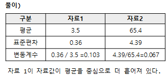
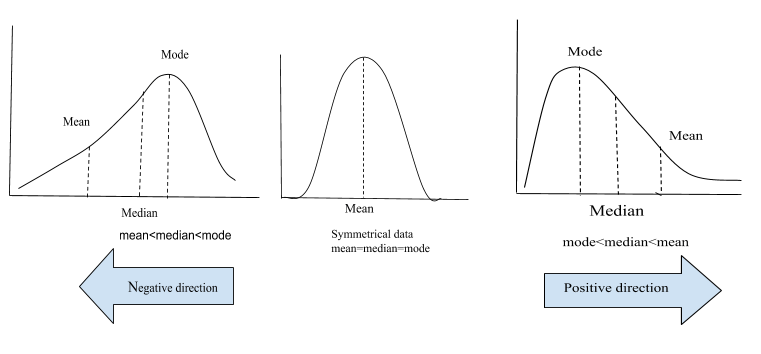
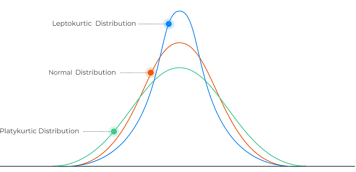

통계의 자료의 요약 방법에 대해 알아본다.

## 범주형 자료

범주형 자료는 빈도와 퍼센트를 이용하여 분석되어 진다

## 연속형 자료

연속형 자료는 범주형자료와 달리 데이터를 요약은 자료의 중심을 측정하는 **집중경향치** , 퍼져있는 정도를 나타내는 **산포도** , 분포가 왼쪽 오른쪽으로 치우친 정도를 나타내는 **비대칭도**, 분포모양의 뾰족한 정도를 나타내는 **첨도** 가있다

### 집중경향치(대푯값)
자료를  잘 나타낼 수 있는 수

* 평균
  
  * 산술평균(mean)
    * 극단값에 민감하며 로버스트(robust, 이상값에 둔감한 )성질을 갖지 못함
    * 모집단평균 : $\mu = \frac{1}{N} \left ( \sum_{i=1}^{N} x_i \right )$
    * 표본평균 :  $\bar{x} = \frac{1}{n} \left ( \sum_{i=1}^{n} x_i \right )$
  
  * 가중평균(Weighted Mean)
    * 중요도에 비례하는 개수를 곱한 후 산출한  평균
  
  * 기하평균(mean)
    * 비율의 평균에 주로 사용, 연평균  증가율 등
    * $G = \sqrt[n]{x_1 \times x_2 \times \cdots \times x_n }$
  
  * 조화평균(harmonic mean)
    * 속도 등과 같이 여러단위가 결합된 경우 적용
    * $\widetilde{x}_H = \frac{n} { \frac{1}{x_1} + \frac{1}{x_2} + \cdots + \frac{1}{x_n} }$
    * ex) 갈때 200Km/h, 올때 100Km/h 온경우  평균시속 133.33Km/h = 2/ (1/200+1/100)

  
* 중앙값(Median)
  * $\widetilde{x} = x_{\frac{n+1}{2} }$
  * 짝수 인경우 2개의 평균을 취함
  
* 최빈값(mode)
  * 자료 중 발생빈도가 가장 높은값으로 빈도수에 의해 산출
  * 유일하지 않을 수 있고, 값이 존재 하지 않을 수 있다
  * 질적자료(범주형 자료)에 대한 대표값
  
* 기타
  * 절사평균(trimmed mean) : 극단값을 제외하고 계산한 평균
  * 사분위수(quartile) : 자료를 4등분 하였을  경우 경계점
  * 십분위수(decile)  : 자료를 10등분 하였을 경우 경계점
  
###  산포도
변량이  흩어져  있는 정도를 하나의 수로 나타낸 값이다.
이의 측정은 범위, 사분위수 범위, 분산 표준편차, 절대편차, 변동계수 등으로 할수 있다.

* 범위 (range) : 자료의 가장 큰 값과 가장 작은값의 차이
* 사분위수 범위(interquartile range: IQR)
  - IQR = 제3사분위수(Q3) - 제1사분위수(Q1)  

* 십분위수  범위(interdecile range)
  - IDR = 제9십분위수(D3) - 제1십분위수(D1)

* 편차(deviation)
  
  - 편차 : 관측값이 자료의 평균으로 부터 떨어진  차이
  - 편차는 양수, 음수 모두 가능하며, 평균보다 크면 양수, 작으면 음수가 된다.
  - 편차의 크기는 관측값이 평균으로 부터 떨어진 거리를 말함
  - 편차의 합은 항상 0이므로 변량이 흩어져 있는 정도를 알수는 없다. 
  - 모집단 평균에서의 편차는 오류(Error), 표본집단 평균에서의 편차는 잔차(Observed Value)라고 한다

* 절대평균편차(mean absolute deviation:MAD)
  - MAD : 편차의 절대값에 대한 평균
  
    $$MAD = \frac{1}{n}  \sum_{i-1}^{n}\left| X_{i} - \bar{X}_{n} \right|$$

* 분산(variance:var)
  * 관측값들이 평균으로 부터 어느정도 떨어져 있는가를 나타낸 수치
  * 편차의 제곱에 대한 평균
  * 모분산 $\sigma ^2 = \frac{1}{N}  \sum_{i-1}^{n}( X_{i} -\mu  )^2$
  * 표본분산 $S ^2 = \frac{1}{n-1}  \sum_{i-1}^{n}( X_{i} -\bar{X}_{n}  )^2$
    - n-1 로 나누에 유의 : 표본분산의 기대값이 n-1로 나눠줘야 모분산이 나옴
  * 분산의 특징
    * X를 확률변수라 하고, a,b를 상수라고 할때 , 항상 다음 조건을 만족
    * $Var(aX) = a^2Var(X)$
    * $Var(aX+b) = a^2Var(X)$

* 표준편차(standard deviation:sd)
  * 모표준편차 $\sigma = \sqrt {\sigma ^2}$
  * 표본표준편차 $S = \sqrt {S ^2}$
  * 분산의 **양의 제곱근을 표준편차**라고 함
  
* 변동계수(coefficient of variation:CV)
  * 평균값을  감안한 상대적 산포도 척도
  * 단위가 상쇄되어 없어짐 (**unitless**, 표준편차 / 평균 )
  * 단위가 다른 두집단의 산포를 비교하거나, 평균차이가 큰 집단의 산포를 비교할 때 이용
  * **변동계수의 값이 큰 분포보다 작은 분포가 평균에 더 밀집**되었다고 이야기 함
  * 모변동계수 = $CV=\frac{ \sigma  }{\mu}$ , 표본변동계수 $v = \frac {s }{\bar x}$

    <pre>예제) 다음 자료1은 5명의 신생아의 몸무게, 자료2는 5명의 성인의 몸무게이다. 
    자료값들 간의 변화가 더 심한 자료는 어떤 자료인가?
    </pre>

    |자료1|자료2|
    |-|-|    
    |4.0 3.0 3.5 3.4 3.6|71.0 64.0 67.0 66.0 59.0|
    
    
        

###  비대칭도  (skewness)
분표의 좌우 대칭정도를 나타낸다.
측정을  위해서 피어슨의 비대칭도 등이 있다.

* 비대칭도(skewness)
    * **평균과 중앙값의 상대적 크기에 따라 비대칭도**가 결정된다.
        * 좌우대칭(symmetric) 분포
        * 오른쪽 꼬리분포(skewed to the right 또는 positively  skewed) - mean>mdeian
          * positive skewed 양수
        * 왼쪽 꼬리분포(skewed to the left 또는 negatively  skewed) - mean < median
          * negative skewed 음수
    * 비대칭도(왜도)의 값이 -2~2 정도이 치우침은 왜도가 크지 않다고 판단, 절대값 3미만이면 기준에 부합

$$비대칭도 = E\left[
\left (
\frac {x-\mu} {\sigma}
\right )^3
\right ] \approx \frac{ \sum_{i-1}^{n}(X_{i} -\bar{X}_{n})^3 }{ \left (  \sum_{i-1}^{n}(X_{i} -\bar{X}_{n})^2 \right )^{(3/2)} }$$

※ 오른쪽 꼬리분포는 오른쪽 치우침을 의미하는 것이 아니고 반대로 생각해야 함

* 간단한 공식
  * 피어슨의 비대칭계수(Person's coefficient of skewness:CS)
  * 3 × (평균값-최빈값 또는 중앙값) / 표준편차

###  첨도
분포 봉우리의 뾰족한 정도를 측정
동시에 분포 양쪽 꼬리의 길고 두꺼운 정도를 측정함

* 첨도계수(coefficient of kurtosis: CK)
  * 높은 첨도(leptokurtic): **첨도계수가 0보다 큰** 분포
  * 보통 첨도(mesokurtic): 첨도계수가 0 인 분포 ( ex: 정규분포가 이에 해당 )
  * 낮은 첨도(platykurtic): **첨도계수가 0 보다 작은 분포**

$$첨도 = E \left[
\left (
\frac {x-\mu} {\sigma}
\right )^4
\right ] - 3 \approx \frac{ \sum_{i-1}^{n}(X_{i} -\bar{X}_{n})^4 }{ \left (  \sum_{i-1}^{n}(X_{i} -\bar{X}_{n})^2 \right )^2 } -  3$$

