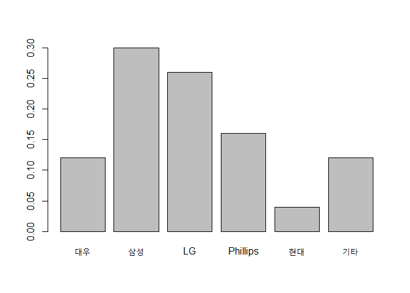
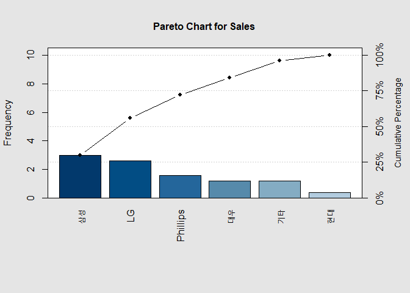
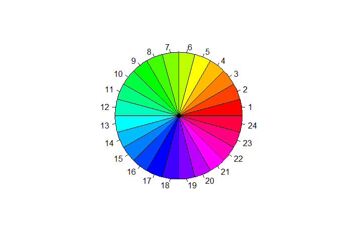
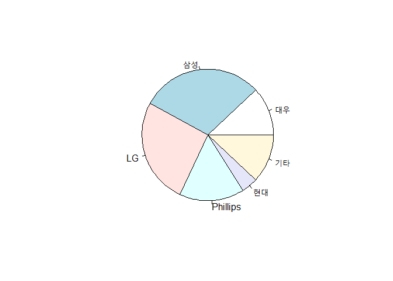

범주형 자료의 표현 방법

범주형 자료의 표현은 막대, 원 차트 정도 이다.

###  막대그래프

* 각 범주에 도수의 크기를 막대의 높이로 나타냄
* 범주형 자료는 X 축의 순서가  의미가 없기 때문에, 높이만 의미가 있다
  - 따라서 전체에서  차지하는  비율을 파악하기 쉽지 않다.
  - X 축이 그려지는 순서의 의미는 없다.
  
  ※ 막대그래프 vs 히스토그램 : x축의  자료가 연속형 즉 막대와  막대사이가 간격이 벌어져 있고, 히스토 그램은  공백없이 붙어 있다. 즉 자료가 연속,범주형에 따라 달라짐


``` r
Sales = c(0.12,0.3,0.26,0.16,0.04,0.12)
names(Sales)=c("대우","삼성","LG","Phillips","현대","기타")
barplot(Sales)
```

<!-- -->


###  파레토 Chart

* **상대도수가 큰 순서대로 범주를 왼쪽부터 차례로 나열** 하여 막대그래프를 그린 이후  **누적상대도수**를 막대 위 중앙에 표시하여 그점을 연결한다
* 범주들이 차지하는 비율과 상대도수가 증가하는 비율 파악이 용이
* 왼쪽 Y축이 relative frequency, 오른쪽 Y축은 cumulative Percentage

``` r
Sales = c(0.12,0.3,0.26,0.16,0.04,0.12)
Sales = Sales * 10
names(Sales)=c("대우","삼성","LG","Phillips","현대","기타")
# install.packages("qcc")
library(qcc)
pareto.chart(Sales)
```

<!-- -->


###  Pie Chart


* 원을 상대도수에 비례하여 중심각을 나누어 나타냄
  
  
``` r
pie(rep(1,24), col=rainbow(24), radius=0.9)
```

<!-- -->

``` r
Sales = c(0.12,0.3,0.26,0.16,0.04,0.12)
names(Sales)=c("대우","삼성","LG","Phillips","현대","기타")
pie(Sales)
```

<!-- -->
