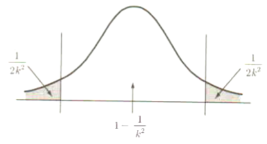
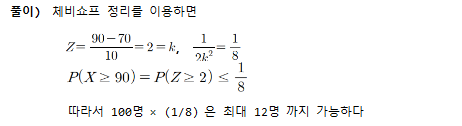
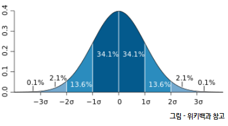

### chebishev's Rule
* 체비셔프 부등식 : $P(\| x- \mu \| < k \sigma) =  P[\mu -k \sigma < x < \mu +k \sigma] \geq 1  -  \frac{1}{k^2}$ 
* chebishev's Rule에 의하면, k=2 라면, 어떠한 데이터 분포라도 $P(\|x- \mu \| < 2 \sigma) \geq 1 - \frac{1}{4}$ 즉 평균값 $\pm 2 \times \sigma$ 내에 있을 확률은 1-$\frac{1}{2^2}$ =  3/4 이상 이라는 의미 이다
* 수리통계적 증명은 집합의 판별함수 활용으로 증명 할수 있다.

  <pre> 예제) 어느 통계학 강좌를 수강한 100명의 학생들에 대하여 시험성적과 
  출석률, 그리고 숙제점수 등을 고려하여 종합적인 평가점수를 산출한 결과, 
  평균이 70점, 표준편차가 10점이었다. 이강좌를 담당한 교수는 절대평가를 
  실시하여 90점 이상이면 A를 주려고 한다. 평가점수의 분포가대칭임을 가정할 때 
  A학점을 받을 학생의 수는 최대한 몇 명까지 가능한가?
  
  </pre>
  

### 중심극한정리 (Centeral Limit Theorem)
* 임의로 추출된 크기가 n인 표본에서, 표본크기가 충분히 클 경우(보통 n≥30), 표본의 평균은 정규분포에 근사한다. 매우 불규칙한 분포라도, 충분한 표본의 수가 추가된다면, 정규분포에 따를 것이다.

### 대수의법칙 (Law of Large Numbers, 라플라스의 정리)
* 표본평균이 모평균에 수렴
  * 모집단에서 무작위로 뽑은 표본평균 $\bar{X}$의 표본 크기 n이 커질수록, 전체 모집단 평균$\mu$과 가까워짐

### 경험의법칙 (Empirical Rule, Rule of Thumb, Normal  Approximation)
* 자료의 분포모양이 대략적으로 평균을 중심으로 종모양과 비슷하여 좌우 대칭이면,(정규분포와 비슷하다면) 다음과 같은 법칙이 성립된다
  * 관측값의 대략 68%는 평균으로부터 ±1배의 표준편차 내에 존재
    * $\mu \pm \sigma$ 또는  $\bar{X_n} \pm S$ 
  * 관측값의 대략 95%는 평균으로부터 ±2배의 표준편차 내에 존재
    * $\mu \pm 2\sigma$ 또는  $\bar{X_n} \pm 2S$   
  * 99%이상이 되는 대부분의 관측값은 평균으로부터 ±3배의 표준편차 내에 존재
    * $\mu \pm 3\sigma$ 또는  $\bar{X_n} \pm 3S$ 

