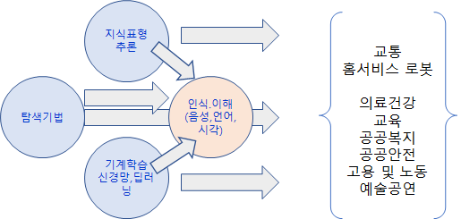
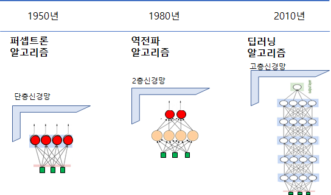

### 이해

* 지능적 행동을 자동화 하기 위한 컴퓨터 과학의 한 분야(Luger & Stubblefield, 1993)
* 현재 사람이 더 잘 하는 일을 컴퓨터가 하도록 하는 연구(Rich & Knight, 1991)

### 개발방법론

* 지식 처리형   -  사람의 지식을 기호의 조합으로 표현 , 전문가 시스템
* 데이터 기반형 - 신호데이터에서 공통 성질을 추출

### 핵심기술 및 응용분야

### 기계학습의 발전

* 차세대 핵심은 명시적 프로그램정의가 아니고 데이터로 부터 학습하는 능력으로 발전
  

