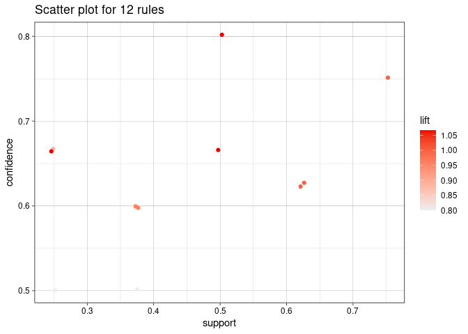
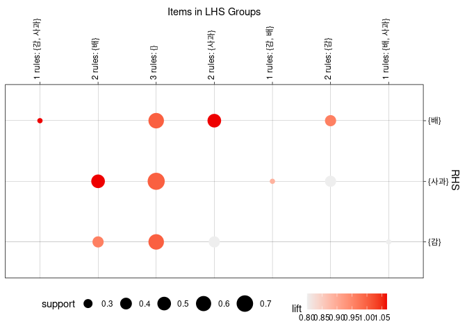
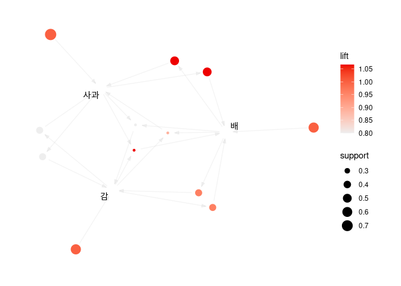

## 분석개요

1.  R실행환경 : Linux
2.  분석파일 : [파일첨부](../../images/2022-03-15-association-ex1/연관분석_1.csv)
3.  대상 및 목적

-   총 8명에 대해 바구니에 담겨있는 과일을 대상으로 연관성 분석을
    실시한다.
-   과일간의 연관규칙을 도출하고, 규칙 품목간의 관계를 시각화 한다.

## 분석실행 (R Code 및 결과)

데이터 로드 R 코드 :

``` r
library(arulesViz)
tmpath <- file( '연관분석_1.csv' , encoding = "EUC-KR")  #Save with Encoding... 세팅은 ECU-KR 로 되어 있어야 함
result <- read.transactions( tmpath , format="basket" ,sep =",", header=F)
close(tmpath)
```

분석실행 :

``` r
rules = apriori(result, parameter=list(supp=0.01, conf=0.5) )
```

    ## Apriori
    ## 
    ## Parameter specification:
    ##  confidence minval smax arem  aval originalSupport maxtime support minlen
    ##         0.5    0.1    1 none FALSE            TRUE       5    0.01      1
    ##  maxlen target  ext
    ##      10  rules TRUE
    ## 
    ## Algorithmic control:
    ##  filter tree heap memopt load sort verbose
    ##     0.1 TRUE TRUE  FALSE TRUE    2    TRUE
    ## 
    ## Absolute minimum support count: 0 
    ## 
    ## set item appearances ...[0 item(s)] done [0.00s].
    ## set transactions ...[3 item(s), 8 transaction(s)] done [0.00s].
    ## sorting and recoding items ... [3 item(s)] done [0.00s].
    ## creating transaction tree ... done [0.00s].
    ## checking subsets of size 1 2 3 done [0.00s].
    ## writing ... [12 rule(s)] done [0.00s].
    ## creating S4 object  ... done [0.00s].

``` r
inspect(rules)  #규칙보기 , attributes(rules) - 전체 , inspect(head(sort(rules,by="lift"))) - lift(향상도) 상위 6개의 향상도 내림차순 정렬
```

    ##      lhs           rhs    support confidence coverage lift      count
    ## [1]  {}         => {감}   0.625   0.6250000  1.000    1.0000000 5    
    ## [2]  {}         => {배}   0.625   0.6250000  1.000    1.0000000 5    
    ## [3]  {}         => {사과} 0.750   0.7500000  1.000    1.0000000 6    
    ## [4]  {감}       => {배}   0.375   0.6000000  0.625    0.9600000 3    
    ## [5]  {배}       => {감}   0.375   0.6000000  0.625    0.9600000 3    
    ## [6]  {감}       => {사과} 0.375   0.6000000  0.625    0.8000000 3    
    ## [7]  {사과}     => {감}   0.375   0.5000000  0.750    0.8000000 3    
    ## [8]  {배}       => {사과} 0.500   0.8000000  0.625    1.0666667 4    
    ## [9]  {사과}     => {배}   0.500   0.6666667  0.750    1.0666667 4    
    ## [10] {감, 배}   => {사과} 0.250   0.6666667  0.375    0.8888889 2    
    ## [11] {감, 사과} => {배}   0.250   0.6666667  0.375    1.0666667 2    
    ## [12] {배, 사과} => {감}   0.250   0.5000000  0.500    0.8000000 2

위 결과를 해석하자면, LHS 즉 감이 담겨있을 확률이 coverage(0.625=5/8) 이
되고, 감-\>배의 경우 지지도는(0.375=3/8) 전체 바구니 8개 중에서 3개
바구니에서 감,배가 담겨있을 확률이 되고,
confidence(0.6=support/coverage)은 감을 사고 배를 사는 확률이 0.6으로
해석 할 수 있으며, lift가 0.96 이라는 것은 둘의 상관관계가 있지만
1보다는 작다 (\* 데이터가 적어서 경쟁관계인지는 좀 더 확인이 필요하다)

support(지지도) vs 신뢰도(confidence)의 시각화:

``` r
plot(rules)  # 겹치지 않게 plot(rules,jitter=0)
```

<!-- -->

연관규칙 그래프 시각화:

``` r
plot(rules, method="grouped")
```

<!-- --> 

위 그림에서 LHS-\>RHS 로 가는 것 중에서 lift가 높은편이 배-\>사과
상관관계가 크며, support가 큰 과일은 사과(가장 많이 팔림) 이다.

``` r
plot(rules, method="graph")
```

<!-- -->
