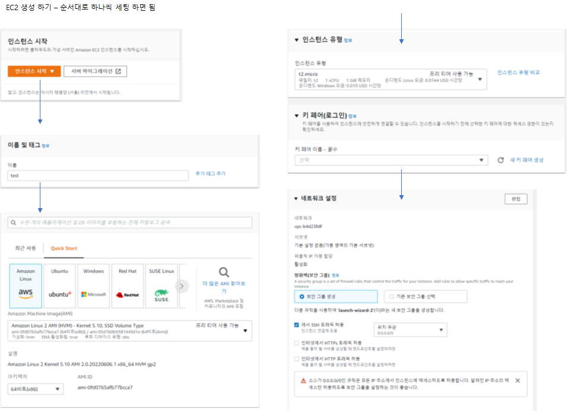
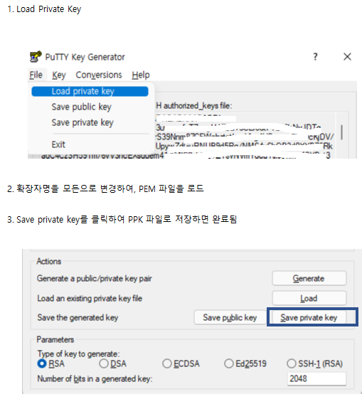
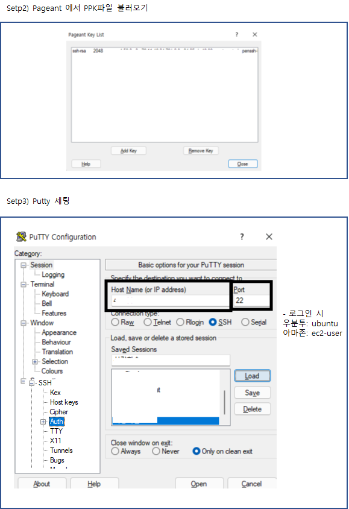

### EC2 서비스 생성 실습

<small> 1.AMI 선택 > 2.인스턴스 유형 선택 > 3. 인스턴스구성 > 4. 스토리지 추가 > 5. 태그 추가 > 6. 보안그룹구성 > 7.검토</small>
 

### EC2 인스턴스 접속 하기

#### 1. 접속을 위하여 PEM 키파일을 PPK 키 파일로 변경해야 함 (puttygen 사용)

 

#### 2. Putty를 통하여 접속하기

 

#### 3. 우분투 서버에 Nginx 설치
* 인스톨전 업데이트
  * 1. sudo apt-get update
  * 2. sudo apt-get upgrade

* 인스톨
  * sudo apt-get install nginx
  * 설치가 되고 나면,
    * ls /var/www/html -> index.nginx-debian.html 파일을 확인
    * 그리고 웹브라우저로 접속.
    * 접속이 안되면, AWS에서 outbound 보안그룹에서 포트(80) 열어 주도록 해야 함
      * 보안그룹-> 인바운드 규칙 -> 인바운드 규칙 편집