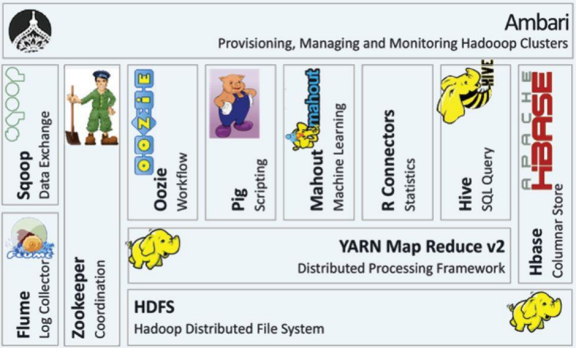

### Hadoop 소개
* 하둡은 빅데이터를 분산,저장,처리 할 수 있는 자바기반의 오픈소스 프레임워크
* 기존의 OLTP(실시간 처리를 위한 데이터 베이스)용 데이터베이스에서 발생하는 문제를 해결
* 3V (Volumn, Velocity, Variety)의 문제
* 큰데이터를 저렴한 비용 및 빠르게 처리 하기 위하여
* Solution : 분산파일시스템 , 분산처리시스템으로 해결 가능
* Hadoop 의 Solution
  * 분산저장(HDFS: Hadoop Distributed File System)
  * 분산처리(MapReduce) :  분산처리 시스템

### Hadoop 특징
* 하드웨어 수의 증가(Scale Out)에 따라 성능이 증가 함
* Fault Tolerant : 데이터 블록의 복사본을 중복 저장하고 유지함
* Simple : 분산된 컴퓨터에서 병렬적으로 처리되는 프로그램을 손쉽게 개발가능
* 오픈소스 :  소프트웨어 라이선스에 대한 비용 부담이 적음

### Hadoop 역사
* 2003년 구글 GFS 논문 발표, 2004년 구글 MapReduce 논문 발표
* 2005년 더그커팅이 오픈소스 검색엔진인 Nutch에 구글 논문을 기반으로 GFS, MapReduce를 적용
* 2006년 하둡이라고 명령된 독립 서브 프로젝트를 구성
* 2008년 하둡이 아파치 탑레벨 프로젝트로 승격
  * (아파치 : 오픈소스 SW를 위한 비영리 재단 , 아파치 서버, 톰캣, 하둡)
* 이 후 대기업 벤더인 EMC, IBM, MS, Oracle 등 하둡관련 제품 출시
* Cloudera, Hortonworks, MapR같은 하둡 전문 기업이 활발히 활동

### Hadoop의 Ecosystem(생태계)
* 하둡의 HDFS, MapReduce 외 기술을 도와주는 시스템
* 빅데이터 수집,저장,처리,분석, 시각화의 여러 단계를 거치는 동안 이용하는 기술들

 

##### Hadoop의 HDFS
* 블럭구조의 파일시스템
* 마스터 역할을 하는 네임노드 서버한대와 슬레이브역할을 하는 데이터노드 서버 여러대로 구성
* 네임노드는 HDFS의 모든 메타데이터를 관리, 데이터노드는 주기적으로 블록 리포트함

##### Hadoop의 YARN
* Yet Another Resource Nagotiator은 하둡 2에서 도입한 클러스터 리소스관리 및 애플리케이션 라이브 사이클 관리를 위한 아키텍쳐
* 잡트래커의 병목현상과 애플리케이션의 호환성을 높이기 위해
* MapReduce, Spark등 댜양한 애플리케이션을 얀에서 리소스를 할당받아서 작업을 실행함

##### Hadoop의 MapReduce
* 대용량의 데이터 처리를 위한 분산 프로그래밍 모델
* 대량의 데이터를 병렬로 분석 가능
* Map과 Reduce함수를 합친말
* Map은 분산되어 있는 데이터를 연관성있는 데이터들로 분류하는 작업
* Reduce는 원하는 데이터를 추출하는 작업
* 프로그래머가 직접 작성하는 두개의 메소드로 구성

##### Hadoop의 Flume
* 분산된 서버에서 생성되는 데이터를 HDFS에 안정적으로 저장하는 플랫폼
* 주로 로그 기록 파일등을 HDFS로 가져오는 역할

##### Hadoop의 SQOOP
* RDBMS의 데이터를 Hadoop의 File System으로 저장하는 솔류션

##### Hadoop의 HBASE
* 하둡 기반의 분산데이터베이스로, 컬럼 기반 NoSql데이터 베이스
* HDFS, MapReduce와 함께 사용하기에 최적화
* 구글 빅테이블 논문을 기반으로 개발됨

##### Hadoop의 Pig
* 대용량 데이터를 다루기 위한 스크립트언어
* 즉 복잡한 MpaReduce 프로그램밍을 대체하기 위한 Pig Latin이라는 자체 언어를 제공
* MapReeduce API를 매우 단순화 해서 SQL과 유사한 형태로 설계됨
* 내부적으로 연속된 MapReduce 작업이 돌게 된다

##### Hadoop의 Hive
* 하둡에서 동작하는 데이터 웨어하우스 인프로 구조로서 하둡기반 SQL Query Engine
* HDFS에 저장된데이터 베이스 구조를 RDB의 테이블과 같은 형태로 정의하는 방법을 제공해줌

##### Hadoop의 Spark
* MapReduce를 대체할 수 있는 기술
* 인메모리 기반의 범용 분산데이터 처리 플랫폼
* 인메모리 실행으로 비약적인 성능 향상
* 대 용량의 메모리가 필요하기 때문에 가격이 비싸짐
* SQL 질의 처리, 스티리밍 데이터 처리, 머신러닝, 그래프라이브러리 처리와 같은 다양한 작업을 수용 할 수 있도록 설계되어 있음

##### Hadoop의 Oozie
* 하둡 작업을 관리하는 워크플로우 스케쥴러
* job의 시작과 종력, 그사이의 각종 분기조건 등을 지정해 자동화 하거나 스케쥴링 하도록 도와주는 솔루션
* 맵리듀스, hive, pig 작업 같은 특정 액션으로 구성된 XML 포멧의 워크플로우로 작업을 제어함

##### Hadoop의 Zookeeper
* 분산환경에서 서버간의 상호 조정이 필요한 다양한 서비스를 제공하는 코디네이션 시스템
* 서비스가 집중되지 않게 서비스를 분산해 동시에 처리하게 해줌
* 처리결과를 다른 서버와 동기화해서 데이터의 안정성을 보장하도록 함
* 분산환경을 구성하는 서버들의 환경설정을 통합적으로 관리

##### Hadoop의 Ambari
* 시각화 툴을 제공하여 서비스 실행, 중지 등 관리를 할 수 있는 Tool임
* 클러스터 상태에 대한 전체 모니터링
* 서비스 설치, 구성, 관리를 웹UI 형태로 제공하는 것