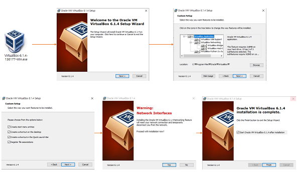
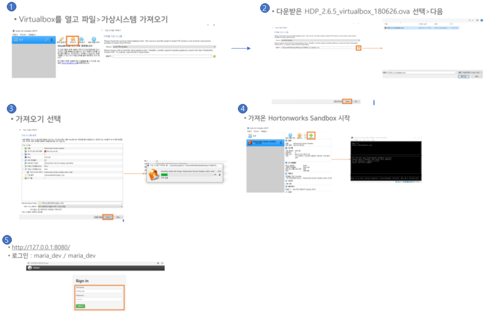
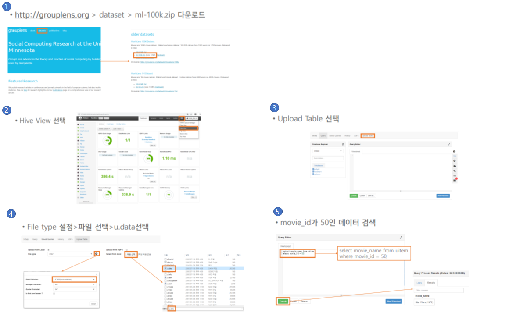

### 실습환경
* 여러 하둡을 패키지로 묶어놓은 것 : HDP(Hortonworks Sandbox)
* Virtural Box

 

* 환경구성
  
  * VirtualBox를 설치 (www.virtualbox.org)
   

  * Hortonworks sandbox 설치 (www.cloudera.com) - 15기가 정도이며 다운로드 받음
  * VirtualBox를 실행해서, 다운로드 받은(Hortonworks sandbox) 파일을 선택, 가져오기를 한다
  
   

### 데이터 다운로드 실습
* Ex: Movelens DataSet을 활용 (MovieLends 100K DataSet)
   