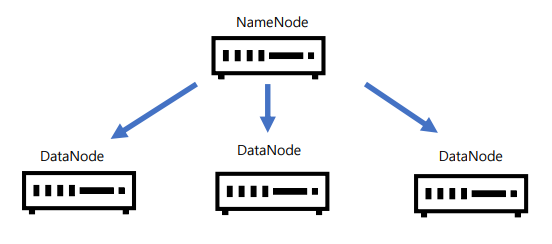

### HDFS의 설계
* 대용량 데이터 저장 : 하나의 파일이 terabyte, petabyte이상의 사이즈로 저장
* 장애복구 : 장애를 신속하게 감지하고 대처할 수 있도록 설계
* 데이터의 무결성 : 한번 저장된 데이터를 수정 할 수 없고 읽기만 가능하게 해서 데이터 무결정을 유지

### HDFS의 Archtecture
* NameNode : DataNode를 관리만 함
  * 항상 클라이언트는 NameNode와 통신
  * ※ Snamenode : Secondrary Name Node
* DataNode : 실제 DataNode를 저장하게 됨
  
 

### HDFS의 접속 방법
* UI(Ambari)
* Command-Line : putty 또는 MobaTerm 등으로 접속해서 명령어 제공
* HTTP/HDFS Proxies
* Java
* NFS GateWay