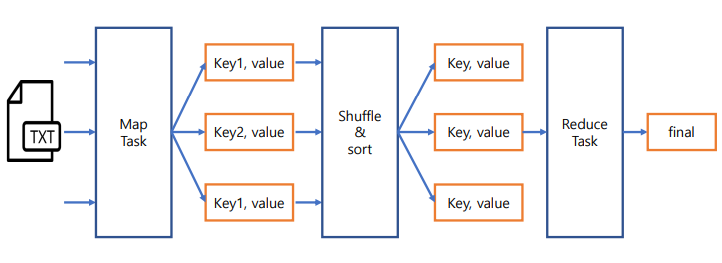
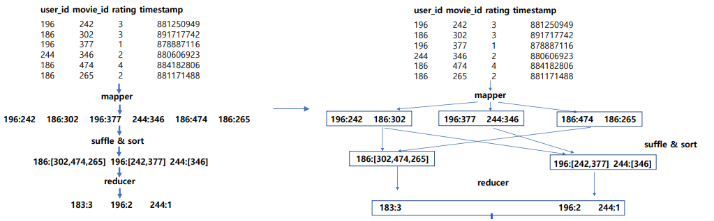

### MapReduce 설계 특성
* 분산 컴퓨팅에 적합한 분산 프로그래밍 모델
* Map과 Reduce함수를 합친말
* Map은 분산되어 있는 데이터를 연관성있는 데이터들로 분류하는 작업
* Reduce 원하는 데이터를 추출하는 작업
* Data Locality를 최대한 활용
* Fault-tolerance

### MapReduce 과정

 

### MapReduce 예제

 
* ※ 파이썬 을 사용하기 위해서는 MRJob 설치

### MapReduce 실행 (예시)
* Local에서 실행하는 방법
  * ex) python CountRatings.py u.data
* 실제 Hadoop에서 실행
  * ex) python CountRatings.py -r hadoop --hadoop-streaming-jar /usr/hdp/current/hadoop-mapreduce-client/hadoop-streaming.jar u.data
* 현업에서는 Hive Pig로 추상화 하여 간단하게 실행 함