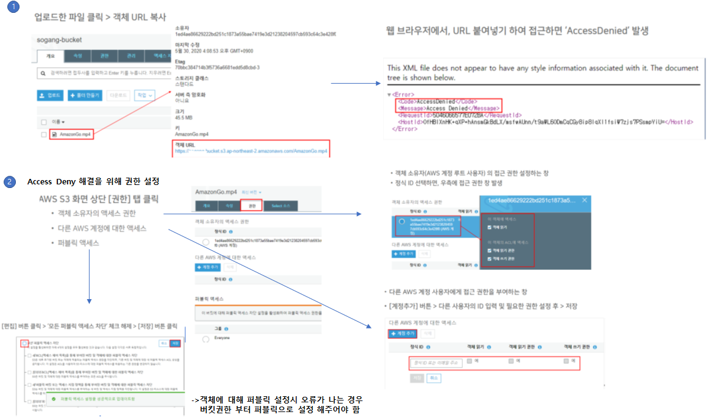

### Amazon S3
* Amazone Simple Storage Service
* 2006년에 출시된 최초의 AWS 서비스
* 웹 서비스 인터페이스를 통해 언제 어디서나 원하는 데이터 접근 가능

### Amazon S3 장점
* 데이터 내구성
  - 모든 S3 객체의 복사본을 자동으로 생성 저장
  - 99.999999999% 내구성 보장
* 스토리지 확장성
  - 변화하는 요구사항에 따라 리소스 확장 및 축소 가능
* 비용 효율성↑
  - 파일 접근 패턴, 빈도 등에 따라 파일 저장 방식 및 요금 정책이 달라짐
* ‘타의 추종을 불허하는’ 보안
  - S3 Block Public Access 기능을 통한 보안 강화
* 쉬운 데이터 관리와 엑세스 제어
  - 여러 리전으로의 데이터 복제 관리
  - 사용자 요청 시 가장 가까운 리전에서의 엑세스 포인트 제공
* 데이터 분석을 위한 쿼리 인 플레이스 서비스
  - 별도의 분석 플랫폼 또는 DW 에 복사하여 로드할 필요 없음
  - 데이터 쿼리 기능 내장, 무료 서비스 제공
  - S3 Select : 쿼리 성능 최대 400%↑, 쿼리 비용 80%↓ 절감

### Amazon S3 실습

#### 버킷과 객체
* 버킷(Bucket) : 파일을 저장하는 컨테이너 (일종의 폴더 개념)
* 객체(Object): 저장할 파일 자체를 의미함

#### 버킷의 생성
 

#### 파일의 업로드
 

#### 파일의 접근
 