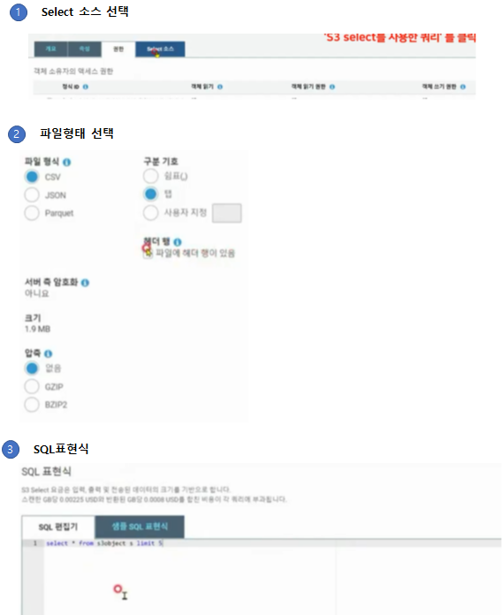

### AWS 활용한 데이터 분석 처리
* 간단한 쿼리 등을 EMR로 수행하기에는 비효율적이다.
* 따라서 좀 간단한 S3 Select 또는 Athena 등의 서비스를 활용한다.
* S3 데이터에 직접 SQL 쿼리를 실행 가능
* 쿼리 실행시 스캔한 데이터 용량에 대해서만 비용을 지불하게 됨
* Order By, Join 등은 지원하지 않음

### AWS S3 Select 실습

 