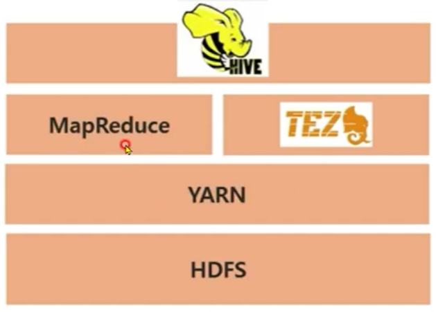

### EMR클러스터 생성

1. 클러스터 생성 클릭<br><br>
 

2. 고급옵션으로 이동 : 빠른옵션 (Availability 때문에 오류 발생 가능성 있음)<br><br>
 

3. 소프트웨어 구성, 변경없이 다음 클릭<br><br>
 

3. 하드웨어 구성, 변경없이 다음 클릭<br><br>
    

4. 일반옵션, 큰 변경없이 다음 클릭<br><br>
    

5. 보안옵션, 본인 키페어 선택 후 생성<br><br>
    


### Hive

* Hadoop Ecosystem 중 Data Warehouse의 기능을 담당
* SQL과 유사한 쿼리를 사용하여 데이터를 탐색/처리 : HiveQl
* Sql 쿼리를 MapReduce 또는 Tez Job으로 변환

 

### Hive 사용방법

* Hive Shell을 사용
* Query File을 사용하여 수행
* -e 옵션을 사용하여 HiveQL을 직접수행
* Ambari/Hue를 이용한 Web UI 에디터 사용

#### Hive Table 생성 및 쿼리 예시
* 생성
```
CREATE EXTERNAL TABLE rating
(user_id INT,
movie_id INT,
rating INT,
rating_time INT)
ROW FORMAT DELIMITED FIELDS TERMINATED BY '\t'
LOCATION 's3://.../rating/';
```
* 조회
```
select m.movie_name, t.rating_count
from movie_info m join top_count t
on m.movie_id = t.movie_id;
```

#### Hive Meta Store
* Hive Table로 관리하기 위해서 File의 메타정보를 관리
* Column 이름, 데이터 타입 등이 Meta정보
* File 자체는 아무런 Meta 정보르를 갖고 있지는 않음
* RDBMS를 사용하여 Meta 정보를 관리
* Meta 정보를 저장하는 공간을 Meta Store라고 함