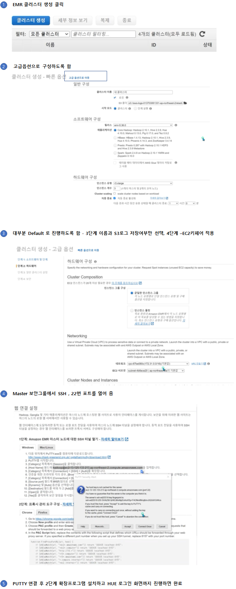
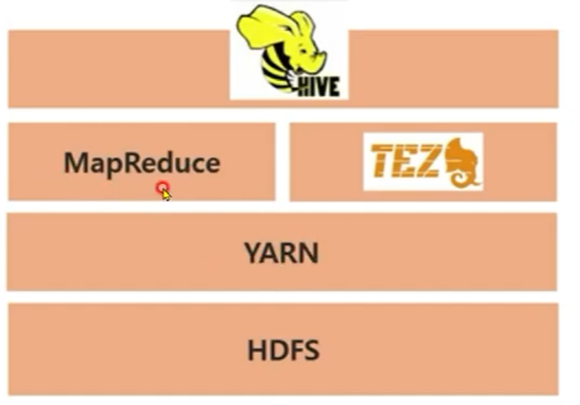

### EMR(Elastic MapReduce)
* Managed Hadoop
* Spark, Hbase, Hive 등도 포함
* 내부적으로 EC2 인스턴스를 활용
* 다른 AWS 서비스들과 통합가능(S3)

### EMR Nodes
* Master Node - Cluster관리를 위한 노드
* Core Node - HDFS 및 Job 실행을 위한 노드
* Task Node - Job 실행만을 위한 노드 (Data는 저장하지 않음)

### EMR 사용
* 클러스터 생성 후 MR Job 실행
  * Master Node에 접속하여 실행 가능
  * Management Console 사용하여 실행 가능
  * Hue/Ambrari를 활용하여 실행 가능

### EMR과 AWS 타 서비스의 통합
* EC2 : Job 실행하기 위한 Computing, HDFS 데이터 저장
* S3 : 로그 데이터 등을 저장
* Cloud Watch : EMR 클러스터의 상태를 모니터니링
* Cloud Tail : EMR Job 실행에 대한 Auditing
* VPC : EMR 클러스터를 Virtural Private Network에서 수행

### EMR클러스터 생성

 

### Hive

* Hadoop Ecosystem 중 Data Warehouse의 기능을 담당
* SQL과 유사한 쿼리를 사용하여 데이터를 탐색/처리 : HiveQl
* Sql 쿼리를 MapReduce 또는 Tez Job으로 변환

 

### Hive 사용방법

* Hive Shell을 사용
* Query File을 사용하여 수행
* -e 옵션을 사용하여 HiveQL을 직접수행
* Ambari/Hue를 이용한 Web UI 에디터 사용

#### Hive Table 생성 및 쿼리 예시
* 생성
```
CREATE EXTERNAL TABLE rating
(user_id INT,
movie_id INT,
rating INT,
rating_time INT)
ROW FORMAT DELIMITED FIELDS TERMINATED BY '\t'
LOCATION 's3://.../rating/';
```
* 조회
```
select m.movie_name, t.rating_count
from movie_info m join top_count t
on m.movie_id = t.movie_id;
```

#### Hive Meta Store
* Hive Table로 관리하기 위해서 File의 메타정보를 관리
* Column 이름, 데이터 타입 등이 Meta정보
* File 자체는 아무런 Meta 정보르를 갖고 있지는 않음
* RDBMS를 사용하여 Meta 정보를 관리
* Meta 정보를 저장하는 공간을 Meta Store라고 함