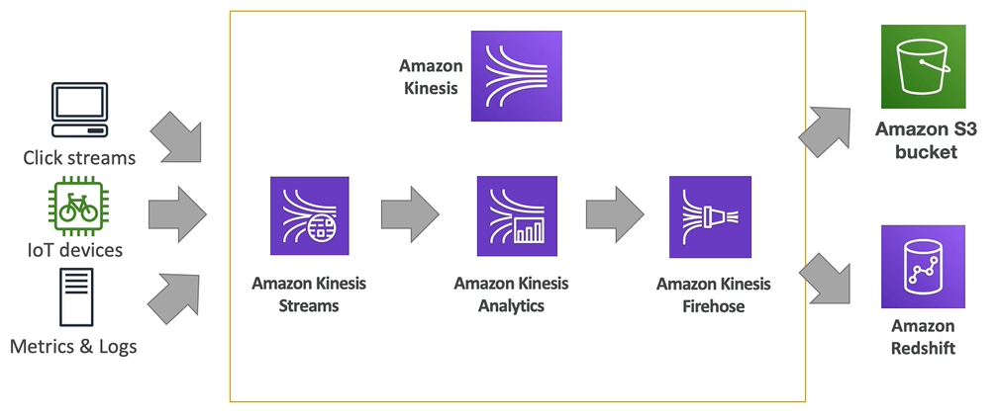
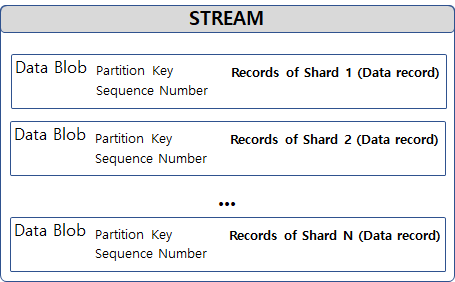

### AWS에서 데이터를 처리한는 방법

* Real time (실시간)
  * Milliseconds 수준의 처리 보장 (가장빠른속도)
  * Ex) Kinesis Data Streams , Simple Queue Service(SQS) , IoT
* Near-Real time (반응형)
  * 초 단위 지연시간 보장 , 주로 데이터 전송용으로 쓰임
  * Ex) Kinesis Firehose , DataBase Migration Service
* Batch (분석용)
  * 초대량의 데이터를 처리해야 하는 경우 이용
  * Ex) Snowball, Data pipeline

### AWS Kinesis 개요

* AWS Kinesis란?
  * 실시간 스트리밍 데이터를 수집,처리,분석할 수 있는 서비스
  * Apache kafka의 대안

* AWS Kinesis의 장점
  * 완전관리형 서비스로 사용자가 인프라를 관리할 필요가 없음
  * 데이터를 최대 3개의 가용 영역에 복제해 고가용성을 보장함
  * 스트리밍 데이터를 규모나 시간에 구애받지 않고 처리함
  
### AWS Kinesis 구조

 

#### AWS Kinesis Streams

* 실시간 데이터를 처리기 하기 위한 것임
* 실시간 데이터를 데이터 레코드라는  데이터 단위로 사용 함
* 데이터는 최소 24시간에서 7일 까지 저장
* Data Streams에 레코드를 넣는 ‘생산자’, Data Streams에 적재되어 있는 레코드를 가져와 처리하는 ‘소비자’ 가 존재
* 데이터를 분산 저장/전송 하기 위한 Shard 개념으로 구성되어 있음
  
 
 
 -> 작은 shard가 모여서 큰 데이터 스트림을 구성하는 개념임 (받을때 초당 1MB, 보낼때는 2MB) 
 -> 여러 shard가 받아서 보내는 형태 

* 데이터 레코드의 구조
 
 
 
 -> DATA BLOB :  데이터 모음 
 -> Partition Key : 어떤 Shard에 저장될 지 결정 - 여러개의 Shard로 적절하게 분류 하게 됨 
 -> Sequence Number : 데이터 레코드의 Primary key 

* Shard의 개수는 사용자가 직접 지정해야 함

  
#### AWS Kinesis Data Analytics

* SQL, Java를 이용해 스트리밍 데이터를 실시간으로 분석하는 서비스
  * 현재 사용자를 실시간으로 분석
* 입력 → 코드(SQL) → 출력 구조로 구성
* 완전관리형 서비스이며, 사용량에 따른 요금을 책정함
 
 
 
 

#### AWS Kinesis Data Firehose
* Near-Real time (반응형)
* 스트리밍 데이터를 원격지에 전송하는 서비스
* S3, Amazon Redshift, Amazon Elasticsearch, Splunk 4가지 저장소로 데이터 전송 가능
* <b>완전 관리형 서비스로 인프라에 대해서 신경쓰지 않아도 됨</b>
  * 데이터 양이 변화되면 자동으로 Scale-In/Out 수행
* Firehose는 시간이 조금 걸리지만 편리하게 사용 가능한 방법이다.

##### AWS Kinesis Data Firehose 세팅
