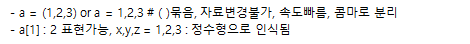
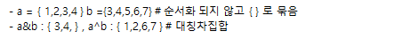

  
### 기본자료형 (정수,실수,복소수,논리형,문자열)

|구분|형식|
|-|-|
|int(정수)|0b0101, 0o1357, 0x12acdf, bin(365), oct(365), hex(365)|
|float(실수)|314.15 또는 3.1415e2|
|complex(복소수)|3 + 5j , (3 + 5j).real , (3 + 5j).imag , (3 + 5j).conjugate()|
|boolean(논리형)|T/F|
|str(문자열) -순차형,불가변-| \r (커서 앞으로) , print('파인애플 \r 사과')=> 사과플|

### 컨테이너자료형 (리스트,튜퓰,사전,집합,None)

|구분|형식|
|-|-|
|list  [ ] -순차형,가변- ||
|tuple  ( ) -순차형,불가변-||
|dict  {키:값 } -순차형,가변-||
|set  { } -비순차형,가변-||

※ 순차형은 인덱스나 키로 접근, 비순차는 iterator 로 접근 
※ 순차형 데이터는 연결, 곱셈은 그 수만큼 중복하여 연결 

※ 컨테이너 자료형은 모두 반복가능(iterable) 
※ 컨테이너에서 일부데이터 추출방법(Slicing) - 끝은 미포함 : [시작:끝:단계] 
※ 컨테이너 관련 기타함수 : in, len, max, min  등 

