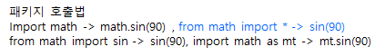

### 선택적흐름 과 반복적 흐름

|구분|내용|
|-|-|
|if,else,elif|선택적흐름|
|for||
|while||
|break,continue|break-반복문 탈출, continue-남은문장 싷행 않고 다음 반복문 진행|
|pass, 무한반복문|pass-아무것도안함, 무한반복-while True: |


### 함수

* 종류

    |구분|내용|
    |-|-|
    |built-in|Python이 기본적으로 제공하는 함수<br>확인법: ```dir(__builtins__)``` |
    |패키지제공||
    |사용자정의||

    ※ 함수내 변수 적용순서(Scoping Rule)는(LGB) : Local -> Global -> built in 순으로 적용<br>
    ※ 함수내 에서 global 변수 변경하면 에러 발생, global 선언을 통해서 해야함
    ```{python}
    x = '글로벌정의'
    def myfunc():
        global x
        print(x)
        x = x+', 로컬정의' # global x 안쓰면 에러 발생
        return
    myfunc()
    print(x)

    글로벌정의
    글로벌정의, 로컬정의
    ```

* 재귀호출 함수
  * 함수가 자기 자신을 호출 하는 경우
  * Ex) 피보나치 수열 $F_{1} = F_{2} = 1, F_{n} = F_{n-1}+F_{n-2} , n=3,4,...$
    ```{python}
    def pibo(n):
        if (n=1) or (n=2):
            return 1
        else:
            return pibo(n-1)+pibo(n-2)
    ```

* lambda 함수
  * 함수를 인자로 전달 할수 있고, 이때 람다함수를 이용 할 수있다.
    ```{python}
    # 함수를 전달하는 경우
    def myfunc(x, print_x_ft):
        x += 2
        print_x_ft(x)

    def print_x(x):
        print('x의 2배: ', x)

    myfunc(2,print_x)

    # 람다로 표현
    def myfunc(x, print_x_ft):
        x += 2
        print_x_ft(x)

    myfunc(2,lambda x: print('x의 2배: ', x))
    ```

* 파일 입출력 함수
  |구분|설명|
  |-|-|
  |open|open(파일이름, [파일 열기 모드,rwabt+], [encoding=인코딩 방식])|  
  |close|파일_객체.close()|  
  |write|파일_객체.write(데이터)|
  |파일읽기|파일_객체.readline()-문자열,파일_객체.readlines()-리스트, 파일_객체.read()-문자열 |
  |pickle.dump(데이터, 파일_객체)|파이썬 객체를 일련의 바이트로 변환하는 것|
  |pickle.load(파일_객체)|바이트를 파이썬 객체로 복원|