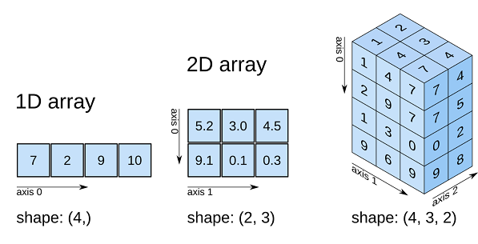
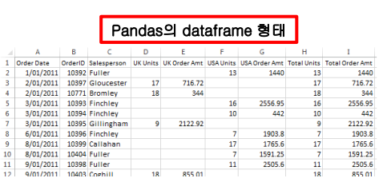
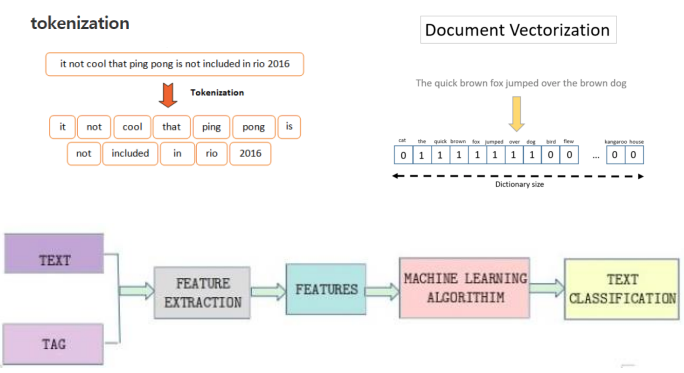
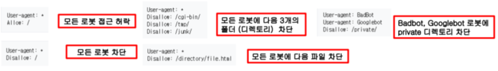

  
## 데이터 처리를 위한 라이브러리

### Numpy

* 파이썬의 리스트를 확장한 다차원 배열(multi-dimensional array) 제공
* 난수생성, 푸리에변환, 행렬연산, 통계분석을 지원
* 일반적으로 Scipy, Pandas, matplotlib 등 다른 패키지와 함께 쓰임.
* Numpy를 보통 np로 호출하는 것이 관례: “import numpy as np”
  

### Pandas

* Pandas는 R의 dataframe 데이터 타입을 참고하여 만든 것으로 pandas dataframe 이라고 부름
* Pandas의 dataframe: 테이블 형식의 데이터 (tabular data type)
  * 열(column), 행(row), 인덱스(index) 로 구성
  * 리스트, 튜플, 사전 타입의 형태로 데이터를 보관

### Spacy

* 웹 사이트에 댓글이나 리뷰를 스크래핑하여 분석 가능한 형태의 데이터로 변환시킬 때 사용하는 라이브러리
  * 특별히, 자연어처리(NLP: Natural Language Processing)를 위해 만들어진 파이썬의 대표적인
라이브러리
  * 쳇봇 등에 주로 사용 ( Voice-> Tockenize -> Document Vertorization -> Text 구분)
  

## 데이터 시각화 Visualization

### Matplotlib

* Data Visualization 분야에서의 대표적인 파이썬 라이브러리
  * 그 이외에 seaborn, plotly, folium 등 다양한 라이브러리 가 있음

  
## 데이터 모델링 위한 라이브러리

### Scikit Learn
* AI, 빅데이터 분석, 머신러닝을 시작할 때 제일 먼저 알아야 하는 파이썬 라이브러리
* 지도 학습, 비지도 학습, 모델 선택 및 평가, 데이터 변환 라이브러리로 구성
  * 지도 학습 : X 변수가 주어 졌을때 , Y 변수를 추정해내는 방법 (새로운 데이터가 나왔을때 진화가 어려움)
  * 비지도 학습 : Y 가 없는 경우, 군집화, 이상치 검출
  * 모델 선택 및 평가
    * 교차 검증(cross-validation) : 전체 자료를 5개로 구분하여, 5번에 나누어 학습하여 평가하는 방법
    * 파이프라인(pipeline) : Variable->Normlized->처리하는 것을 한번에 처리하는 것
  * 데이터 변환 : 속성 추출(Feature Extraction), 전처리(Preprocessing)
* 6개 모듈: Data Pre-Processing, Dimensions Reduction, Regression, Classification, Clustering, Model Selection
* 클래스는 기본 BaseEstimator가 있고, ClassifierMixin, RegressorMixin, ClusterMixin 클래스가 있어 상속받아 구현됨.
  * 데이터를 적합하는 fit 메서드와 예측하는 predict 메서드를 가짐.
    * 모델 과 Data를 fit에 넣어서 예측 모형을  만드는 과정
    * 예측모형을  predict에 넣어서  예측을하는데 Probablity 예측과 Probablity 예측을 기반으로 분석
* 라이브러리 명: import sklearn

### TensorFlow
* 구글 브레인팀이 연구와 제품개발을 목적으로 만든 머신러닝 라이브러리
  * Tensorboard 상에 있는 Data Flow Graphs 가 특징
  * 코드 수정 없이 CPU/GPU 모드로 동작
  * 계산 구조와 목표 함수만 정의하면 자동으로 미분 계산 처리 ( 에러함수를 구할때 주로 사용 )
  
* 데이터 플로우 그래프 (Data Flow Graph)
  * 수학 계산과 데이터의 흐름을 노드(Node)와 엣지(Edge)로 표현
  * 에러를 최소화 시키다 보면  Overfit이 발생할  수 있다. 이 기준으로  Stop 시점을 잡아낸다

* TensorFlow 용어 정리
  * 노드: 수학적 계산, 데이터(텐서) 입/출력의 작업을 수행하는 표현으로 오퍼레이션(Operation) 또는 op 라고 부름
  * 엣지: 노드들 간 데이터의 입출력 관계를 표현
  * 텐서: 수학/물리에서는 기하 구조를 좌표 독립적으로 표현하기 위한 표기법의 의미이지만 여기에서는 학습 데이터를 저장하는 다차원 배열의 의미를 갖음
  * 세션(session): 오퍼레이션의 실행 환경을 캡슐화한 것으로 그래프 <u><b>실행</b></u>을 위해서는 세션 객체가 필요
  * 변수(variable): 메모리 상에서 텐서를 저장하는 버퍼 역할을 하면서 그래프 실행시, 파라메터(parameter)를 저장하고 갱신하는데 사용

### Keras

* 파이썬으로 작성된 딥러닝(신경망) API
  * TensorFlow, CNTK, Theano와 함께 사용 ( 도우미 역할 )
  * 컨볼루션 신경망(CNN) - 얼굴인식 등, 순환 신경망(RNN)- Time Series 모델, CNN&RNN 조합 모두를 지원
* (특징1) 사용자 친화성: 일관되고 간단한 API 제공, 자주 쓰는 기능에 대해서 사용자 액션 최소화, 사용자 에러가 발생하는 경우 명료하고 구체적인 피드백 제공
* (특징2) 모듈성: 최소한의 제약으로 다양한 조합이 가능한 독립적이고 다양한 기능을 수행할 수 있도록 프로그래밍 지원
* (특징3) 확장성: 새로운 모듈, 클래스, 함수를 간단하게 추가

### PyTorch

* 페이스북에서 만든 머신러닝 라이브러리
  * 특별히 딥러닝을 위하여 만든 라이브러리로 다양한 API와 내장 함수를 제공
* 1.3버전으로 올라가면서부터 tensor flow의 tensor board와 연동이 가능
* 주요 기능
  * 이미지 (Image), 오디오 (Audio), 텍스트 (Text) 분석
  * 강화 학습 (Reinforcement Learning)
  * PyTorch 모델을 운영환경(Production)에 적용
  * 병렬 & 분산 학습
  * 모델 최적화 (Model Optimization)

  
## 이미지, 오디오 인식 라이브러리

### Librosa

* 오디오 인식을 위한 라이브러리
* Laplacian segmentation 알고리즘을 쉽게 구현

### OpenCV

* 이미지와 비디오 인식을 위한 라이브러리
* 다양한 API와 파이썬 뿐만이 아니라 Java와 matlab 도 함께 지원

  
## 웹 개발을 위한 라이브러리

### Django
* 몇 줄 안되는 코드로 쉽게 웹 서비스 개발을 구현할 수 있게 도와주는 라이브러리
* 대부분의 데이터베이스를 지원하는 database-driven 프레임워크를 가짐

### Flask
* 작고 간단한 Task를 쉽게 구현할 수 있도록 만든 웹 개발 프레임워크
* 대부분의 파이썬 라이브러리의 웹 유저 인터페이스(Web UI)는 Flask로 짜여짐.

  
## Data Gathering 라이브러리

### Scrapy

* 웹 크롤링(Web Crawling)을 위한 도구
* 특정 웹 사이트 내용을 읽어드리고자 하는 경우 사용
* 예를 들어, 어느 레스토랑의 리뷰를 모두 검색하여 정리하고자 할 때 사용

  ※ 로봇배제표준(robots exclusion standard 또는 robots exclusion protocol) 
  * 웹 사이트에 로봇이 접근하는 것을 방지하기 위해 만든 규약 (권고안)
  * 로봇이 robots.txt 파일을 읽고 접근 제한
  

### Beautiful Soup
* 웹 화면에 나온 내용을 크롤링(Crawling)하는 도구
* 웹문서인 HTML이나 XML에서 데이터를 추출하여 파서(parser)를 이용해 분석

### Selenium
* 웹 브라우저(크롬, 파이어 폭스, IE, 사파리 등등)를 콘트롤하는 Framework
* Webdriver라는 API를 통해 웹 브라우저를 제어
* 브라우저 다운받을때 Selenium 와 연결하는 작업이 필요