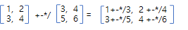
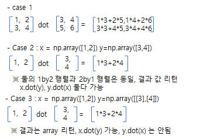
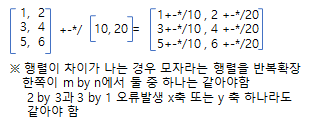

  
## Numpy 라이브러리 (데이터처리용)

Numarray와 Numeric이라는 오래된 Python 패키지를 계승해서 나온 수학 및 과
학 연산을 위한 파이썬 모듈 ( import numpy as np )

|구분|사용|설명|
|-|-|-|
|배열계산|x+y,x-y,x*y,x/y||
|행렬연산|x.dot(y), np.dot(x,y)||
|수학함수||np.sum(x) #모든요소합, np.sum(x,axis=0) #y축합, np.sum(x,axis=1) #x축합|
|브로드캐스팅|shape서로달라도 연산||