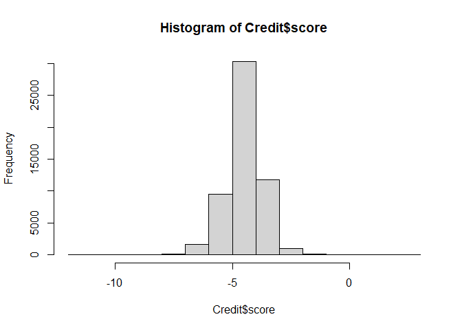
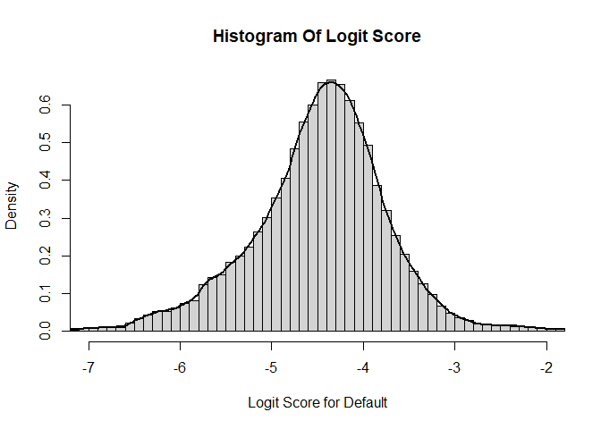
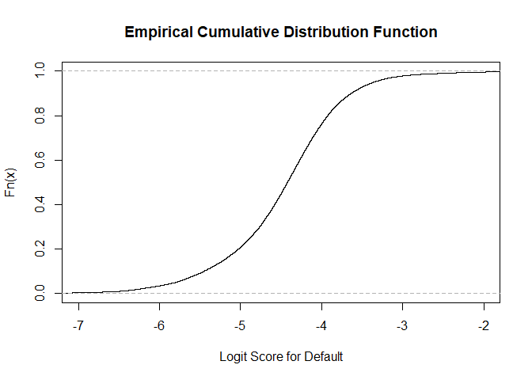

자료의 표현 및 Data Visualization

-   수량자료 (numeric 형 변수) : 도수분포:히스토그램,
    도수다각형(frequency polygon), 누적도수다각형(ogive),
    줄기-잎그림(stem-and-leaf), 상자-수염(box-and-whiskers)
-   범주형 자료(factor 형 변수) : 도수분포:막대그래프, 원그래프(pie
    chart)

## 도수분포표

``` r
gender=c('M','F','M','M','F','M','F','M','F')
Btype=c('B','A','O','AB','A','B','AB','A','B')
table(gender)
```

    ## gender
    ## F M 
    ## 4 5

``` r
table(gender, Btype)
```

    ##       Btype
    ## gender A AB B O
    ##      F 2  1 1 0
    ##      M 1  1 2 1

## 히스토그램

``` r
Credit = read.csv('C:/R_Study/u1s4Score.csv',h=T)
hist(Credit$score)
```

<!-- -->

``` r
# 좀더 부드럽게 하기 위해 200로 나누고 x 축을 줄인다.
hist(Credit$score, breaks=200, freq=FALSE, xlim=c(-7,-2),main="Histogram Of Logit Score", xlab="Logit Score for Default")

#막대그래프에 라인을 추가한다.
lines( density(Credit$score), lwd=2 )
```

<!-- -->

## 누적분포함수

``` r
plot(ecdf(Credit$score), xlim=c(-7,-2), main="Empirical Cumulative Distribution Function", xlab="Logit Score for Default")
```

<!-- -->

## 줄기잎그림

``` r
Stat = read.csv('C:/R_Study/StatScore.csv',h=T)

# 줄기단위 : 10단위, 잎단위 : 1단위
stem(Stat$기말고사)  
```

    ## 
    ##   The decimal point is 1 digit(s) to the right of the |
    ## 
    ##   0 | 000
    ##   1 | 
    ##   2 | 
    ##   3 | 
    ##   4 | 44777
    ##   5 | 0000003336666689999
    ##   6 | 222445555557778888888
    ##   7 | 00000113334444466666789999
    ##   8 | 000022558888
    ##   9 | 11

``` r
# 줄기단위 : 10단위, 잎단위 : 2단위
stem(Stat$기말고사, scale=2)
```

    ## 
    ##   The decimal point is 1 digit(s) to the right of the |
    ## 
    ##   0 | 000
    ##   0 | 
    ##   1 | 
    ##   1 | 
    ##   2 | 
    ##   2 | 
    ##   3 | 
    ##   3 | 
    ##   4 | 44
    ##   4 | 777
    ##   5 | 000000333
    ##   5 | 6666689999
    ##   6 | 22244
    ##   6 | 5555557778888888
    ##   7 | 000001133344444
    ##   7 | 66666789999
    ##   8 | 000022
    ##   8 | 558888
    ##   9 | 11

줄기 잎그림은 분포모향을 알수 있다.

-   대칭형분포(symmetric distribution) : 예) 종모양

-   이봉형분포(bimodal distribution) : 두개의 다른집단이 혼재

-   균일형 분포(uniform distribution)

-   편중된 분포(skewed distribution)

    -   왼쪽 꼬리분포(skewed to the left), 오른쪽 꼬리 분포(skewed to
        the right)
