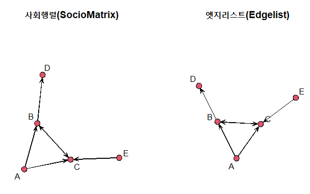

네트워크 표현형식은 아래와 같이 2가지로 표현이 가능하다.

<div style="display:inline-block;">
<table>
<caption>사회행렬(SocioMatrix)</caption>
    <tr><td></td><td>A</td><td>B</td><td>C</td></tr>
    <tr><td>A</td><td>0</td><td>1</td><td>1</td></tr>
    <tr><td>B</td><td>0</td><td>0</td><td>1</td></tr>
    <tr><td>C</td><td>0</td><td>1</td><td>0</td></tr>
</table>
</div>
<div style="display:inline-block;margin-left:20px;">
<table style="width:200px;">
<caption>인접행렬(adjacencyMatrix)</caption>
    <tr><td>from</td><td>to</td></tr>
    <tr><td>A-></td><td>B</td></tr>
    <tr><td>A-></td><td>C</td></tr>
    <tr><td>B-></td><td>C</td></tr>
    <tr><td>C-></td><td>B</td></tr>    
</table>
</div>

차이는 사회행렬을 엣지(인접)형태로 표현하게 되면 저장공간이 매우 효율화 된다.

### 네트워크 객체 정보
네트워크 자료형에서 노드와 엣지는 반드시 필요하지만, 추가적인 정보를 더 담을 수 있다.

|구성요소|설명|필수여부|
|-|-|-|
|노드|노드 혹은 Vertex라고 불리며 네트워크 노드를 구성|필수|
|엣지|엣지 혹은 링크, Tie라고 불리며 네트워크 연결을 담당|필수|
|노드 속성|노드 속성을 표현, 노드가 사람인 경우 성별 등|옵션|
|엣지 속성|엣지 속성을 표현, 엣지가 금융거래의 경우 거래금액 등|옵션|
|메타데이터|전체 네트워크에 대한 정보를 포함|옵션|

### 네트워크 객체 생성
* SocioMatrix
```{r}
> library(network)
> netmat1 <- rbind(c(0,1,1,0,0),
                 c(0,0,1,1,0),
                 c(0,1,0,0,0),
                 c(0,0,0,0,0),
                 c(0,0,1,0,0))
> rownames(netmat1) <- c("A","B","C","D","E")
> colnames(netmat1) <- c("A","B","C","D","E")
> net1 <- network(netmat1, matrix.type="adjacency")
> summary(net1)
```

* 엣지리스트
  * 엣지리스트의 경우 network.vertex.names(net2) <- c("A","B","C","D","E") 를 사용해서 라벨을 붙인다.
```{r}
> library(sna)
# 1로 세팅된 자표만 R bind 시킨다.
> netmat2 <- rbind(c(1,2),
                c(1,3),
                c(2,3),
                c(2,4),
                c(3,2),
                c(5,3))
> net2 <- network(netmat2,matrix.type="edgelist")
> network.vertex.names(net2) <- c("A","B","C","D","E")
> summary(net2)
```

### 시각화
```{r}
> par(mfrow=c(1,2))
> gplot(net1, vertex.col = 2, displaylabels = TRUE, main="사회행렬(SocioMatrix)")
> gplot(net2, vertex.col = 2, displaylabels = TRUE, main="엣지리스트(Edgelist)")
```

<center></center>


### 네트워크 노드 속성
```{r}
# net1에 노드에 대한 속성 gender 추가
> set.vertex.attribute(net1, "gender", c("F", "F", "M", "F", "M"))

# net1에 노드 내부에 degree() 속성을 추가 , 노드로 들어 오는 경로가 몇개인지 확인
> net1 %v% "alldeg" <- degree(net1)

# 노드에 대한 속성 확인
> list.vertex.attributes(net1)
```
```
  [1] "alldeg"       "gender"       "na"           "vertex.names"
```
※ set.vertex.attribute는 library(network) 에 있는 function을 사용


```{r}
# 추가된 gender 속성확인
> get.vertex.attribute(net1, "gender")
```
```
  [1] "F" "F" "M" "F" "M"
```

### 네트워크 엣지 속성

```{r}
> set.edge.attribute(net1,"rndval", runif(network.size(net1),0,1))
> list.edge.attributes(net1)
> summary(get.edge.attribute(net1,"rndval"))
```

  * 엣지속성은 SNS같은 네트워크를 표현할 때 자주 등장
  * SNS에서 좋아요(like)를 표현할때 요긴함
  * ignore.eval=FALSE, names.eval=“like” 인자로 표현하게 되면 네트워크 엣지에 0, 1 대신 실제 값(좋아요 갯수) 사용이 가능
  * 사용예시
  
    ```{r}
    > netval1 <- rbind(c(0,2,3,0,0),
                    c(0,0,3,1,0),
                    c(0,1,0,0,0),
                    c(0,0,0,0,0),
                    c(0,0,2,0,0))
    > netval1 <- network(netval1,matrix.type="adjacency", ignore.eval=FALSE,names.eval="like")
    > network.vertex.names(netval1) <- c("A","B","C","D","E")
    > list.edge.attributes(netval1)

    > summary(netval1)
    ```


