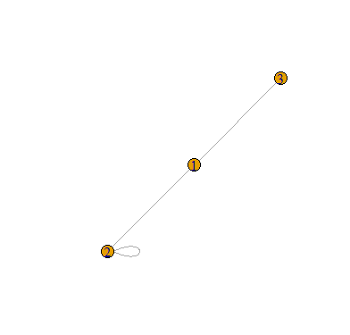
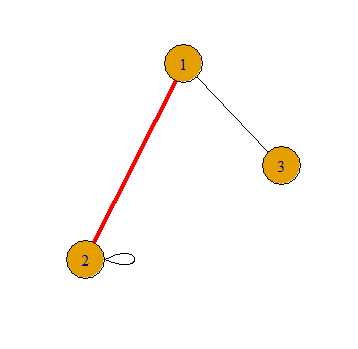
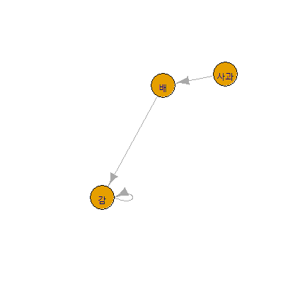
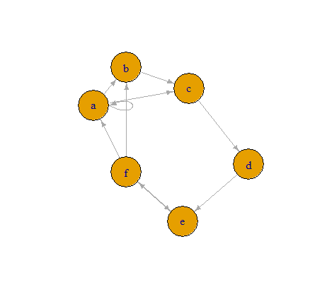

igraph 네트워크 객체로 표현하면 노드속성과 엣지속성을 표현하는데 장점이 많다.

### 네트워크 구성을 위한 Data 설명
* 네트워크 구성을 위한 데이터는 start와 end로 이루어진 **두개의 컬럼**을 가진 데이터 프레임으로 정의 하는 경우
  * graph_from_data_frame를 활용해서 네트워크 데이터로 변환
* 하나의 컬럼을 가진 벡터 데이터의 경우는 c(첫번째,두번째,두번째,세번째,세번째,네번째) 구성되어야 하며, 내부 꼭지점의 ID로 해석된다
  * 이 경우는  graph( edges=c(첫번째,두번째,두번째,세번째,세번째,네번째), n=3, directed=TRUE) 를 활용해서 네트워크 데이터로 변환
* **네트워크**에 사용된 노드들에서 유니크 한 값을 추출 하는 경우는 V()라는 함수로 찾아 볼수 있다. Ex: V(g1)

### 네트워크의 속성
네트워크를  구성한 다음은 네트워크가 어떤 특성을 가졌는지 분석해야 하고 이 경우 해당 **노드가 가지는 중요도을 수치화** 해야 한다.

1) Shortest.paths(g) , shortest_paths(g,from='사과',to='배') : 최적경로를 산출해준다.
2) degree (g), degree (g, mode='in'), degree (g, mode='out')
   * 해당노드가 몇개의 경로가 들어오는지 를 보여주는 수치이다.
   * mode 옵션으로 확인할 수 있다
3) eccentricity, diameter, radius
   * 3가지는 전부 노드간 거리와 관련된 지표이다.
   * eccentricity는 해당 노드가 자신 이외의 노드와의 거리 중 가장 큰값, 별도 옵션이 없으면 undirected가 기준이 되며, mode 옵션으로 들어오는 거리, 나가는 거리를 확인 할 수 있다.
4) Centrality
   * 노드별로 중요한 정도를 표시하는 척도로서 degree, betweeness, closeness가 있다.
   * betweeness : 노드가 엣지와 엣지 사이에 얼마나 많이 등장하는지를 나타내고 값이 클수록 두 노드 사이에 연관될 가능성이 높다.
   * closeness : 해당 노드에서 다른 노드들로 가기까지의 거리가 얼마나 되는를 나타내는 척도

### Plot에 적용되는 파리미터
Plot(g, layout=layout.fruchterman.reingold, vertex.size=8, edge.arrow.size=0.5,... )

1) layout 옵션 : layout.random, layout.cicle, layout.fruchterman.reingold, layout.kamada.kawai, layout.sprint, layout.lgl, layout.mds, layout.svd
   
2) 엣지관련
   
   |파라미터|의미|파라미터|의미|파라미터|의미|
   |-|-|-|-|-|-|
   |E(g).color|선색상|E(g).width|폭|E(g).arrow.size|화살크기|
   |E(g).arrow.width|화살폭|E(g).arrow.mode|화살 머리 유형|E(g).lty |선 유형.solid, dashed, dotted |
   |E(g).label.font |라벨폰트,serif, sans, mono |E(g).label.color |라벨색상|||

3) 노드관련
   
   |파라미터|의미|파라미터|의미|파라미터|의미|
   |-|-|-|-|-|-|
   |vertex.size|점크기|vertex.frame.color|점 윤곽의 색|vertex.label|점 레이블|
   |vertex.label.font|폰트|vertex.label.dis|점 중심과의 거리|vertex.label.color |점 레이블 색상|
   |vertex.color|점의 색 지정|vertex.shape|점의 형태|vertex.label.family|점 레이블 종류|
   |vertex.label.cex |점 레이블 크기 |vertex.label.gegree|점 레이블 방향|||  


### 네트워크 Visulalization Example

```{r}
#---------------------------------------------
# 기본생성, 필요라이브러리 : library(igraph)
#---------------------------------------------
> g1 <- graph( edges=c(1,2, 2,3, 3,1), n=3, directed=FALSE)
# plot(g1, vertex.size=5,vertex.label=V(g1)$name, vertex.label.cex=1.2, vertex.label.dist=2, vertex.label.color="black") - 라벨 노드 밖, 글자 사이즈 조절 하는 경우
# plot(g1, vertex.label=NA) - 라벨을 없앨 경우
> plot(g1)  
```
<center></center>

```{r}
# 예제1 - node 사이즈 ,엣지 등 다양한 스타일 조절
> g1 <- graph( edges=c(1,2, 2,2, 3,1), n=3, directed=FALSE)
> E(g1)$color = 'black'; E(g1)[1]$color = 'red'
> E(g1)$width = 1; E(g1)[1]$width = 4
> plot(g1, vertex.size=40)
```

<center></center>

```{r}
# 예제2 - 명칭으로 연결, directed = TRUE 화살표
> g1 <- graph( edges=c('사과','배','배','감', '감','감'), n=3, directed=TRUE)
> plot(g1, vertex.size=40)
> V(g1) # 유니크 값을 확인 해보려면
```
```{r}
# 예제2 과 동일한 결과 이다.

df = data.frame(start=c('사과','배','감'), end=c('배','감', '감') )
g2 = graph_from_data_frame(df)
plot(g2, vertex.size=40)
> V(g2)
```
<center></center>

```{r}
# 예제3 - 네트워크 속성확인
> g1 <- graph( edges=c('a','b','a','a','a','c', 'b','c','c','d','d','e','e','f','f','b','f','a','f','e' ),  directed=TRUE)
> plot(g1, vertex.size=40)  # plot(g1, vertex.size=40 , layout=layout.circle) 원 형태로 그리고자 할때

# Unique Node 확인
> V(g1)
# vertices(정점) 개수 확인
> vcount(g1)

# 최단경로 확인
> shortest.paths(g1)
> shortest_paths(g1, from='a', to='e')
# 노드로 들어 오는 경로가 몇개인지 확인
> degree(g1)  # degree(g1,mode='in') or degree(g1,mode='out')

# 자기자신 향햐는 엣지을 제외한 엣지의 수
> eccentricity(g1) # eccentricity(g1,mode='in') or eccentricity(g1,mode='out')

# degree: 노드의 엣지에서 전체노드수 -1 만큼 나눠서 계산
# betweeness : 노드가 엣지와 엣지 사이에 얼마나 많이 등장하는지
# closeness : 해당 노드가 다른 노드로 가기까지의 거리 , 각 노드의 근접 중심성( 또는 정규화된 근접 중심성)

data.frame( degree = degree(g1) / (length(names(V(g1))) -1), between=betweenness(g1), close=closeness(g1,normalized=F))
```

<center></center>
```
# V(g1) 결과
+ 6/6 vertices, named, from 50ebeac:
[1] a b c d e f

# vcount(g1) 결과
[1] 6

# 최단경로 결과
  a b c d e f
a 0 1 1 2 2 1
b 1 0 1 2 2 1
c 1 1 0 1 2 2
d 2 2 1 0 1 2
e 2 2 2 1 0 1
f 1 1 2 2 1 0

# a - > e 경로 확인 (방향성이 고려됨)
$vpath
$vpath[[1]]
+ 4/6 vertices, named, from dc4dad0:
[1] a c d e

# degree 의 결과
a b c d e f 
5 3 3 2 3 4 

# eccentricity 의 결과
a b c d e f 
2 2 2 2 2 2 

# degree, between, close 결과
  degree between      close
a    1.0     2.5 0.09090909
b    0.6     2.5 0.06666667
c    0.6     9.0 0.07142857
d    0.4     9.0 0.07692308
e    0.6    10.0 0.08333333
f    0.8    10.0 0.12500000
```

