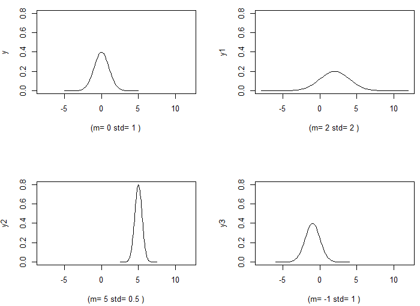

### 다양한 평균,분산에 따른 정규분포 비교
```{r}
> m = 0
> std = 1
> x <- seq((m-5*std),(m+5*std), length=101 )
# Y <- (1/sqrt(2*pi))*exp(-X^2/2) 정규분포 함수를 직접 활용해도 됨
> y <- dnorm(x,mean=m,sd=std)  
> m1 = 2
> std1 = 2
> x1 <- seq((m1-5*std1),(m1+5*std1), length=101 )
> y1 <- dnorm(x1,mean=m1,sd=std1)
> m2 = 5
> std2 = 0.5
> x2 <- seq((m2-5*std2),(m2+5*std2), length=101 )
> y2 <- dnorm(x2,mean=m2,sd=std2)
> m3 = -1
> std3 = 1.0
> x3 <- seq((m3-5*std3),(m3+5*std3), length=101 )
> y3 <- dnorm(x3,mean=m3,sd=std3)
> yli = c(min(y,y1,y2,y3), max(y,y1,y2,y3))
> xli = c(min(x,x1,x2,x3), max(x,x1,x2,x3))
> par(mfrow = c(2, 2))
> plot(x,y, type = "l" , xlim = xli, ylim = yli , xlab = paste("(m=",m,"std=",std,")") )
> plot(x1,y1, type = "l", xlim = xli , ylim = yli, xlab = paste("(m=",m1,"std=",std1,")") )
> plot(x2,y2, type = "l", xlim = xli, ylim = yli, xlab = paste("(m=",m2,"std=",std2,")") )
> plot(x3,y3, type = "l", xlim = xli , ylim = yli, xlab = paste("(m=",m3,"std=",std3,")") )
```
<center></center>

### 기본 Histogram에 정규분포를 겹쳐 그리기
```{r}
> library(rcompanion)
> x= c(rnorm(10000))
> plotNormalHistogram( x, prob = FALSE,
                      main = "히스토그램에 정규분포겹침",
                      col=rgb(0.9,0.9,0,0.5),
                      line = rgb(0,0,0.9,0.5),                      
                      length = 1000 )
```

<center></center>


### 정규분포표에 다양한 Shading
```{r}
> library(ggplot2)
> library(dplyr)

> mean.1 <-0
> sd.1 <- 1
> zstart <- 2
> zend <- 3
> zcritical <- 1.65

> my_col <- "#00998a"
> x <- seq(from = mean.1 - 3*sd.1, to = mean.1 + 3*sd.1, by = .01)
> MyDF <- data.frame(x = x, y = dnorm(x, mean = mean.1, sd = sd.1))
> shade_curve <- function(MyDF, zstart, zend, fill = "red", alpha = .5){
   geom_area(data = subset(MyDF, x >= mean.1 + zstart*sd.1
                           & x < mean.1 + zend*sd.1),
               aes(y=y), fill = fill, color = NA, alpha = alpha)
   }
> p1a <- ggplot(MyDF, aes(x = x, y = y)) + geom_line() +
   shade_curve(MyDF = MyDF, zstart = -1, zend = 1, fill = my_col, alpha = .3) +
   shade_curve(MyDF = MyDF, zstart = 1, zend = 2, fill = my_col, alpha = .5) +
   shade_curve(MyDF = MyDF, zstart = -2, zend = -1, fill = my_col, alpha = .5) +
   shade_curve(MyDF = MyDF, zstart = 2, zend = 6, fill = my_col, alpha = .7) +
   shade_curve(MyDF = MyDF, zstart = -3, zend = -2, fill = my_col, alpha = .7) +
   scale_x_continuous(breaks = -3:3) +
   scale_y_continuous(breaks = NULL) +
   theme_classic() +
   ylab("") + xlab("")
> p1a

> MyDF %>%
  mutate(y_cdf = cumsum(y)) -> MyDF

> MyDF %>%
  filter(x %in% c(-3, -2.58, -2, -1.65, -1, -.5, 0, .5, 1, 1.65, 2, 2.58, 3)) -> MyDF_filtered

> p1a + geom_text(data = MyDF_filtered,
                aes(x = x, y = y + .1, label = paste(round(y_cdf, 0),"%")),
                check_overlap = TRUE) +
  geom_segment(data = MyDF_filtered,
               aes(x = x, xend = x, y = 0, yend = y), linetype = "dashed")
```
<center></center>

### $P(X < 1010) = P( X \leq 1010 )$ 의 영역 표시하기

```{r}
> Mean <- 1000
> Sd <- 10

# X grid for non-standard normal distribution
> x <- seq(-3, 3, length = 100) * Sd + Mean 
> f <- dnorm(x, Mean, Sd)

> lb <- min(x) # Lower bound
> ub <- 1010   # Upper bound

> x2 <- seq(min(x), ub, length = 100) # New Grid
> y <- dnorm(x2, Mean, Sd) # Density

> plot(x, f, type = "l", lwd = 2, col = "red", ylab = "", xlab = "Weight")
> abline(v = ub) 

> polygon(c(lb, x2, ub), c(0, y, 0), col = rgb(0, 0, 0.5, alpha = 0.1))


# pnorm(1010, Mean, Sd) # 0.8413447 or 84.13% <=> 1 - pnorm(1010, Mean, Sd, lower.tail = FALSE) # Equivalent
> prs <- as.character(round( pnorm(1010, Mean, Sd) * 100, 2))  
> prs <- paste(prs,"%")
# text(x,y, 값)
> text(995, 0.01, prs) 

```

<center></center>


### 영역 표시 $P(X > 980) = P( X \geq 980 )$ 

```{r}
# 함수정의
# mean: mean of the Normal variable
# sd: standard deviation of the Normal variable
# lb: lower bound of the area
# ub: upper bound of the area
# acolor: color of the area
# ...: additional arguments to be passed to lines function

> normal_area <- function(mean = 0, sd = 1, lb, ub, acolor = "lightgray", ...) {
      x <- seq(mean - 3 * sd, mean + 3 * sd, length = 100) 
      
      if (missing(lb)) {
         lb <- min(x)
      }
      if (missing(ub)) {
         ub <- max(x)
      }

      x2 <- seq(lb, ub, length = 100)    
      plot(x, dnorm(x, mean, sd), type = "n", ylab = "")
      
      y <- dnorm(x2, mean, sd)
      polygon(c(lb, x2, ub), c(0, y, 0), col = acolor)
      lines(x, dnorm(x, mean, sd), type = "l", ...)
   }

> Mean = 1000; Sd = 10; lb = 980

> normal_area(mean = Mean, sd = Sd, lb = lb, acolor = rgb(0, 0, 1, alpha = 0.5))
> prs <- paste(as.character(round( pnorm(lb, Mean, Sd, lower.tail = FALSE) * 100, 2)),"%") 
> text(1000, 0.01, prs)

```
```
... 결과 생략
```

### 영역 표시 $P(X \leq 1000) - P( X \leq 990 )=P(X < 1000) - P( X < 990 )$  

```{r}

> Mean = 1000; Sd = 10; lb = 980; ub = 1000

> normal_area(mean = Mean, sd = Sd, lb = lb, ub=ub, acolor = rgb(0, 0, 1, alpha = 0.5))
> prs <- paste(as.character(round( (  pnorm(ub, Mean, Sd) - pnorm(lb, Mean, Sd) ) * 100, 2)),"%") 
> text(995, 0.01, prs, srt=90)

```
```
... 결과 생략
```

### 영역 표시 $P[ \bar{X} - Z_{\alpha/2} \times {\frac{\sigma}{\sqrt{(n)}}} \le \mu \le \bar{X} + Z_{\alpha/2} \times {\frac{\sigma}{\sqrt{(n)}}} ] = 1-\alpha$  

```{r}

> library(latex2exp)
> Mean = 0; Sd = 1; lb = -1.96; ub = +1.96
> normal_area(mean = Mean, sd = Sd, lb = lb, ub=ub, acolor = rgb(0, 0, 1, alpha = 0.05))
> prs <- paste(as.character(round( (  pnorm(ub, Mean, Sd) - pnorm(lb, Mean, Sd) ) * 100, 2)),"%")  
> text(0, 0.1, TeX("$1-\\alpha $"), srt=0)
> text(+2.5, 0.01, TeX("$\\alpha /2 $"), srt=0)
> text(+2.5, 0.01, TeX("$\\alpha /2 $"), srt=0)
> text(-1.96, -0.01, TeX("$z_{\\alpha /2} = -1.96 $"), srt=0)
> text( 1.96, -0.01, TeX("$z_{\\alpha /2} = +1.96 $"), srt=0)
```
```
... 결과 생략
```

### 누적정규분포 함수 ( pnorm )

```{r}
par(mfrow = c(1, 2))

# Grid of X-axis values
x <- seq(-4, 8, 0.1)

#-----------------------------------------
# Same standard deviation, different mean
#-----------------------------------------
# Mean 0, sd 1
> plot(x, pnorm(x, mean = 0, sd = 1), type = "l",
     ylim = c(0, 1), ylab = "", lwd = 2, col = "red")
# Mean 3, sd 1
> lines(x, pnorm(x, mean = 3, sd = 1), col = "blue", lty = 1, lwd = 2)

# Legend
> legend("topleft", legend = c("0 1", "3 1"), col = c("red", "blue"),
       title = expression(paste(mu, " ", sigma)),
       title.adj = 0.9, lty = 1, lwd = 2, box.lty = 0)

#-----------------------------------------
# Same mean, different standard deviation
#-----------------------------------------
# Mean 1, sd 1
> plot(x, pnorm(x, mean = 1, sd = 1), type = "l",
     ylim = c(0, 1), ylab = "", lwd = 2, col = "red")
# Mean 1, sd 0.5
> lines(x, pnorm(x, mean = 1, sd = 0.5), col = "blue", lty = 1, lwd = 2)

# Legend
> legend("topleft", legend = c("1 1", "1 0.5"), col = c("red", "blue"),
       title = expression(paste(mu, " ", sigma)),
       title.adj = 0.75, lty = 1, lwd = 2, box.lty = 0)

> par(mfrow = c(1, 1))
```

<center></center>


### 누적정규분포 함수 ( $P(X<0)=0.5$ )

```{r}

> x <- seq(-4, 4, 0.1)
> plot(x, pnorm(x, mean = 0, sd = 1), type = "l",
     ylim = c(0, 1), ylab = "P(X < x)", lwd = 2, col = "red")
> segments(0, 0, 0, 0.5, lwd = 2, lty = 2)
> segments(-4, 0.5, 0, 0.5, lwd = 2, lty = 2)

```

<center></center>


### 정규분포 함수 ( rnorm )
* 평균($\mu$)  과 분산($\sigma$) 를 가진 정규분포로 부터 n 개의 관측치를 생성하는 함수
* 사용법 : rnorm(n,mean=0,sd=1)

```{r}

> x <- seq(-10, 10, length = 200)
> set.seed(3)
# n = 100
> hist(rnorm(100, mean = 0, sd = 1), main = "n = 100",
     xlab = "", prob = TRUE)

# plotNormalHistogram(rnorm(100, mean = 0, sd = 1), main = "n = 100", prob = TRUE) 아래 2개와 동일함, 단 library(rcompanion) 사용해야함
> segments(-4, 0.5, 0, 0.5, lwd = 2, lty = 2)
> lines(x, dnorm(x), col = "red", lwd = 2) # 정규분포 함수

```


<center></center>