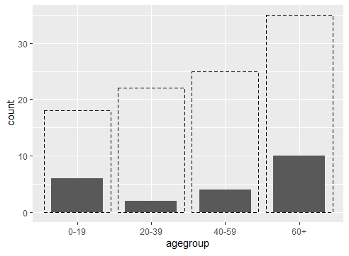

## ggplot
그래프를 그리기 위한 코드는 그래프 틀을 정해주는 ggplot 함수와 그래프 형태를 정해주는 함수가 추가로 붙게 되며, 레이어 추가방식 + 를 통해서 계속 지정이 가능하다.

```{r}
# stat : identity - y축의 높이을 데이터로 적용, 
ggplot(data=mydata, aes(x=ID, y=extra)) + geom_bar(stat='identity') + ...+ ...
#     ----  그래프  -----                         ----  그래프추가  -----

```

### ggplot  예제
```{r}
> library(ggplot2)
> library(data.table)

> age = sample(1:100,100,T)
> segment = sample(1:5,100,T)

> data = data.frame(age,segment)
> setDT(data)[age > 0 & age < 20, agegroup := "0-19"]

> data[age >19 & age <40, agegroup := "20-39"]
> data[age >39 & age <60, agegroup := "40-59"]
> data[age >59, agegroup := "60+"]

> ggplot() + geom_bar(data=data, aes(agegroup),fill = NA, color = "black", linetype = 2 ) + geom_bar(data=data[segment == 2,], aes(agegroup) , width=0.7)
```

<center></center>