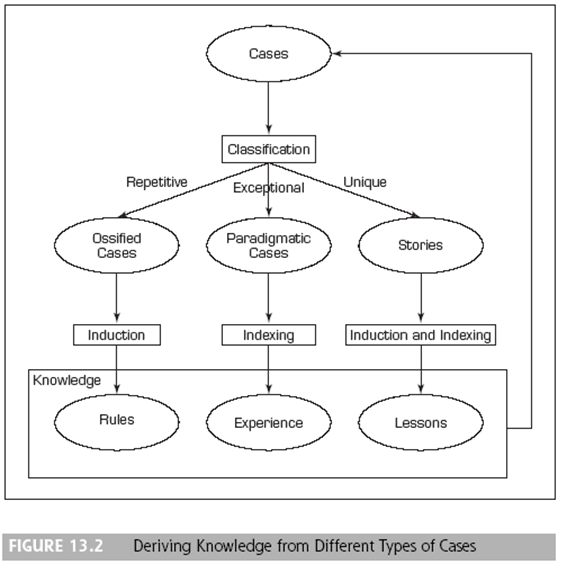
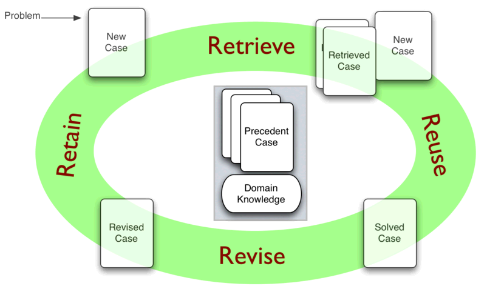

### 사례기반추론(Case-Based Reasoning, CBR)개념
* 과거의 사례들의 결과를 바탕으로 새로운 사례 결과를 예측하는 방법
* 굉장히 간단하지만, 유용성이 매우크다.
* 과거 사례들을 저장해 둔 사례 기반으로부터 해결하고자 하는 새로운 사례와 가장 유사한 사례를 검색한 후, 유사 사례의 해 결책을 바탕으로 당면한 문제의 해결책을 제안 하는 과정으로 진행

### 사례의 정의 및 개념
* Stories : 많은 정보와 에피소드를 가진 사례. 학습은 이러한 사례에서 부터 파생된다.
* CBR에서의 3가지 종류의 Case
  * 1 type: Case는 **많은 반복(A lot of repetitively)**에서 Rules이 형성
  * 2 type: Case는 **예외(Exceptional)**에서 Experience이 형성
  * 3 type: Case는 **고유(Unique)**에서 Lessons이 형성

### 사례기반 추론을 위해 문제 해결 방법

* 새로운 문제와 각 사례를 비교하고 가장 유사한 Case(사례)를 선택해야 한다.
* 이러한 비교를 위해서는 유사도(Similarity) 가장 중요한 개념이 된다.* 
* Step 1: 유사도의 측정
  * $Distance = \| Number1 - Number2  \|$
  * Ex) 10에서 4 또는 7 어떤것이 유사할까 ?
    * similarity between 7 and 10 = 7/10 = 0.7
    * similarity between 4 and 10 = 4/10 = 0.4 , 0.7 > 0.4 7이 더 유사하다고 할 수 있다
  * 하지만 , 색깔 등 Categorical의 유사도 측정에는 문제가 있다.
  * 그 외, 문장내 유사문장의 유사도 등에 사용된다.
  
* Step 2: 사례에 대해 서로 다는 중요도에 따라 가중치를 부여 한다.
* Setp 3: 각 Similarity와 가중치를 가지고 Case 에 대한 가중평균화한 Similarity를 계산한다
* Setp 4: 가중평균 Similarity와 유사한 사례를 가지고 문제를 해결한다.
* Setp 5: 해결된 사례의 솔루션은 재사용(Reuse) 하도록 한다.
* Setp 6: 진단이 정확하다면 사례를 새로운 경험을로 저장한다

### CBR Process

1) 검색(Retirve) : 대상 문제가 주어지면, 사례 데이터베이스에서 그것 을 풀기에 적절한 사례들을 검색한다
   
2) 재사용(Reuse) : 이전의 사례로부터 대상 문제의 해결 방법을 연결 한다
   
3) 수정(Revise) : 이전의 해결 방법을 대상의 상황에 연결시킨 후, 그 새로운 해결 방법을 실세계에서 테스트하고, 필요하다면 수정 한다
   
4) 유지(Retain) : 해법이 성공적으로 대상문제에 적용된 후에, 그 러한 새로운 경험이 사례 데이터 베이스에 새로운 사례로서 저장 된다

  

### CBR 특징
* 전통적 기법과 다른점은 기존의 일반화된 관계를 따라 연관 시키기 보다는, 이전에 경험한 구체적인 사례를 가지고 특정지식을 활용을 할 수 있다는 것이 차이점이다
* 장점
  * 지식습득이 개선된다
  * 시스템 개발시간이 빠르다
  * 존재하는 데이터와 지식이 배가된다.
  * 완벽한게 공식화된 지식이 필요하지 않는다.
  * 수치형 변수와 범주형 변수 모두가 사용 가능하다.
  * 복잡한 문제를 비교적 적은 정보로 의사결정, 문제해결이 가능 하다
  * 새로운 사례의 습득이 쉽다.
* 단점
  * 정확도가 떨어진다.
  * 사례저장공간 등이 필요하다
  * 일반화를 위한 학습과정과 해결이 동시에 일어나기 때문에 시간이 소요된다.

### CBR 사례
* SMART 고객지원 시스템, 사례기반(보험금지급사례와 보험통계 사례)으로 보험추천 시스템 등
* Call Center, 제조업의 진단 등