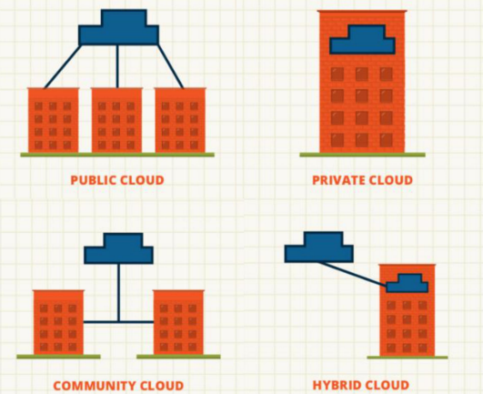

### 클라우드 컴퓨팅 분류

<table>
  <thead>
    <tr><th>Service Model</th><th>Deployment Model</th></tr>
  </thead>
  <tbody> 
    <tr>
      <td><b>클라우드 활용</b> InfraStructure as Service Platform as a Service Software as a Service <b>자체 구축</b> On Premise
      </td><td>Public Cloud Private Cloud Hybrid Cloud Community Cloud</td></tr>  
  </tbody>   
</table>

#### 1. Service Model 분류

<table>
  <thead>
    <tr><th>On Premises(자체, 전통적 방식)</th><th>IAAS(virtural machines)</th><th>SASS(Software as a Service)</th><th>PASS(app service)</th></tr>
  </thead>
  <tbody> 
    <tr>
      <td> * 자체 서버의 모든것을 구출하는 개념</td>
      <td>
        * IT 기본 자원만제공 
        * Sever, Storage, Network 
        * 새로 컴퓨터 하나 구매하는 개념 
        * 컴퓨터를 제공
      </td>
      <td>
        * 모든 기능이 동작하는 SW 제공 
        * 돈만 내면 모든것을 제공   
      </td>      
      <td>
        * Iaas에 Os, Middleware, runtime 추가 
        * 일반적인 개발자를 대상으로 함 
        * 코드 개발만을 해서 올릴 수 있는 상태 
      </td>           
    </tr>  
  </tbody>   
</table>

#### 2. Deployment Model 분류

<table>
  <thead>
    <tr><th>Public Cloud</th><th>Private Cloud</th><th>Hybrid Cloud</th></tr>
  </thead>
  <tbody> 
    <tr>
      <td> 
        * Cloud서비스를 필요하는 사람은 누구나 사용가능 
        * 누구나 사용한 만큼 비용만 지불하면 됨 
        * cloud사업자가 It자원을 서비스로 제공
      </td>
      <td>
        * 기업 및 기관 내부에서만 사용 가능한 cloud computing 환경을 구축 
        * 해당 기업/기관에 속하지 않은 사람은 사용 불가 
        * 구축 난이도 높지만, 보안/법적 규제 등의 이유로 사용
      </td>
      <td>
        * Pulbic/Private Cloud를 조합해서 사용하는 형태 
        * 보안이 중요한 시스템은 Private Cloud에, 그 외 시스템은 Public Cloud를 사용 가능 
        * Private Cloud를 주로 사용 하되 예상치 못한 수준의 트래픽이 몰리는 경우 Public Cloud로 확장 
        * 다양한 시나리오 존재하며 최근 기업들이 가장 관심
      </td>      
    </tr>  
  </tbody>   
</table>

### 클라우드 주요용어
* Data Center: 수많은 서버들을 한 데 모아 네트워크로 연결해놓은 시설
* Region: Data Center 위치한 지역, 리전의 선택은 서비스 성능에 영향을 주기 때문에 가까운 곳을 설정해야 함
* Availability Zone
  * Availability(가용성) : 시스템이 정상적으로 가동되는 상태
  * 가용영역이라고 하며 AZ라고 표시, AZ는 하나의 Data Center
  * 서비스를 단일 Data Center(AZ)에서만 운영하면 장애가 나는 경우 접속 불가 (여러 건물로 나누어 운영하자는 개념)
* Virtualization(가상화)
  * 가상화는 소프트웨어로 가상의 하드웨어 (VM - Virtual Machine)
  * Cloud 서비스스에 서버는 가상화된 서버를 할당 받음
  * 가상화 사용 이유는 하나의 물리공간에서 사용하게 되면 서로의 영역이 충돌 가능성이 있다.
  * 따라서 가상화를 통해 Mail, Web 등 각각을 서로 영향 받지 않고 사용할 수 있는 것이다.