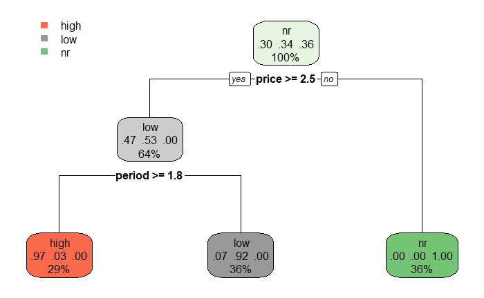

### A. 데이터 준비

|total|price|period|variety|response|
|--|--|--|--|--|
|5.1|1.4|0.2|3.5|nr|
|...|...|...|...|...|
|5.9|5.1|1.8|3|high|

* 전체 150개 데이터,  [파일첨부](../../images/2022-03-23-dt-case_1/sampledata.csv)
* response: 핸펀광고시 nr(무반응), low(반응저조), high(구매까지 이어짐), 
* total : 상품을 한번 구매시 지출금액
* price : 평균가격
* period : 구매간격 Mth

### B. 데이터 구분

``` r

result <- read.csv("sampledata.csv", header=TRUE)
View(result)

set.seed(1234) 
resultsplit <- sample(2, nrow(result), replace=TRUE, prob=c(0.7, 0.3))
trainD <- result[resultsplit==1,]  # 70% train Data 로 저장
testD <- result[resultsplit==2,]  # 30% test Data 로 저장
```

### C. 의사결정나무 형성

```{r}
trainModel <- rpart(response~. , data=trainD) # response 종속변수
```

### D. Fitting 값을 확인
**Training Data** 를 가지고 검증 해본다.
```{r}
table(predict(trainModel, newdata=trainD, type="class"), trainD$response) # Coverge 즉 설명에 대한 부분을 확인 해본다. 
```
```  
  ##       high  low  nr
  ## high    31    1   0
  ## low      3   37   0
  ## nr       0    0  40    
```
  
 위 예시 결과 에서 Fitting Ratio = (112-4) / 112 = 0.964 가 된다.

### E. Accuracy 값을 확인

**Test Data**를 가지고 검증해 본다

```{r}
    table(predict(trainModel, newdata=testD , type="class"), testD$response)
```
```  
  ##       high  low  nr
  ## high    14    0   0
  ## low      2   12   0
  ## nr       0    0  10    
```  
위 예시 결과 에서 Accuracy Ratio = (38-2) / 38 = 0.947 가 된다.

### F. 의사결정나무를 확인
```{r}
    print(trainModel)
    rpart.plot(trainModel)
```
```
  ## n= 112 

  ## node), split, n, loss, yval, (yprob)
  ##       * denotes terminal node

  ## 1) root 112 72  nr (0.3035714 0.3392857 0.3571429)  
  ##   2) price>=2.45 72 34  low (0.4722222 0.5277778 0.0000000)  
  ##     4) period>=1.75 32  1  high (0.9687500 0.0312500 0.0000000) *
  ##     5) period< 1.75 40  3  low (0.0750000 0.9250000 0.0000000) *
  ##   3) price< 2.45 40  0  nr (0.0000000 0.0000000 1.0000000) *
```
별표(*)로 표시되는 것이 leaf(terminal node) 이다

<!-- -->

1) (yprob) : ( high, low, nr ) 3개의 확률을 의미한다.
   
2) rule의 갯수는 3개 - leaf node의 갯수와 같다.
``` python   
   - rule 1 : price < 2.5
   - rule 2 : price >= 2.5 and period >=1.8
   - rule 3 : price >= 2.5 and period < 1.8
```
  
4) (yprob) : ( high, low, nr )를 rule에 따라 해석 해보면
``` python   
   - rule1 의 경우 rule1를  만족하는 것 중에서 nr확률이 1.00 (100%) 이다.
   - rule2 의 경우 rule2를  만족하는 것 중에서 high 확률이 0.07(7%), low확률이 0.92(92%) 이다
   - rule3 의 경우 rule3를  만족하는 것 중에서 high 확률이 0.97(97%), low 확률이 0.03(3%) 이다
```

5) node안의 숫자 상세설명
   
``` python
  - root node : 100% 는 전체 데이터에 해당
  - low node( 64% ) 
     - TrainD의 112개 중에서 72개가 price >= 2.5 해당 72/112 = 0.642
     - 72 개중 low는 38개 high는 34개 로, low 확률이 0.53(38/72) high 확률이 0.47(34/72),  nr은 0 이 된다.
  - high node( 29% ) 
     - TrainD의 72개 중(parent node)에서 period >= 1.8 해당 갯수는 32 개이다.
     - 이 32개 중에서 high 개수가 31개, 1개가 low 이기 때문에, 0.97(=31/32) high 확률, 0.03(=1/32) low 확률이 된다.
     - high node의 29%는 112개 중에서 rule2를 만족하는 32개의 확률 32/112 = 0.29 를 의미한다.
  - low node( 36% ) 
    - TrainD의 72개 중(parent node)에서 period < 1.8 해당 갯수는 40 개이다.
    - 이 40개 중에서  low 개수가 37개 high 개수가 3개로, low 확률은 0.92(37/40)  high 확률은 0.07(3/40) 이다.
    - 36%는 112개 중에서 rule3를 만족하는 개수 40개의 확률로 36%(40/112=0.357)를 의미한다.
  - nr node( 36% ) 
    - TrainD의 112개 중(parent node)에서 price < 2.5 해당 갯수는 40 개이다.
    - 이 40개 중에서  low 개수가 0개 high 개수가 0개로 nr 개수는 40개로, nr 확률이 100%(40/40)을 나타낸다
    - 36%는 112개 중에서 rule1을 만족하는 개수 40개의 확률로 36%(40/112=0.357)를 의미한다.
```