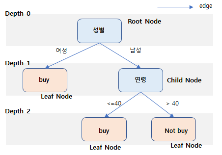
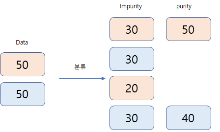
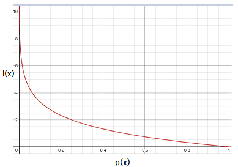
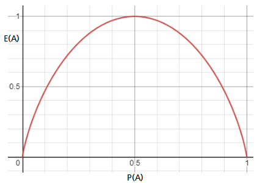

의사결정 나무는 간단하게 말해 if~else와 같이 특정 조건을 기준으로 O/X로 나누어 분류/회귀를 진행하는 tree 구조의 분류/회귀 데이터마이닝 기법이다.

여러가지 규칙을 순차적으로 적용하여 독립 변수 공간을 분류 하는 모형이다.

종속변수가 범주형일 경우 Decision Tree Classification으로 분류를 진행 하고, 종속변수가 연속형일 경우 Decision Tree Regression 으로 분류를 진행한다.

( * Classification & Regression 모두 사용하기 때문에 CART (Classification And Regression Tree) 라고 도 함)

## 1. Tree 구조의 이해
Tree를 구성하는 두가자 요소는 node 와 edge 이다.

* node
  * Parent node는 상대적인 개념으로 특정 노드의 바로 위 노드를 의미한다.
  * Child node는 Parent node와 반대되는 상대적 개념으로 특정 노드의 바로 아래 노드를 의미한다.
  * Root node는 상위노드가 없는 가장위에 존재하는 노드를 의미한다.
  * Leaf node(=Tip)는 Child 노드가 없는 가장 아래의 노드를 의미한다.
  * Internal node는 Leaf node 가 아닌 노드를 의미한다.

**※ Leaf Node의 경우 종속변수가 범주형이면 범주의 분류(=최빈값), 연속형이면 회귀(=평균)이 될 것이다.**

* edge
  * edge는 노드를 연렬시키는 다리역할을 한다. 이는 샘플을 분류하는 조건이 위치하는 곳이다.
  * node에는 변수가 위치하나 edge에는 조건이 위치한다는 것을 헷갈리지 말자.

* deapth
  * depth는 Root node에서 특정 노드까지 도달하기 위해 거쳐야하는 Edge의 수를 의미한다. (위 경우 Depth = 2 )
  

## 2. 분기기준(Splitting Criterion)

* 분기의 기준이란, 독립변수를 이용하여 어떻게 범주를 설정하는 것이 종속변수 구분이 잘 되는지의 결정 기준이다
* 이때 종속변수 구분이 잘되는 정도를 순수도(purity) 또는 비순수도 (impurity)라는 지표를 산정하여 적용한다.

왼쪽보다 오른쪽으로 분류되는 기준이 순수도가 높다고 할 수 있다.
이러한 순수도를 나타내는 지표는  모두 분기기준으로 적용할 수 있는다.

|분기기준 사용지표| 내용 |
|-|-|
|카이제곱 통계량의 p값|분석대상 자료의 검정통계량 χ2 의 유의확률 P값이 가장 작은 독립변수와 이에 따른 최적 분리로 Child Node 구성|
|지니지수(Gini Index)|데이터의 비순수도를 나타내는 지니지수를 측정하여 이를 감소시켜 주는 독립변수와 이에 따른 최적 분리로 Child Node로 구성됨|
|엔트로피 지수(Entropy Index)|비순수도를 나타내는 지표로서 이를 감소시켜주는 독립변수와 이에 따른 최적분리로 Child 노드를 구성함|
|ANOVA Table의 F 통계량 p값|ANOVA Table의 F 통계량에 대한 유의확률 p값이 가장 작은 독립변수와 이에 따른 최적 분리로 Child 노드를 구성|
|분산의 감소량(Variance Reduction)|종속변수의 실측치와 모형에 의한 추정치와의 오차를 최소화하는 기준과 같이, 분산을 최소화하는 독립변수와 이에 따른 최적 분리로 Child Node 구성|

<blockquote style="margin-left:20px;">
<h3> ※ 분기기준 중에서 엔트로피 상세설명 </h3>
* Entropy란 ? 불순도의 측정 지표로서, 정보량의 기대값이다. 
* 수식으로 표현하면.
  

$$Entropy(S)  =  \sum_{i=1}^{c} p_i \times I(x_i) \quad$$
$S$:이미발생한 사건의 모음, $c$:사건의 개수,  $I(x)$(정보량) $=  \log_{2} \frac{1}{p(x)}$ , $p(x)$ : 사건 $x$가 발생할 확률
 
정보량을 그래프로 나타내 보면...

위 그림은 사건 발생확률 P(x)가 증가할 수록, 정보량은 0에 수렴한다는 의미 즉 <b>많이 발생하는 사건은 정보가 많지 않다고 해석</b>이 된다.
 

$Entropy(S)$를 다시 표현하면, $Entropy(S)  = - \sum_{i=1}^{c} p_i \times \log_{2} \ p(x_i) \quad$ 이 된다.
 
특정 영역 A에 대한 엔트로피 는 $Entropy(A)  = - P_A \log_{2} \ P_A - (1-P_A) \log_{2} \ (1-P_A)$
이며 
 
그래프로 그려보면 ....

 
즉 이는  p = 0 -> Entropy는 0, p = 1 -> Entropy는 0 , p = 0.5 -> Entropy는 1 을 의미한다.
즉 모두 A의 범위거나, A의 범위가 아니면 Entropy는 0이 되며, 섞여 있는 경우가 Entropy 가 커지며, 분류가 어렵다는 것을 의미하게 된다.

</blockquote>

## 4. Information Gain (변수의 중요도 선택지표)
Information Gain은 의사결정나무에서 변수의 중요도를 선택하는 지표로서, Entropy가 낮추는 방향으로 의사결정나무가 형성될때 각 변수의 Information Gain이 계산된다.
$$Information Gain = Entropy_{before}-Entropy_{after}$$

before는 상위노드이고, after는 하위 분류된 node들의 Entropy의 가중평균이며 Information Gain이 높은 노드가 상위노드로 위치하게 되며, Entropy가 낮추는 방향으로 Decision Tree가 형성된다.

## 5. 모델학습

의사결정나무의 학습과정은 입력변수 영역을 두개로 구분하는 재귀적분기(recursive partitioning)와 너무 깊은 Depth를 통합하는 가지치기(pruning) 두가지 과정으로 나누게 된다.

* 재귀적분기 (recursive partitioning)
  
  * 재귀적 분기란 예를 들어 첫번째 레코드, 나머지와의 분기전 Entropy , 분기후 Entropy를 계산한 뒤 Information Gain을 알아본다. 
  * 그리고 계속 순차 반복한다.
  * 모든 경우의 수 가운데 정보획득이 가장 큰 변수와 그 지점을 택하여 첫번째 분기를 하게 된다.
  * 이후 똑같은 작업을 계속해 나가는 것이 바로 의사결정나무의 학습니다.

* 가지치기 (pruning)
  * 모든 leaf node의 순도가 100%인 상태를 Full Tree라고 하는데, Full Tree를 생성한 뒤 적절한 수준에서 leaf node를 결합 해주어야 과적합이 발생하지 않는다.
  * 가치치기를  위해서는 가치치기의 비용함수(cost function)이 최소화 하는 분기를 찾도록 학습하게 된다.
  * 가지치기 비용함수 소개
  $$ CC(T) = Err(T) + \alpha \times L(T)$$

  $CC(T)$ : Tree의 비용 복잡도

  $Err(T)$ : 오류분류율(불순도)

  $L(T)$ : terminal node수 (복잡도 ,CP=Complexity Parameter)

  $\alpha$ : $Err(T)$ 와 $L(T)$를 결합하는 가중치
  
  $\alpha$ 값으로 트리의 복잡도를 조정하게 되며, 커지게 되면 $L(T)$ 가중치가 높아지기 때문에 $L(T)$ 가 조금만 많아져도 비용함수가 커지기 때문에 leaf node를 많이 쳐 버리게 된다.

## 6. 의사결정트리 한계
* 계산의 복잡성 대비 높은 예측성능을 내는 것으로 정평이 나있음.
* 데이터 축이 수직이기 때문에 특정 데이터에서 잘 작동할 가능성이 높다.
* 이 단점을 Cover 하기 위해 나온것이 랜덤 포레스트 기법
