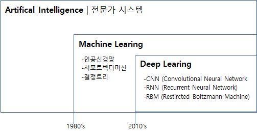
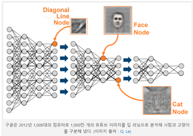

### 이해

* 인공신경망이 발전형태로서, 음성 인식, 이미지 식별 또는 예측 등 사람의 작업을 대신 수행하도록 컴퓨터를 학습시키는 일종의 머신 러닝 기술
* 데이터가 사전 정의된 방식을 통해 실행되도록 구성하는 다른 기술과 달리, 딥러닝은 데이터에 대한 기본 파라미터를 설정하고 컴퓨터가 여러 처리 계층을 이용해 패턴을 인식함으로써 스스로 학습하도록 훈련시키는 기술
* 여러 비선형 변환기법의 조합을 통해 높은 수준의 추상화(abstractions, 다량의 데이터나 복잡한 자료들 속에서 핵심적인 내용 또는 기능을 요약하는 작업)를 시도하는 기계 학습 알고리즘의 집합으로 정의
* 큰 틀에서 사람의 사고방식을 컴퓨터에게 가르치는 기계학습의 한 분야 

### 알고리즘
* 어떠한 데이터가 있을 때 이를 컴퓨터가 알아 들을 수 있는 형태(예를 들어 이미지의 경우는 픽셀정보를 열벡터로 표현하는 등)로 표현(representation)하고 이를 학습에 적용하기 위해 많은 연구(어떻게 하면 더 좋은 표현기법을 만들고 또 어떻게 이것들을 학습할 모델을 만들지에 대한)가 진행

* 비지도 학습방법을 기반으로 한 방법 (예: Deep Belief Network, Deep Auto-encoder)
* 컨볼루셔널 뉴럴 네트워크의 다양한 변형들
* 시계열 데이터를 위한 리커런트 뉴럴 네트워크(RNN; Recurrent Neural Network)와 게이트 유닛들 (예: Long-Short Term Memory(LSTM))

### Deep Neural Networks
* 많은 Layer 구조가 핵심이다.
  

### 활용사례
* IBM 와슨 - 암진단 및 치료법 조언, DNA 분석을 통해 질병 예측 및 맞춤형 치료, 자동차는 바퀴달린 인공지능
* 로버어드바이저(Kensho 애널 업무를 수분내 처리), Fin Tech, 가상비서, 번역, 기사, 소설 , 추상화 그림

### 