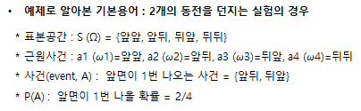

### 확률의 기본개념

* 확률이란 ?
  * 여러 가지 가능한 결과 중 하나가 일어나는 실험에서, 일부가 일어날 가능성을 0과 1 사이의 값으로 나타낸 것
    * Ex) 동전을 10번 던져서 앞면이 5번 나올 확률 등

* 기본용어
  
  <table>
  <thead><tr><th>구분</th><th>내용</th><th>예시</th></tr></thead>
  <tbody>
  <tr><td>표본공간(sample space, S 또는 Ω)</td><td>실험에서 일어날 수 있는 모든 결과들의 집합</td><td rowspan=4></td></tr>
  <tr><td>근원사건<br>(elementary event, a 또는 ω)</td><td>실험에서 일어날 수 있는 개개의 결과</td></tr>
  <tr><td>사건(event, A)</td><td>근원사건으로 구성된 표본공간의 부분집합</td></tr>
  <tr><td>P(A)</td><td>사건 A가 발생할 확률</td></tr>  
  </tbody>
  </table>  

* 확률의 해석
  
    ``` {python}
    * 해석1 : 근원사건에 동일한 확률을 부여
        - 주사위 던졌을 경우 1의 눈이 나올 확률은 1/6
    * 해석2 : 실험을 반복할 때 사건 A가 발생하는 상대도수 극한값
        - 동전을 던질 때 앞면이 나올 확률은 1/2 
    * 해석3 : 사건 A가 일어날 가능성에 대한 믿음을 수치화한 것
        - 10년 이내에 통일이 될 확률

    -> 확률은 이 모든 의미를 다 포함하고 있음
    ``` 
  
### 확률의 연산

  |구분|내용|
  |-|-|
  |상호배반사건(mutually exclusive events) $A \cap B$ = 공사건|사건 A와 B가 동시에 일어날 수 없는 사건|
  |합사건(union) $A \cup B$|사건 A와 B 중 어느 하나만 일어나도 포함되는 사건|
  |곱사건(intersection) $A \cap B$|사건 A와 B 모두 일어나야 하는 사건|  
  |여사건(complement) $A^{c}$|표본공간 S의 원소 중에서 어떤 사건 A에 포함되지 않은 원소로 구성된 사건|

  
### 확률의 공리
  
   1. 모든 사건 A에 대하여, $0 \le P(A) \le 1$
   2. $P(S) = P(\Omega)=1$
   3. 사건 $A_{1},A_{2}, ....$가 서로 배반일 때 (무한 배반 사건열)
      $$ P\left ( \bigcup_{i=1}^{∞} A_i \right ) = \sum_{i=1}^{∞} P(A_i) $$


### 확률의 Counting 방법
  
* 기본 Counting
  
  |구분|내용|
  |-|-|
  |곱의 법칙 (Multiplication Law)|전체 실험이 두 개 이상으로 나누어지고 서로 영향을 받지 않는다면 곱하기로 경우의 수를 계산한다.<br>주사위를 던지고 동전을 던지는 경우: 6 × 2 = 12 (가지)|
  |순열 (Permutation)$_nP_k$|n 개 중에서 k 개를 뽑아 순서있게 나열하는 경우의 수<br>$n(n-1)(n-2)...(n-k+1)=n!/(n-k)!$|
  |조합 (Combination)$_nC_k$|사건 A와 B 모두 일어나야 하는 사건<br>$_nC_k=_nP_k / k! = n!/((n-k)!k!)$|

  
  * Ex1) 50명 학생 과목에서 생일이 최소한 2명이상 같을 확률은? $$1-_{365}P_{50} / 365^{50}=0.97$$

    ``` {R}
    # R에서는 choose() 함수 와 factorial() 함수사용
    > 1 - choose(365,50) * factorial(50) / (365^50)
    [1] 0.9703736
    ```
     
  * Ex2) $(x+y)^{10}$의 $x^{2}y^{8}$ 계수는 얼마인가? 10개의 $(x+y)$항에서 2개를 뽑는 것으로 $$_{10}C_{2} = 45$$
  
    ``` {R}
    > choose(10,2)
    [1] 45
    ```
    
* 이항정리
  * $(x+y)^n$은 다음과 같이 전개된다
    $$ (x+y)^{n} = \sum_{r=1}^{n} {_n}C_r x^{r}(y)^{n-r}  $$

  * 만일 x=p, y=1-p로 설정하면 다음과 같다 ( → 이항분포의 기본형)
    $$ (p+1-p)^{n} = 1 = \sum_{r=1}^{n} {_n}C_r p^{r}(1-p)^{n-r}  $$

