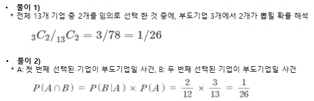
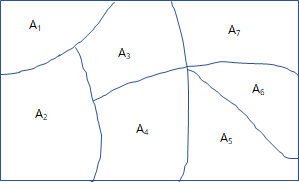
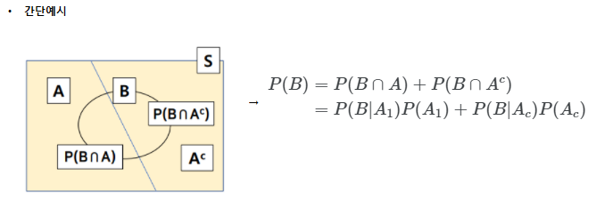

### 조건부 확률

* 사건 B가 발생했다는 조건 아래 사건 A가 발생할 확률
* 사건 B 안에서 A가 차지하는 비율 즉, **표본공간을 B로 한정하고, 그 안에서 사건 A가 발생할 확률**
* $P(A\|B)$ 라 표기하고 다음과 같이 정의 한다.
  
    $$P(A\|B) = \frac{P(A \cap B)} {P(B)}$$

  ※ 확률의 곱셈법칙 $P(A \cap B) = P(A\|B) \times P(B)$

예제) 3개의 부도기업과 10개의 정상기업이 있는 상황에서 임의로 2개 기업을 선택하였을 경우 선택된 2개 기업 모두가 부도기업일 확률은 얼마인가?
  
  

### 표본공간의 분할

* 유한 사건열 $A_{1},A_{2}, ... , A_{k}$이 다음 조건을 만족하는 경우 표본공간 S의 분할이라고 한다.
  * 조건 1) $A_{1},A_{2}, ... , A_{k}$ 은 유한 배반 사건열
  * 조건 2) $A_{1} \cup A_{2} \cup  ... \cup  A_{k}=S$
  
  

### 전확률 공식 ( 전체확률법칙 )
* 유한 사건열 $A_{1},A_{2}, ... , A_{k}$가 표본공간의 S의 분할이라고 할때, 
* 임의의 사건 B에 대해
  
  $$\begin{align} P(B) & = P(B \cap A_{1})+P(B \cap A_{2})+ ... + P(B \cap A_{k}) \\
    & = P(B \vert A_{1})P(A_{1}) + P(B \vert A_{2})P(A_{2}) + ... + P(B \vert A_{k})P(A_{k}) \\
    & = \sum P(B \vert A_{i})P(A_{i})  \end{align} $$

  

    

