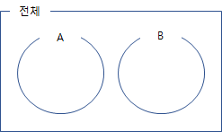
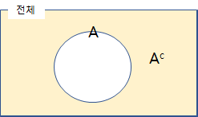

###  **덧셈정리 개요**

확률의 덧셈정리라고 하면, 확률의 합사건  $P(A \cup B)$ 를 구한는 것이다. 즉 **사건A**와 또는 **사건B** 가 발생할 수 있는 경우를 말한다.

즉, 확률의 덧셈 정리는
$P(A \cup B) = P(A)+P(B)-P(A \cap B)$ 로 표현이 된다.

### **배반사건의 개념**

배반사건이라 하면 **서로의 공통분모가 하나도 없는 상태**를 이야기 한다.
이를 그림으로 나타내 보면, 

$P(A \cap B) = 0$  이 성립하고, 두사건 A와 B는 상호 배반적이다 라고 한다.
 
( * 이것은 독립사건과 개념이 다른 것임에 유의 해야 한다. )

따라서 A와 B가 서로 배반사건이면, 확률의 덧셈정리는 $P(A \cup B) = P(A)+P(B)$ 라 적을 수 있다.

### 배반과 여사건
여사건이라 하면 어떤 사건 $A$가 존재 할때, A가 일어나 않는 사건을 여사건이라고 하고 $A^c$ 라고 표시한다. 
이를 그림으로 표현하면

즉 $A$ 와 $A^c$ 는 상호 배반이다.
따라서 $P(A \cup A^c) = P(A)+P(A^c)$ 로 적을수 있고 이는 
$1 = P(A)+P(A^c)$  이 되고 다음이 성립하게 된다.

$$ P(A^c) = 1 -  P(A)$$

