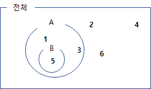

###  **곱셈정리 개요**

확률의 곱셈정리라고 하면, 확률의 곱사건  $P(A \cap B)$ 를 구한는 것이다. 즉 **사건A**와 동시에**사건B** 가 발생할 수 있는 경우를 말한다.
이를 다른 형태로 표현하면

사건 A먼저 일어난 경우 $P(A \cap B)=P(A)P(B|A)$로 표현할 수 있고 
사건 B먼저 일어난 경우 $P(A \cap B) = P(B)P(A|B)$로 표현할 수 있다.

즉, 확률의 곱셈 정리는
$$
P(A \cap B) = P(A)P(B|A) = P(B)P(A|B) \quad P(A)>0,P(B)>0
$$

로 표현이 된다.

### **독립사건과 종속사건의 개념**

쉽게 표현하면 사건A가 사건B의 확률에 영향을 미치지 않을때 (사건 A가 먼저 일어나고 사건 B의 확률과, 사건 A일어나지 않과 사건 B의 확률이 동일 할때)를 독립사건이라 한다.

이는 배반사건과는 다른 개념이다. 배반사건은 $A \cap B = 0$ 즉 사건A와 B의 교집합이 없으면 된다
따라서 이 둘은 동시에 일어 날 수 없다는 의미이다. $P(A \cap B) = 0$ 이 된다.

여기서 독립사건 - 영향을 미치지 않는다(동시에 일어 날수도 있다) vs 배반사건 - 동시에 일어날 수 없는 사건이다 라고 구분하는 것이 좋겠다.

예를 들어 주사위 1개를 굴려 2의 배수가 나올 확률 P(A), 3의 배수가 나올 확률을 P(B)라고 할때,

위의 벤다이어 그램으로 나타날 수 있고

$P(A) = \frac3  6 이고, P(B) = \frac2  6 = \frac1  3, P(A \cap B) = \frac1 6$
6 이기 때문에, $P(A) \times P(B) = P(A \cap B)$

가 성립된다. 
이것은 2의 배수가 나왔다고 해서 3의 배수가 나올 확률에 어떠한 영향도 미치지 않는 사건이라 볼 수 있고 즉 **독립사건** 이라고 할 수있다

오히려 배반사건의 경우 P(A)가 일어나면, P(B)가 일어날수 없기때문에 강한 영향을 미친다고 할 수있다.

결국 독립인경우 사건A가 일어나던, 일어나지 않던 사건 B가 일어날 확률이 동일 하다는 것은
$
P( B|A ) = \frac {P(A \cap B)}{P(A)} , P(B|A^c) = \frac {P(A^c \cap B)}{P(A^c)} = \frac {P(B)-P(A \cap B)}{1- P(A)}$ 두식이   같으려면 , $P(A) \times P(B) = P(A \cap B)$ 이다

정리하자면, 
독립사건일때, $P(A \cap B)= P(A) \times P(B)$ 단, $P(A)>0,P(B)>0$

종속사건일때, $P(A \cap B) = P(A)P(B|A) = P(B)P(A|B)$

이러한 차이가 있는 것이다.

### **시행의 독립과 사건의 독립**

이 둘의 개념은 차이가 있다.
사건의 독립이라는 것은 두 부분집합 A, B 사건 두개가 독립 이라는 의미지만, 시행이라는 것은 시행에 따라 표본이 변형이 발생 할 수 있기 때문에 독립시행이라는 것은 시행을 하더라도 표본의 변형이 일어나지 않는 경우를 말한다.

즉, 시행이후 표본이 변형되지 않는 복원추출, 주사위 반복 던지기 이러한 행위들이 대표적인 독립시행이 되는 것이다.
독립시행에 대한 확률은 아래와 같이 표시할 수 있다.

$$
P(A \times B) = P(A) \times P(B) 
$$

즉 두 시행의 확률은 곱의 확률과 교집합의 확률은 다르다는 것을 알아야 할 것이다.

아래의 예시를 보면 좀 더 이해가 쉬울 것이다.

주사위를 던졌을때 홀수가 나온는 사건을 A, 5의 배수가 나오는 사건을 B 라고 했을때

$P(A \cap B) = \frac{1} {6} , P(A) = \frac{3} {6} , P(B) = \frac{1} {6}  , P(A) \times P(B) = \frac{1} {12}$, 즉 $P(A \cap B) \not = { P(A) \times P(B) }$

사건 A와 사건 B는 독립사건이 아니다. 하지만 두 시행에 독립시행이며, 이에 대한 확률은 

$P(A \times B) = P(A) \times P(B) = \frac{1} {12}$로 구할 수 있다.

