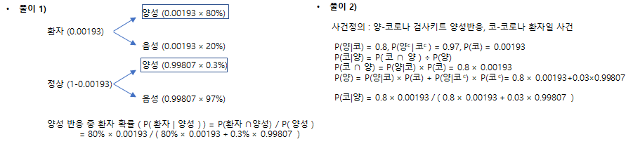
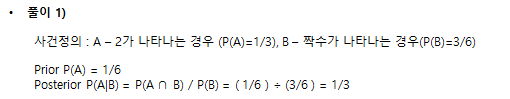

두 확률 변수의 사전 확률과 사후 확률 사이의 관계를 나타내는 정리다

### 베이즈 정리

* 유한 사건열 $A_{1},A_{2}, ... , A_{k}$ 가 표본공간 S의 분할이라 할 때,
* 임의의 사건 B에 대하여
  
  $$\begin{align} P(A_{j} \vert B) & = \frac {P(A_{j} \cap B)} {P(B)} \\
                    & = \frac { {P( B \vert A_{j})} {P(A_{j})} } {  \sum_{i=1}^{k} {P( B \vert A_{i})} {P(A_{i})} } \end{align}$$

    <pre>예제) 최근에 개발된 코로나 자가 검사키트는, 코로나 환자에게 적용하면 
         80%가 양성 반응을 나타나는 것으로 확인되었으며(민감도), 정상인에게는
         97%가 음성반응이 나타나는 것으로 확인되었다 
        (특이도). 2022년 2월 기준으로 코로나 환자는 인구 10만명 당 193명이 
        발병한 것으로 보고되어 있다. 

        어떤 사람이 새롭게 개발된 코로나 자가 검사키트에서 양성 반응이 나타났다면, 
        이 사람이 실제 코로나 환자일 확률(양성예측도)은 얼마인가?
    </pre>

    

### 사전확률과 사후확률

* 사전확률
  * 아무런 정보가 없는 처음 상태에서 사건 A가 발생할 확률을 사전확률
  * Prior라고 하고 $P(A)$,

* 사후확률
  * 사건 B가 발생했다는 조건 아래서 사건 A가 발생할 조건부 확률을 사후확률 
  * Posterior 하고 $P(A \| B)$,  
  
    <pre>
      예제) 주사위를 던지는 실험에서 2의 눈이 나타날 확률 (Prior)
              과 실험 결과가 짝수의 눈이 나왔다는 조건 아래서 2의 눈
              이 나타날 확률 (Posterior)은 어떻게 다른가?
    </pre>  

    