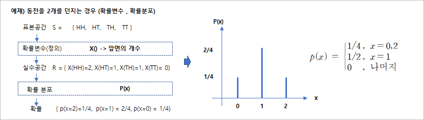
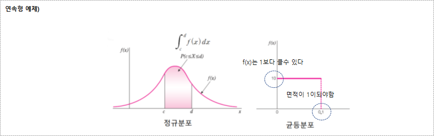
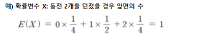
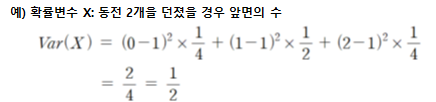

추측 통계학을 연결하는 중간적인 개념으로 확률 변수가 발생한다.

### 확률변수

* 사건(표본공간)에 수치를 부여하는 규칙을 가진 함수(X,Y,Z)-대문자로 표기하고, 소문자는 확률 변수의 값
* 함수의 형태이지만 확률변수(random variable)이라고 부르게 된다.
  * 확률공간에서 실수의 공간으로 가게 되는 함수가 정확한 표현
* 종류는 이산형확률변수(discrete random variable)과 연속형 확률변수(continuous random variable)로 나눌 수 있다

### 확률분포

* 확률변수에 확률을 할당하는 함수, 즉 **확률변수가 특정값을 가질 확률을 나타내는 함수**

* 이산형 확률 분포(discrete probablity distribution)
  * 이산형 확률변수에 확률을 할당하는 함수
  * 확률질량함수(probability mass function, pmf), 𝒑(𝒙) , 확률함수
  * 한점 한점에 대해 확률이 부여되기 때문에 다소 어렵게 된다.
  * 확률질량함수, pmf(확률함수,pf)의 조건
    * 조건1)  $\le p(x_i) \le 1 , i = 1,2,...,r$
    * 조건2)  $p(x) = 0 , 나머지 (x \ne x_i)$
    * 조건3)  $\sum_{i=1}^{r} p(x_i)=1$

* 연속형 확률분포(continuous probability distribution)
  * 연속형 확률변수에 확률을 할당하는 함수
  * 확률밀도함수(probability density function, pdf), 𝒇(𝒙)
  * 한점의 확률은 0 이기 때문에 구간의 개념으로 확률을 부여하게 된다.
  * 확률밀도함수, pdf 의 조건
    * 조건1)  $f(x) \gt 0, -∞ \le x \le ∞$ ※ 1보다 클수도 있다
    * 조건2)  $\int_{-∞}^{∞}f(x)dx = 1$
    * 조건3)  $임의의수 c,d에 대하여, p(c \le X \le d)=\int_{c}^{d}f(x)dx$

### 누적분포함수

* 누적분포함수(cumulative distribution function, cdf)
  * $F(x) = P(X \le x)$
* 누적분포함수, F(x) 의 특징
  * 특징1) $F(x)$는 비감소함수 (non-decreasing function)
  * 특징2) $F(-∞)=0$
  * 특징3) $F(∞)=1$
  

### 이산형 확률변수의 요약

* 기대값
  * 기대값(Expected Value): 확률변수의 평균
  * 어떤 실험을 동일한 조건에서 무수히 반복했을 때 얻을 수 있는 평균값(long-run average of repeated observations)
  * $E(x)$ 또는 $\mu$로 표기 (모평균의 개념)
  * $E(x) = \sum_{i=1}^{r}x_{i}p(x_{i})$
  
    

* 분산
  * 분산(Variance): 확률변수의 산포도를 나타내는 수치
  * 𝑽𝒂𝒓(𝑿) 또는 𝝈𝟐 로 표기 (모분산의 개념)
  * 편차제곱의 평균값
  * $Var(X)=\sum_{i=1}^{r}(x_i-\mu)^2p(x_i) = E[(X-\mu)^2]$

    

