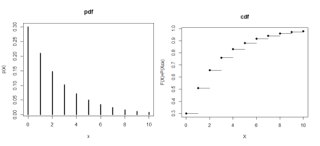

### 베르누이 분포

* 베르누이 시행
* 다음과 같은 시행(실험)을 베르누이 시행(Bernoulli trial)이라고 한다
  * 시행 결과가 두 가지 (성공, 실패) 중 하나인 경우
  * 각 시행에서 성공의 확률은 (항상 일정한) p 이다.
  * 각 시행은 서로 독립이다. (예제)
    * 동전 앞면성공, 뒷면 실패
   $$f(x) = \left\{\begin{matrix} 1/2 , x= 0 \\ 1/2 , x= 1 \\  \end{matrix}\right.$$      
    * 빨간공7,검정공3개에서 검정공이면 성공/빨강이면 실패 등
     $$f(x) = \left\{\begin{matrix} 3/10 , x= 1 \\ 7/10 , x= 0 \\  \end{matrix}\right.$$      
* 분포의 특징
  * 확률함수 
   $$f(x) = \left\{\begin{matrix}1-p, x= 0 \\ p, x= 1 \\ 0, 나머지 \\ \end{matrix}\right.$$
  * 기대값 $E(X) = 0 \times (1-p) + 1 \times p = p$
  * 분산 $Var(X) = (0-p)^2\times(1-p)+(1-p)^2\times p=p(1-p)$

* 분포관련 R 표현
  ``` {R}
    # 예제1) 빨간공 7개, 검정공3개에서 검정공이면 성공인 확률분포
    > x = 0:1; p=1-3/10
    > cy = rep(0, length(x) )  # 초기화
    > 
    > # pdf
    > py = c(p, 1-p)
    > plot(x, py,xlab="x", ylab="p(x)", type='h', lwd = 3, main="pdf", xaxt="n" )
    > axis(side=1, at= x )

    > # cdf = pdf 의 합 (PDF->CDF 일반화)
    > for( i in 1:length(x) ) { 
    +     if ( i == 1 ) {
    +         cy[i] = py[i]
    +     } else {
    +         for( j in 1:i ) {
    +             cy[i] =cy[i] + py[j]
    +         }
    +     }  
    + }
    > plot(x,cy,xlab="X", ylab="F(X)=P(X≤x)", lwd = 3, pch=16, main="cdf")
    > for(i in x) { lines(c( x[i+1],x[i+2]), c(cy[i+1],cy[i+1]) )  }
    
  ```

  <center></center>  

### 이항분포

* 확률변수 X의 정의
  * 독립적인 베르누이 실험을 여러 번 (𝒏 번) 시도하여 **성공 사건이 발생한 횟수** $(𝒙 ≤ n )$
  * **이항분포는 여러번(n번) 베르누이 시행한것과 동일하다**
  * $X \sim B(n,p)$로 표기
* 분포의 특징
  * 확률함수 
   $$f(x) = \left\{\begin{matrix} \binom{n}{x}p^x(1-p)^{(n-x)},  x= 0,1,2...,n \\ 0, 나머지 \end{matrix}\right.$$
  * 기대값 $E(X) = E(X_1+X_2+...+X_n) = np$
  * 분산 $Var(X) = Var(X_1)+Var(X_2)+...+Var(X_n)=np(1-p)$

* 분포관련 R 함수

  <table>
    <thead>
      <tr><th>내용</th><th>형식</th></tr>
    </thead>
    <tbody>
      <tr><td>밀도함수</td><td>dbinom(x,size,prob)</td></tr>    
      <tr><td>누적분포함수</td><td>pbinom(x,size,prob,lower.tail=TRUE)</td></tr>    
      <tr><td>분위수함수</td><td>qbinom(x,size,prob,lower.tail=TRUE)</td></tr>    
      <tr><td>난수발생</td><td>rbinom(x,size,prob)</td></tr>                      
    </tbody>
  </table>
  ※ size : 베르누이 시행 횟수, prob는 성공확률 ,
     lower.tail	logical; if TRUE (default), probabilities are P(X ≤ x), otherwise, P(X > x)

  * R 예제

  ``` {R}
    # 예제1) 동전을 10번 던저 앞면이 나올 횟수의 확률분포(n=10, p=1/2) PDF,CDF
    > x =0:10; n = 10; p = 1/2
    # PDF
    > py = dbinom(x,n,p) 
    > plot(x, py,xlab="x", ylab="p(x)", type='h', lwd = 3, main="pdf") 
    # CDF
    > cy = pbinom(x,n,p) # CDF
    > plot(x,cy,xlab="X", ylab="F(X)=P(X≤x)", lwd = 3, pch=16, main="cdf")
    > for(i in x) { lines(c( x[i+1],x[i+2]), c(cy[i+1],cy[i+1]) )  }
  ```
  <center></center>  

  ``` {R}
    # 예제2) 주사위를 6번던져 2가 나올 횟수의 확률분포 (n=6, p=1/6) PDF,CDF
    > x =0:6; n = 6; p = 1/6
    # PDF
    > py = dbinom(x,n,p) 
    > plot(x, py,xlab="x", ylab="p(x)", type='h', lwd = 3, main="pdf")
    # CDF
    > cy = pbinom(x,n,p) # CDF
    >  plot(x,cy,xlab="X", ylab="F(X)=P(X≤x)", lwd = 3, pch=16, main="cdf")
    > for(i in x) { lines(c( x[i+1],x[i+2]), c(cy[i+1],cy[i+1]) )  }
  ```
  <center></center>  

### 기하분포

* 동일한 베르누이 분포를 따르는 시행의 독립적인 반복에서 **처음으로 성공하기까지의 시도횟수**
* 확률변수 X의 정의
  *  매번 같은 성공확률을 가진 독립적인 시행에서 성공할 때까지 시도한 횟수
  *  예를 들면 동전을 던져 앞면이 나오는 경우를 성공이라고 할 때, 처음 앞면이 나올 때 까지 **동전을 던진 횟수는 기하분포**를 따르게 됨

* 분포의 특징
  * 확률함수 
    $$f(x) = (1-p)^{x-1} × p , x=0,1,2,... $$

  * 기대값 $E(X)= \frac{1} {p}$
  * 분산 $Var(X) =\frac{1-p} {p^2}$ 

* 분포관련 R 함수
  
  <table>
    <thead>
      <tr><th>내용</th><th>형식</th></tr>
    </thead>
    <tbody>
      <tr><td>밀도함수</td><td>dgeom(x, prob)</td></tr>    
      <tr><td>누적분포함수</td><td>pgeom(q, prob, lower.tail = TRUE)</td></tr>    
      <tr><td>분위수함수</td><td>qgeom(p, prob, lower.tail = TRUE)</td></tr>    
      <tr><td>난수발생</td><td>rgeom(n, prob)</td></tr>
    </tbody>
  </table>  

* R 예제
  
  ``` {R}
  # 동전을 던져서 앞면이 나오는 경우 성공 이라고 할때, 앞면이 나올때 까지 분포
  # 단 앞면이 나올 확률은 동전이 찌그러져서 0.3 이라고 가정

  > x=0:10; p = 0.3
  > py = dgeom(x,p) # PDF
  > plot(x, py,xlab="x", ylab="p(x)", type='h', lwd = 3, main="pdf")
    
  > cy = pgeom(x,p) # CDF
  > plot(x,cy,xlab="X", ylab="F(X)=P(X≤x)", lwd = 3, pch=16, main="cdf")
  > for(i in x) { lines(c( x[i+1],x[i+2]), c(cy[i+1],cy[i+1]) )  }
  
  ```

  <center></center>  

### 음이항분포 - 기하분포(Geom)의 확장

* 확률변수 X의 정의
  *  성공이 최초 목격되는 것을 확장하여, X=r번째 성공을 얻을 때까지 걸리는 시행횟수 (** 만약 r이 1이면 기하분포 )
  
* 분포의 특징
  * 확률함수 
    $$f(x) = \binom{x-1}{r-1}p^r(1-p)^{x-r}, x=r,r+1,... $$
    - x=1일때 성공 p , x=2 일때 성공 (1-p)×p, x=3 일때 성공 (1-p)×(1-p)×p 와 같이 됨
  * 기대값 $E(X)= r \frac{1} {p}$
  * 분산 $Var(X) = r \frac{1-p} {p^2}$ 
  * 실패의 횟수로 표현한 음이항 분호
    * 음이항 분포는 r번째 성공을 얻기 위해 걸렸던 실패횟수 Y=X-r의 함수로 나타내기도 함
    $$f(y) = \binom{y+r-1}{y}p^r(1-p)^{y}, y=0,1,2,... $$
    * 기대값 $E(X)= r \frac{1} {p}$
    * 분산 $Var(X) = r \frac{1-p} {p^2}$  
  
* 분포관련 R 함수
  
  <table>
    <thead>
      <tr><th>내용</th><th>형식</th><th>설명</th></tr>
    </thead>
    <tbody>
      <tr><td>밀도함수</td><td>dnbinom(x, size, prob)</td><td>x:실패횟수(n-k),size:성공횟수,prop:단일시행 성공확률</td></tr>    
      <tr><td>누적분포함수</td><td>pnbinom(q,  size, prob, lower.tail = TRUE)</td><td>q:P(X<=x)에서 x값, x는 실패횟수,size:성공횟수,prop:단일시행 성공확률, lower.tail=T : P(X≤x)</td></tr>    
      <tr><td>분위수함수</td><td>qnbinom(p,  size, prob, lower.tail = TRUE)</td><td>p:확률값,size:성공횟수,prop:단일시행 성공확률</td></tr>    
      <tr><td>난수발생</td><td>rnbinom(n,  size, prob)</td><td>n:생성할 난수,size:성공횟수,prop:단일시행 성공확률</td></tr>
    </tbody>
  </table>  


* R 예제
  
  ``` {R}
  # 야구선수가 안타칠 확률이 0.25인 경우, 7번째 타석에서 3번째 안타를 칠 확률은 ?
  > successnum=3; failurenum=7-3; prob = 0.25
  > dnbinom(failurenum, successnum, prob) # PDF
    [1] 0.07415771
  ```
  > $$ \binom{x-1}{r-1}p^{r} (1-p)^{x-r} = \binom{7-1}{3-1}0.25^{3} 0.75^{7-3}=0.0742$$

  ``` {R}
  # 퀴즈를 맞힐 확률이 30%라고 한다. 4번째 문제에서 2번째 정답을 맞힐 확률은?
  > successnum=2; failurenum=4-2; prob = 0.3
  > dnbinom(failurenum, successnum, prob) # PDF
    [1] 0.1323
  ```
  > $$ \binom{x-1}{r-1}p^{r} (1-p)^{x-r} = \binom{4-1}{4-2}0.3^{2} 0.7^{4-2}=0.1323$$


  ``` {R}
  # 뽑기 기계에서 뽑을 확률이 0.1일때, 3개의 인형을 뽑으려고 하는 경우 10번 게임을 할 확률은 ?
  > successnum=3; failurenum=10-3; prob = 0.1
  > dnbinom(failurenum, successnum, prob) # PDF
    [1] 0.01721869

  # 뽑기 기계에서 뽑을 확률이 0.1일때, 3개의 인형을 뽑으려고 하는 경우 적어도 4번 게임을 할 확률은 ?
  > successnum=3; failurenum=3-3; prob = 0.1
  > 1 - pnbinom(failurenum, successnum, prob)
    [1] 0.999
  ```

  > Sol1) 
  > $$\binom{x-1}{r-1}p^{r} (1-p)^{x-r} = \binom{10-1}{3-1}0.1^{3} 0.9^{10-3}=0.1721869$$
  
  > Sol2) 
  > $$ 1-P(X≤3) = 1 - P(X=3) = 1 - 0
  0\sum_{x=3}^{x=3} \binom{x-1}{3-1}p^{3} (1-p)^{x-3} = 0.999 $$  

  ``` {R}
  # 야구선수가 안타칠 확률이 0.3인 경우, 7번째 타석에서 안타를 칠 확률분포

  > successnum=0:7; failurenum=7:0; prob = 0.3
  > py = dnbinom(failurenum, successnum, prob) # PDF
  > plot(x, py,xlab="x", ylab="p(x)", type='h', lwd = 3, main="pdf")
    
  > cy = pnbinom(failurenum, successnum, prob) # CDF
  > plot(x,cy,xlab="X", ylab="F(X)=P(X≤x)", lwd = 3, pch=16, main="cdf")
  > for(i in x) { lines(c( x[i+1],x[i+2]), c(cy[i+1],cy[i+1]) )  }
  ```  


  <center></center>    

### 초기하 분포

* 확률변수 X의 정의
  * 하얀 공 a개 검은 공 b개가 있는 주머니에서, n개의 공을 꺼냈을 경우, n개의 공에서 하얀 공의 수
  * 초기하 분포는 하나를 꺼내고 나면, 뒤에 사건에 영향을 주는 독립시행이 아니기 때문에 이항과 베르누이 시행과 구분이 되어야 한다. (독립조건이 깨어짐)
  * **복원추출이면 이항분포, 비복원 추출이면 초기하분포**, N이 충분히 크면 이항분포에 근사함
  
* 분포의 특징
  * 확률함수 
    $$f(x) = \left\{\begin{matrix} \frac {\binom{a}{x}\binom{b}{n-x}} {\binom{a+b}{n}},  x= 0,1,2...,n (n \le a) \\ 0, 나머지\end{matrix}\right.$$
  * 기대값 $E(X) = n \times \frac{a}{a+b}$
  * 분산 $Var(X) = \frac{a+b-n}{a+b-1} [ n \times \frac{a}{a+b} \times \frac{b}{a+b} ]$ 

* 분포관련 R 함수

  <table>
    <thead>
      <tr><th>내용</th><th>형식</th><th>인자</th></tr>
    </thead>
    <tbody>
      <tr><td>밀도함수</td><td>dhyper(x, m, n, k)</td><td>x:뽑고자 하는 수,m: 뽑고자 하는 원소의 수, n: 원하지 않는 원소의 수, k:뽑는 수 </td></tr>    
      <tr><td>누적분포함수</td><td>phyper(q, m, n, k, lower.tail = TRUE)</td></tr>    
      <tr><td>분위수함수</td><td>qhyper(p, m, n, k, lower.tail = TRUE)</td></tr>    
      <tr><td>난수발생</td><td>rhyper(nn, m, n, k)</td></tr>                      
    </tbody>
  </table>  

* R 예제

  ``` {R}
  # 10개의 하얀공, 5개의 검은공에서 3개의 공을 꺼냈을 때 하얀공이 2개 일 확률
  > x = 2; m= 10; n=5; k=3
  > dhyper(x,m,n,k)
  [1] 0.4945055
  ``` 
 
     > $$f(X=x) =  \frac {\binom{10}{2}\binom{5}{3-2}} {\binom{10+5}{3}} = 0.4945055 $$
  
 
  ``` {R}
  > 100개의 하얀공, 50개의 검은공 50개의 공을 꺼내는 경우 확률 분포
  > # pdf
  > x = 0:50; m =100;  n=50; k=50
  > py = dhyper(x,m,n,k) # PDF
  > plot(x, py,xlab="x", ylab="p(x)", type='h', lwd = 3, main="pdf")

  > cy = phyper(x,m,n,k) # CDF
  > plot(x,cy,xlab="X", ylab="F(X)=P(X≤x)", lwd = 3, pch=16, main="cdf")
  > for(i in x) { lines(c( x[i+1],x[i+2]), c(cy[i+1],cy[i+1]) )  }
  ``` 

  <center></center>  


### 포아송 분포

* 확률변수 X의 정의
  * 일정한 **시간이나 공간**에서 특정 사건이 발생 횟수 (이항과의 차이는 n이 거의 무한대)
  * 예)
    * 일본에서 1년 동안 발생한 진도 4 이상의 지진 횟수
    * 1년 동안 발생한 위암 환자 수
    * 1시간 동안 콜센터에 걸려오는 전화 횟수
    * 1m 길이의 정사각형 나무 판자에서 발견된 흠집의 수
  
* 포아송 분포의 조건
  * 짧은 구간에서 사건이 2번 이상 발생할 확률은 0에 가까움
  * 정해진 구간에서 사건이 발생할 확률은 **구간의 길이에 비례**
  * 서로 겹치지 않는 두 구간에서 발생하는 **사건의 수는 서로 독립**
  
* 분포의 특징
  * 확률함수 (**평균을 람다로 표기하고, 구간에서 발생하는 횟수를 의미**)
    $$f(x) = \left\{\begin{matrix}\ \frac {e^{-\lambda} \lambda^{x}}{x!} ,  x= 0,1,2... \\ 0, 나머지\end{matrix}\right.$$
  * 기대값 $E(X) =\lambda$
  * 분산 $Var(X) = \lambda$ 
  
* 분포관련 R 함수

  <table>
    <thead>
      <tr><th>내용</th><th>형식</th></tr>
    </thead>
    <tbody>
      <tr><td>밀도함수</td><td>dpois(x, lambda)</td></tr>    
      <tr><td>누적분포함수</td><td>ppois(q=x, lambda, lower.tail = TRUE)</td></tr>    
      <tr><td>분위수함수</td><td>qpois(p=x, lambda, lower.tail = TRUE)</td></tr>    
      <tr><td>난수발생</td><td>rpois(x,lambda)</td></tr>                      
    </tbody>
  </table>  
  
  ※ lambda : 일정시간,공간에서 발생하는 사건 회수


* R 예제
  
  ``` {R}
  # 람다가 3인 포아송 분포
  > x = 0:10; lambda=3
  > 
  > # pdf
  > py = dpois(x,lambda) # PDF
  > plot(x, py,xlab="x", ylab="p(x)", type='h', lwd = 3, main="pdf")
  > # pdf
  > py = dpois(x,lambda) # PDF
  > plot(x, py,xlab="x", ylab="p(x)", type='h', lwd = 3, main="pdf")
  > cy = ppois(q=x, lambda) # CDF
  > plot(x,cy,xlab="X", ylab="F(X)=P(X≤x)", lwd = 3, pch=16, main="cdf")
  > for(i in x) { lines(c( x[i+1],x[i+2]), c(cy[i+1],cy[i+1]) )  }
  ``` 

  <center></center>  

### 포아송 분포와 이항분포와의 관계

* 만일 확률변수 Y를 1분에 발생하는 사건의 수이고, Y는 평균 횟수 λ 인 포아송 분포를 따른다 고 하자. ($Y\sim P(\lambda)$)
* 구간을 충분히 큰 n으로 나누고, 확률변수 X를 나눈 구간에서 발생한 사건의 수라고 하면 각 구간은 평균 λ /n 의 포아송 분포를 따르게 된다 ($X\sim P(\lambda / n)$)
* 이는  또한 또한 이항분포와 동일한 상황이 된다. $X\sim B(n,λ /n)$
* n이 충분히 크고 p가 작은 이항분포는 포아송 분포를 근사한다
  
  <center></center>


  > **n이 한번 베르누이, 여러번 이항분포, 무한대 포아송**

