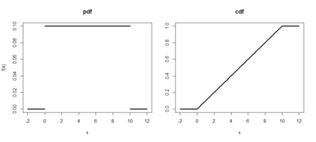

### 균등 분포(Uniform probability distribution)

* 확률변수 X : 구간 (a,b)에서 균등한 가능성으로 발생한 값.
* 분포의 특징
  * 확률함수 
   $$f(x) = \left\{\begin{matrix}\frac{1} {b-a}, a < x < b \\ 0, 나머지 \\ \end{matrix}\right.$$
  * 기대값 $E(X) = \frac{a+b}{2}$
  * 분산 $Var(X) = \frac{ (b-a)^2 }{12}$
  
* 분포관련 R 함수

  <table>
    <thead>
      <tr><th>내용</th><th>형식</th></tr>
    </thead>
    <tbody>
      <tr><td>밀도함수</td><td>dunif(x, min, max)</td></tr>    
      <tr><td>누적분포함수</td><td>punif(q, min, max, lower.tail=TRUE/FALSE)</td></tr>    
      <tr><td>분위수함수</td><td>qunif(p, min, max, lower.tail=TRUE/FALSE)</td></tr>    
      <tr><td>난수발생</td><td>runif(n, min, max)</td></tr>                      
    </tbody>
  </table>
  
* 분포관련 R 표현
  
  ``` {R}
    # PDF
    > min = 0; max=10; x=seq(min,max,length.out=100)  #연속형이기 때문에 갯수를 많이 쪼깸

    > # pdf
    > y = dunif(x,min,max)    
    > plot(x, y,xlab="x", ylab="f(x)", type='l', lwd = 3, main="pdf", xlim=c(min-2,max+2) ,ylim=c(0,1/(max-min)) )
    > lines(c(min-2,min),c(0,0),lwd=3)
    > lines(c(max,max+2),c(0,0),lwd=3)
 
    > # cdf = pdf 의 합 (PDF->CDF 일반화)
    > cy = punif(x,min,max)
    > plot(x, cy,xlab="x", ylab="f(x)", type='l', lwd = 3, main="cdf", xlim=c(min-2,max+2) ,ylim=c(0,1) )
    > lines(c(min-2,min),c(0,0),lwd=3)
    > lines(c(max,max+2),c(1,1),lwd=3)    
  ```

  <center></center>  


### 지수 분포(Exponential probability distribution)

* 확률변수 X : 포아송 과정(ex: 수명, 대기시간 등)에서 하나의 사건이 발생할 때까지의 대기시간
* 분포의 특징
  * 확률밀도함수(pdf)
   $$f(x) = \left\{\begin{matrix}\ \lambda e^{-\lambda x}, x  \ge 0 \\ 0, x < 0  \\ \end{matrix}\right.$$

   $$\lambda : 단위시간동안 평균 이벤트 발생횟수$$
  
  * 누적분포함수(cdf)
   $$F(x) = P(X\le x) = \left\{\begin{matrix} 1-e^{(-\lambda x)}, x  \ge 0 \\ 0, x < 0   \\ \end{matrix}\right.$$

  * 기대값 $E(X) = \frac {1} { \lambda }$
  * 분산 $Var(X) = \frac {1} { \lambda^2 }$


* 분포관련 R 함수

  <table>
    <thead>
      <tr><th>내용</th><th>형식</th><th>비고</th></tr>
    </thead>
    <tbody>
      <tr><td>밀도함수</td><td>dexp(x, rate)</td><td>rate=1/λ</td></tr>    
      <tr><td>누적분포함수</td><td>pexp(q, rate, lower.tail=TRUE/FALSE)</td><td></td></tr>    
      <tr><td>분위수함수</td><td>qexp(p, rate, lower.tail=TRUE/FALSE)</td><td></td></tr>    
      <tr><td>난수발생</td><td>rexp(n, rate)</td><td></td></tr>
    </tbody>
  </table>
  
   
* 분포관련 R 표현
  
  ``` {R}
    # Ex : 20분당 통화가 1번 걸려오는 경우 , 람다 = 20
    > lambda = 20; x=seq(0,30,length.out=100)  #연속형이기 때문에 갯수를 많이 쪼깸

    > # pdf
    > y = dexp(x,1/lambda)    
    > plot(x, y,xlab="x = Call간격", ylab="f(x)", type='l', lwd = 2, main="pdf" )
    # 20보다 해당영역 표시, polygon(c(x[20: length(x) ], x[ length(x) :20]),c(rep(-2,length(x[20: length(x) ])), y[ length(x) :20]),col=adjustcolor( rgb(0, 0, 1.0), alpha=0.5 ),lwd=2 )
 
    > # cdf = pdf 의 합 (PDF->CDF 일반화)
    > cy = pexp(x,1/lambda) 
    > plot(x, cy,xlab="x", ylab="F(x)", type='l', lwd = 3, main="cdf" )

  ```

   <center></center>  