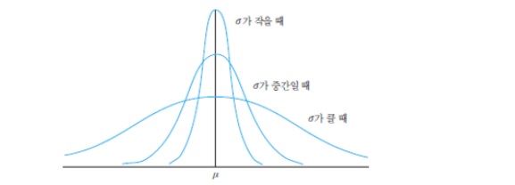
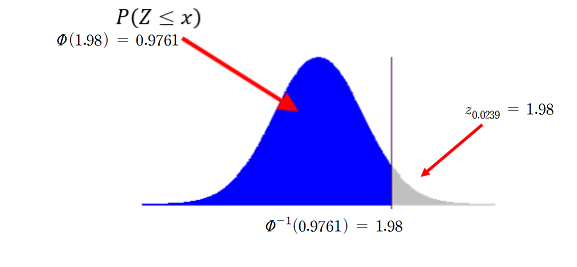
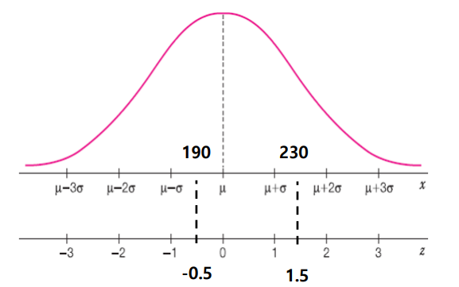

### 정규분포(normal distribution)

* 연속형 확률분포에서 가장 대표적인 확률분포 : $X \sim N(\mu,\sigma^2)$
* 확률밀도 함수

  $$f(x)= \frac {1} {\sqrt{2 \pi \sigma^2 }} e^{ - \frac{(x-mu)^2}{2\sigma^2}}$$

* 평균, 분산
  $$E(X)= \mu, Var(X)= \sigma^2 $$

* 특징
  * 평균을 중심으로 좌우 대칭, 평균 = 중앙값 = 최빈값
  * 평균에서 멀어질수록 확률밀도함수 값은 점차 작아진다
  * 분산이 클수록 확률밀도함수의 꼬리가 두꺼워진다.
  * 정규분포의 pdf 직접 적분하여 확률을 구하는 것은 쉽지 않다

* 모양
    

  

### 표준정규분포(standiard normal distribution)

* 표준정규분포: 평균이 0이고 분산이 1인 정규분포, $X \sim N(0,1)$
  * 표준정규분포를 따르는 확률변수를 일반적으로 Z 로 표현

* 확률밀도 함수
  $$f(x)= \frac {1} {\sqrt{2 \pi }} e^{ - \frac{1}{2} x^2 }$$

* 정규분포의 표준화
  * 모든 정규분포는 표준정규분포로 변환할 수 있다.

    $$ Z값 = \frac{X-\mu}{\sigma} , 표본의 경우 = \frac{X-\bar{X}_{n}}{\sigma}$$

* 표준정규분포의 누적분포함수
  * 파이라고 읽는다
  
    $$ Ø(x) = F(x) = P(Z≤x) = \int_{-∞}^{x} \frac {1} {\sqrt{2 \pi }} e^{ - \frac{1}{2} z^2 }dz $$  

  

  $$Ø(1.98) = 0.9761, Ø^{-1}(0.9761) = 1.98, z_{0.0239} = 1.98$$

  ### 일반 정규분포와 표준정규분포와의 관계
  * 일반 정규분포의 값은 평균으로부터 표준편차 몇 배로 떨어져 있는 지를 나타내는 수치가 표준정규분포 값을 의미한다
  
  

### 이항분포의 정규근사

* 이항분포 확률계산은 쉽지 않기 때문에
* n 이 크고 p 가 작은 경우는? 포아송 근사
* n 이 크고 p 가 0 이나 1 에 크게 쏠리지 않는 경우는? 정규 근사
  
    $$ X \sim B(n,p) => X \approx  N(np,np(1-p))$$

    * np ≥ 10(또는 5) 이고, np(1-p) ≥ 10(또는 5)이면 근사 가능

* 연속수정계수( continuity correction factor )
  
  * 𝒏 이 비교적 작더라도 만족스러운 결과를 얻기 위한 수정
  * 이산형 ➔ 연속형의 변환 과정에서 필요한 조정
  * 연속을 위하여 연속수정계수: 0.5를 더하거나 빼는 것
  * 수정 방법 (범위가 좀더 커지는 방향으로)
    * $P(a≤X≤b) = P(a-1/2<X<b+1/2)$
    * $P(X≥a) = P(X≥a-1/2)$
    * $P(X≤b) = P(X≤b+1/2)$
    * $P(X=k) = P(k-1/2≤X≤k+1/2)$

### 포아송분포의 정규근사
* 주어진 시간에 발생한 사건 수가 포아송분포를 따른다면 주어진 시간을 합하여 발생한 총 발생 건수는 정규분포로 근사 가능

    $$ X \sim P(n,\lambda) => X \approx  N(n\lambda,n\lambda)$$

### 정규분포 관련 R 함수

    <table>
      <thead>
        <tr><th>내용</th><th>형식</th><th>비고</th></tr>
      </thead>
      <tbody>
        <tr><td>밀도함수</td><td>dnorm(x, mean = 0, sd = 1, log = FALSE)</td><td>log = TRUE이면 반환되는 값의 log값을 반환</td></tr>    
        <tr><td>누적분포함수</td><td>pnorm(q, mean=0, sd=1, lower.tail = TRUE, log.p = FALSE)</td><td>lower.tail : TRUE 이면 확률 계산을 P(X<= x)로, FALSE 이면 P(X>x)</td></tr>    
        <tr><td>분위수함수</td><td>qnorm(p, mean=0, sd=1, lower.tail = TRUE, log.p = FALSE)</td><td>α = P(Z > zα), α는 Z가  zα 보다 클 확률</td></tr>    
        <tr><td>난수발생</td><td>rnorm(n, mean = 0, sd = 1)</td><td></td></tr>
      </tbody>
    </table>

* Example)
  
  > rnorm(5) # 표준정규분포 N(0,1)에서 난수 5개 생성 
  > rnorm(5) # 매 실행 시 다른 결과를 제공 
  > rnorm(10,mean=3,sd=2) # N(3,4)에서 난수 10개 생성 
  > dnorm(0) # 표준정규분포에서 x가 0일때 y값   
  > pnorm(1.96) # 표준정규분포의 누적분포함수에서 x가 1.96일 때 y값 
  > qnorm(0.975) # 상위 2.5%를 갖는 x 값 
  > qnorm(0.975, lower.tail=FALSE) # 하위 2.5를 갖는 x 값 