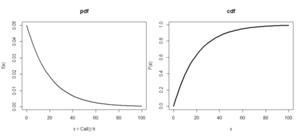
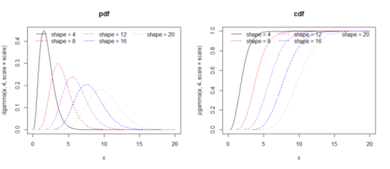
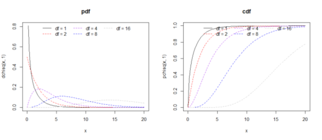

### 균등 분포(Uniform probability distribution)

* 확률변수 X : 구간 (a,b)에서 균등한 가능성으로 발생한 값.
* 분포의 특징
  * 확률함수 
   $$f(x) = \left\{\begin{matrix}\frac{1} {b-a}, a < x < b \\ 0, 나머지 \\ \end{matrix}\right.$$
  * 기대값 $E(X) = \frac{a+b}{2}$
  * 분산 $Var(X) = \frac{ (b-a)^2 }{12}$
  
* 분포관련 R 함수

  <table>
    <thead>
      <tr><th>내용</th><th>형식</th></tr>
    </thead>
    <tbody>
      <tr><td>밀도함수</td><td>dunif(x, min, max)</td></tr>    
      <tr><td>누적분포함수</td><td>punif(q, min, max, lower.tail=TRUE/FALSE)</td></tr>    
      <tr><td>분위수함수</td><td>qunif(p, min, max, lower.tail=TRUE/FALSE)</td></tr>    
      <tr><td>난수발생</td><td>runif(n, min, max)</td></tr>                      
    </tbody>
  </table>
  
* 분포관련 R 표현
  
  ``` {R}
    # PDF
    > min = 0; max=10; x=seq(min,max,length.out=100)  #연속형이기 때문에 갯수를 많이 쪼깸

    > # pdf
    > y = dunif(x,min,max)    
    > plot(x, y,xlab="x", ylab="f(x)", type='l', lwd = 3, main="pdf", xlim=c(min-2,max+2) ,ylim=c(0,1/(max-min)) )
    > lines(c(min-2,min),c(0,0),lwd=3)
    > lines(c(max,max+2),c(0,0),lwd=3)
 
    > # cdf = pdf 의 합 (PDF->CDF 일반화)
    > cy = punif(x,min,max)
    > plot(x, cy,xlab="x", ylab="f(x)", type='l', lwd = 3, main="cdf", xlim=c(min-2,max+2) ,ylim=c(0,1) )
    > lines(c(min-2,min),c(0,0),lwd=3)
    > lines(c(max,max+2),c(1,1),lwd=3)    
  ```

  <center></center>  


### 지수 분포(Exponential probability distribution)

* 확률변수 X : 포아송 과정(ex: 수명, 대기시간 등)에서 **하나**의 사건이 발생할 때까지의 **대기시간**

* 분포의 특징
  * 확률밀도함수(pdf)
   $$f(x) = \left\{\begin{matrix}\ \lambda e^{-\lambda x}, x  \ge 0 \\ 0, x < 0  \\ \end{matrix}\right.$$

   $$\lambda : 단위시간동안 평균 이벤트 발생횟수$$
  
  * 누적분포함수(cdf)
   $$F(x) = P(X\le x) = \left\{\begin{matrix} 1-e^{(-\lambda x)}, x  \ge 0 \\ 0, x < 0   \\ \end{matrix}\right.$$

  * 기대값 $E(X) = \frac {1} { \lambda }$
  * 분산 $Var(X) = \frac {1} { \lambda^2 }$

* 지수분포에서 건망증
  
  * 어떤 장치가 고장나지 않았다는 조건하에서 나머지 수명은,그 시간 이전의 그 장치의 수명에 대한 확률밀도함수와 같아짐
  * 즉, 그 시간 경과한 후에  마치 0 시점에서 새로 시작하는 것처럼 행동함

* 분포관련 R 함수

  <table>
    <thead>
      <tr><th>내용</th><th>형식</th><th>비고</th></tr>
    </thead>
    <tbody>
      <tr><td>밀도함수</td><td>dexp(x, rate)</td><td>rate=1/λ</td></tr>    
      <tr><td>누적분포함수</td><td>pexp(q, rate, lower.tail=TRUE/FALSE)</td><td>tail=TRUE, default 이고 left side 즉 P(X≤x) 의미</td></tr>    
      <tr><td>분위수함수</td><td>qexp(p, rate, lower.tail=TRUE/FALSE)</td><td></td></tr>    
      <tr><td>난수발생</td><td>rexp(n, rate)</td><td></td></tr>
    </tbody>
  </table>
  
   
* 분포관련 R 표현
  
  ``` {R}
    # Ex : 20분당 통화가 1번 걸려오는 경우 , 람다 = 20
    > lambda = 20; x=seq(0,30,length.out=100)  #연속형이기 때문에 갯수를 많이 쪼깸

    > # pdf
    > y = dexp(x,1/lambda)    
    > plot(x, y,xlab="x = Call간격", ylab="f(x)", type='l', lwd = 2, main="pdf" )
    # 20보다 해당영역 표시, polygon(c(x[20: length(x) ], x[ length(x) :20]),c(rep(-2,length(x[20: length(x) ])), y[ length(x) :20]),col=adjustcolor( rgb(0, 0, 1.0), alpha=0.5 ),lwd=2 )
 
    > # cdf = pdf 의 합 (PDF->CDF 일반화)
    > cy = pexp(x,1/lambda) 
    > plot(x, cy,xlab="x", ylab="F(x)", type='l', lwd = 3, main="cdf" )

  ```

   <center></center>  

* 지수분포 문제풀이
  * 문제가 "이상" 일 확률과  "이하" 확률 구분에 주의 하며, 람다 = 1/주어진 문제의 평균
  * Ex1) 어느 회사 TV의 평균수명은 5년인 경우 이 TV 수명이 6년 이상 지속될 확률은 ?
    > sol1) 람다=1/5, P(X≥6) = 1 - P(X<6) = e^(-1/5*6) = 0.3012 <br>
    > sol2) R 풀이 P(X≥6) = 1- pexp(6, 1/5)
  * Ex2) 어느 회사 TV의 평균수명은 3년이고, 보증기간은 1년이라고 한다. 이 TV가 이년이내 고장나서 보상받을 확률을 구하시오
    > sol1) 람다=1/3, P(X≤1) = 1-e^(-1/3*1) = 0.2834687 <br>
    > sol2) R 풀이 pexp(1, 1/3)
  * Ex3) 병원에서 진료대기시간이 평균 8분인 경우 병원에 가서 대기할 시간이 4분~11분 사이 확률은 ?
    > sol1) 람다=1/8, P(4≤X≤11) = P(X≤11) - P(X<4) = 1-e^(-11/8) - ( 1-e^(-4/8)) = 0.3536911 <br>
    > sol2) R 풀이 pexp(11, 1/8) - pexp(4, 1/8) = 0.3536911


### 감마 분포(Gamma probability distribution)

* 확률변수  푸아송 과정에서 개의 **n개의** 사건이 발생할 때까지의 대기시간
* 분포의 특징
  
  * 확률밀도함수(pdf)

   $$f(x) = \left\{\begin{matrix}\ \frac{\lambda^\alpha}{\Gamma(\alpha)}  e^{-\lambda x} x^{\alpha - 1} ,  x  \ge 0 \\ 0, x < 0  \\ \end{matrix}\right.$$ 
   * 편의상 $\beta =  \frac{1}{\lambda}$(첫번째 사건이 발생할 때까지 걸린 시간) 로하면,
  
     $$f(x) = \left\{\begin{matrix}\ \frac{1}{\Gamma(\alpha) \beta ^\alpha} e^{-\frac{x}{\beta}} x^{\alpha - 1} ,  x  \ge 0 \\ 0, x < 0  \\ \end{matrix}\right.$$ 

   * 설명하면 $\alpha$번째 사건이 일어날때 까지 걸리는 시간에 대한 연속확률 분포
   * $X-\Gamma(\alpha,\beta)$ 라 하고, $\alpha$는 형태모수, $\beta$는 척도모수 라 한다
   * 여기서 $\Gamma(\alpha)$는 감마함수로서 pdf의 면적이 1되도록 하는데 필요
   * $\alpha =1$인 경우는 지수분포가 됨  $\epsilon(\lambda) = \Gamma(1,1/\lambda)$
  
  * 누적분포함수(cdf)
   $$F(x) = P(X\le x) = \left\{\begin{matrix} 1-\sum_{y=0}^{\alpha-1} \frac{(x/\beta)^ye^{-x/\beta}}{y!} , x  \ge 0 \\ 0, x < 0   \\ \end{matrix}\right.$$

  * 기대값 $E(X) = \frac{\alpha}{\lambda} = \alpha \beta$
  * 분산 $Var(X) = \frac{\alpha}{\lambda^2} = \alpha \beta^2$

* 분포관련 R 함수

  <table>
    <thead>
      <tr><th>내용</th><th>형식</th><th>비고</th></tr>
    </thead>
    <tbody>
      <tr><td>밀도함수</td><td>dgamma(x, shape, rate = 1, scale = 1/rate)</td><td>shape: α 형태모수 , rate:scale의 역수로, 둘중 반드시 하나만 지정해야함 scale: β 척도모수 </td></tr>    
      <tr><td>누적분포함수</td><td>pgamma(q, shape, rate = 1, scale = 1/rate)</td><td></td></tr>    
      <tr><td>분위수함수</td><td>qgamma(p, shape, rate = 1, scale = 1/rate)</td><td></td></tr>    
      <tr><td>난수발생</td><td>rgamma(n, shape, rate = 1, scale = 1/rate)</td><td></td></tr>
    </tbody>
  </table>
  
  
* 분포관련 R 표현
  
    
  ``` {R}
    # Ex 
    > x <- seq(0, 20, length.out = 101); scale = 0.5;

    > # shape 별로 pdf 그리기
    > plot(x, dgamma(x, 4, scale = scale), type = 'l', main="pdf" )
    > lines(x, dgamma(x, 8, scale = scale), col = 'red', lty = 2)
    > lines(x, dgamma(x, 12, scale = scale), col = 'purple', lty = 2)
    > lines(x, dgamma(x, 16, scale = scale), col = 'blue', lty = 2)
    > lines(x, dgamma(x, 20, scale = scale), col = 'grey', lty = 2)
    > legend('top', bty = 'n', ncol = 3, lty = c(1, 2, 2, 2, 2),
       col = c('black', 'red', 'purple', 'blue', 'grey'),
       legend = c('shape = 4', 'shape = 8', 'shape = 12', 'shape = 16', 'shape = 20'))
  
 
    > # cdf
    > plot(x, pgamma(x, 4, scale = scale), type = 'l', main="cdf")
    > lines(x, pgamma(x, 8, scale = scale), col = 'red', lty = 2)
    > lines(x, pgamma(x, 12, scale = scale), col = 'purple', lty = 2)
    > lines(x, pgamma(x, 16, scale = scale), col = 'blue', lty = 2)
    > lines(x, pgamma(x, 20, scale = scale), col = 'grey', lty = 2)
    > legend('top', bty = 'n', ncol = 3, lty = c(1, 2, 2, 2, 2),
       col = c('black', 'red', 'purple', 'blue', 'grey'),
       legend = c('shape = 4', 'shape = 8', 'shape = 12', 'shape = 16', 'shape = 20'))

  ```

     <center></center>  


### 카이제곱 분포(Chi-Squared probability distribution)
*  $\gamma$개의 서로 독립적인 표준정규 확률변수를 각각 제곱한 다음 합해서 얻어지는 분포이다. 이 때 $\gamma$을 자유도라고 하며, 카이제곱 분포의 매개변수가 된다. 
*  감마 분포의 특수한 형태로 감마 분포에서 $\alpha=\gamma/2, \beta=2, 단 \gamma \ge 2$ 인경우
*  $X \sim \chi^2(\gamma)$ X는 자유도 $\gamma$인 카이제곱 분포를 따른다

* 분포의 특징
    
  * 확률밀도함수(pdf)
  
     $$f(x) = \left\{\begin{matrix}\ \frac{1}{\Gamma(\gamma/2) 2 ^{\gamma/2}} e^{-x/2} x^{\gamma/2 - 1} ,  x  \ge 0 \\ 0, x < 0  \\ \end{matrix}\right.$$ 

  * 기대값 $E(X) = \gamma$
  * 분산 $Var(X) = 2\gamma$

  * 분포관련 R 함수

    <table>
      <thead>
        <tr><th>내용</th><th>형식</th><th>비고</th></tr>
      </thead>
      <tbody>
        <tr><td>밀도함수</td><td>dchisq(df)</td><td>df: 자유도 γ  </td></tr>    
        <tr><td>누적분포함수</td><td>pchisq(df, lower.tail=TRUE/FALSE)</td><td></td></tr>    
        <tr><td>분위수함수</td><td>qchisq(df, lower.tail=TRUE/FALSE</td><td></td></tr>    
        <tr><td>난수발생</td><td>rchisq(n, df)</td><td></td></tr>
      </tbody>
    </table>
    
 
* 분포관련 R 표현
  
    
  ``` {R}
    # Ex 
    > x <- seq(0, 20, length.out = 101);

    > # shape 별로 pdf 그리기
    > plot(x, dchisq(x, 1), type = 'l', main="pdf" )
    > lines(x, dchisq(x, 2), col = 'red', lty = 2)
    > lines(x, dchisq(x, 4), col = 'purple', lty = 2)
    > lines(x, dchisq(x, 8), col = 'blue', lty = 2)
    > lines(x, dchisq(x, 16), col = 'grey', lty = 2)
    > legend('top', bty = 'n', ncol = 3, lty = c(1, 2, 2, 2, 2),
       col = c('black', 'red', 'purple', 'blue', 'grey'),
       legend = c('df = 1', 'df = 2', 'df = 4', 'df = 8', 'df = 16'))
  
 
    > # cdf
    > plot(x, pchisq(x, 1), type = 'l', main="cdf" )
    > lines(x, pchisq(x, 2), col = 'red', lty = 2)
    > lines(x, pchisq(x, 4), col = 'purple', lty = 2)
    > lines(x, pchisq(x, 8), col = 'blue', lty = 2)
    > lines(x, pchisq(x, 16), col = 'grey', lty = 2)
    > legend('top', bty = 'n', ncol = 3, lty = c(1, 2, 2, 2, 2),
       col = c('black', 'red', 'purple', 'blue', 'grey'),
       legend = c('df = 1', 'df = 2', 'df = 4', 'df = 8', 'df = 16'))       

  ```    

  
     <center></center>  

