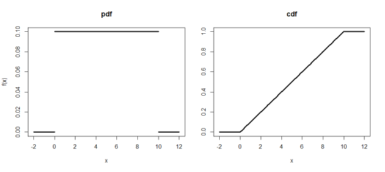

### 표본분포의 이해
* 표본들의 특성을 나타내는 통계량의 분포를 표본분포라고 한다
* 개념

  

   

* 모수 (parameter) : 모집단(분포)의 특성을 나타내는 수
* 통계량 (statistic) : 표본으로부터 계산되는 수식의 형태
  * 모평균 μ 는 모수가 되며, 표본평균은 통계량이 된다
* 표본분포 (sampling distribution) : 통계량의 분포
  * 대부분의 경우 모수를 추정하기 위하여 통계량을 사용
  