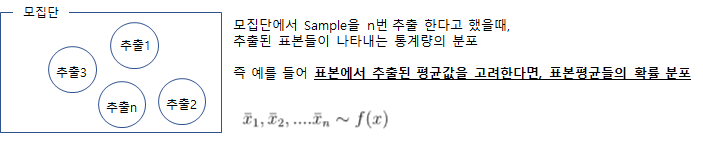

### 표본분포의 이해

* 표본들의 특성을 나타내는 **통계량의 분포**를 표본분포라고 한다
* 개념

  

   

* 모수 (parameter) : 모집단(분포)의 특성을 나타내는 수
* 통계량 (statistic) : 표본으로부터 계산되는 수식의 형태
  * 모평균 μ 는 모수가 되며, 표본평균은 통계량이 된다
  * 유용한 통계량 : 평균(비율)/분산
  
* 표본분포 (sampling distribution) : 통계량의 분포
  * 대부분의 경우 모수를 추정하기 위하여 통계량을 사용

### 평균의 표본분포

* 평균( $\overline{X}$ ) 의 기대값, 분산
  $$ E(\overline{X}) = \mu , Var(\overline{X}) = \frac{\sigma^2}{n}$$

* 평균( $\overline{X}$ ) 의 표본분포 종류
  * 모집단의 분포가 정규분포이면, 표본크기에 관계없이 표본평균의 분포는 정규분포이다
  * **모집단의 분포에 관계없이 표본크기**가 크면, 표본평균의 분포는 정규분포에 가까워 진다. (중심극한정리)
  $$ \overline{X} \sim N(\mu, \frac{1}{n}\sigma^2) ⇒ (정규화시키면) \quad \frac{\overline{X} - \mu }{\sigma / \sqrt{n}} \sim N(0,1) $$

> 예제) K사의 주워니료 1일 사용량은 평균 270Kg, 표준편차 50Kg인 정규분포를 이루고 있다. 매일 주원료 사용량이 독립적이고 1주일 가동일 수를 5일, 1개월 가동일 수를 20일이라고 할 때 다음을 구하시오 
> 1) 1주일 동안의 1일 평균 사용량이 300kg을 초과할 확률 
> 2) 1개월 동안의 1일 평균 사용량이 300kg을 초과할 확률
> 2) 1주일 동안 1일 평균 사용량이 250kg 이하일 확률 
> 3) 1개월 동안의 1일 평균 사용량이 250kg 이하일 확률

### 비율의 표본분포
* 비율의 기대값, 분산
  $$ E(p) = \pi , Var(p) = \frac{\pi(1-\pi)}{n} $$

* 비율의 표본분포 종류
  * 모집단의 비율(pi)이 0.5이면, 표본의 크기에 관계없이 비율의 표본분포는 정규분포이다
  * 모집단의 비율(pi)이 0.5가 아닌경우 $n \pi≥5$ 이고 또한 $n (1-\pi)≥5$ 이면, 정규분포에 접근한다.

  $$ p \sim N(\mu, \frac{\pi}{(1-\pi)} ) ⇒ (정규화시키면) \quad \frac{p - \pi }{\sqrt{\frac{\pi(1-\pi)}{n}}} \sim N(0,1)$$

> 예제) 휴대폰을 보유한 우리나라 대학생 40%가 T사에 가입하고있다. 
> 1) 휴대폰을 보유한 대학생 100명을 무작위 추출하는 경우 T사에 가입한 학생의 비율이 45% 이상일 확률 
> 2) 1)번에서 비율이 30% 이하일 확률
> 2) 1)번에서 196명을 표본 추출하는 경우 45% 이상일 확률 
> 3) 3)의 문제에서 비율이 30% 이하일 확률

### 평균의 표본분포(t분포) : $\sigma$가 알려지지 않은 경우

* 정의
  * 표준정규분포를 따르는 확률변수 Z와 자유도가 n인 카이제곱  분포를 따르는 확률변수 V가 서로 독립이라면 다음에 정의된 확률변수는 자유도 n인 t-분포를 따르게 된다
  
    $$ T = \frac{Z}{\sqrt{V/n}} \sim t(n) $$

* t분포의 특징
  * t-분포는 표준정규분포와 비슷하여 평균이 0이고 대칭형 종  모양을 이루지만 분산이 1보다 조금 크다
  * 자유도가 1인 t-분포에서는 기대값이 존재하지 않는다
  * 정규 분포와 마찬가지로 t 분포도 대칭형입니다. 평균에서 반으로 접는다고 생각해보면 양쪽이 서로 동일
  * 표준 정규 분포(또는 z 분포)와 마찬가지로 t 분포의 평균도 0
  * 정규 분포에서는 모집단 표준편차를 알고 있다고 가정. t 분포에서는 이러한 가정을 내리지 않음
  * t 분포는 자유도에 의해 정의. 자유도는 표본 크기와 관련
  * t 분포는 모집단 표준편차를 알 수 없거나 두 가지 모두 적용될 때 작은 표본 크기에 가장 유용
  * 표본 크기가 커질수록 t 분포가 정규 분포와 비슷
  * 기대값과 분산
    $$ E(T) = 0, (n>1) $$
     $$Var(T) = \left\{\begin{matrix}\frac{n} {n-2}, n > 2 \\ ∞, 1<n ≤ 2 \\ \end{matrix}\right.$$
  
* 평균의 표본분포
  * t분포(Student's distribution)는 **모집단 표준편차를 알 수 없을 때** 표본 평균과 모집단 평균 사이 표준화된 거리를 설명하며, 관측값은 정규 분포를 따르는 모집단에서 추출
    * 어떤 모집단이 있고, 이 모집단은 정규분포를 따르는 것 같다
    * 모분산을 몰라서 Z 통계량을 이용한 통계적 추정 방법을 없다
    * 표본의 크기 n 이 30보다 작아서 중심극한정리에 의해 표본평균의 분포가 정규분포라고 할 수도 없다
  * 이러한 경우 표본분산 $s^2$은 알 수 있다.  z 통계량을 아래와 같우 수정하게 해보면 (모분산을 표본분산으로 변경해 보면)
  
  $$ \frac{ \overline{X} - \mu }{\frac{\sigma}{\sqrt(n)}} \Rightarrow  \frac{ \overline{X} - \mu }{\frac{s}{\sqrt(n)}}  $$

  * 그리고 통계량을 $\sigma$로 나누어 주면 다음과 같다.

  $$ \frac {\frac{ \overline{X} - \mu }{\sigma} }{ \frac{s} {\sqrt(n)\sigma}} =  \frac {\frac{ \overline{X} - \mu }{\frac{\sigma}{\sqrt(n)}} }{ \sqrt {\frac{s^2} {\sigma^2}}}  $$

  $$ \Rightarrow \frac{\overline{X} - \mu}{  \frac{\sigma} {\sqrt(n)} } \sim N(0,1), \qquad \frac{s^2}{\sigma^2} \sim \frac{\Chi^2_{n-1}}{n-1}  $$

  * 즉, 처음 정의한 확률변수  $T = \frac{Z}{\sqrt{V/n}}$ 과 같은형태 이므로 자유도 n-1인 t분포를 따른다.

  $$\overline{X} \sim t(n-1) = \frac{ (\overline{X} - \mu ) } { s/ \sqrt{n}}  $$

* 확률의 계산
  * 자유도 (n-1)의 t분포표를 사용하여 확률계산

> 예제) 서울시 인근지역 가맹점의 하루 평균고객 수가 400명, 1인당 평균 구매액 8,000원이라고 한다. K씨가 3개 가맹점에서 1일 고객 수 와 1인당 구매금액을 조사한 결과 자료에서 편의점 본사의 주장이 사실이며, 정규분포라고 가정하고 다음을 구하라
> 1) 각 가맹점의 고객 수 및 구매액의 표본평균 값이 본사의 주장보다 클 경우
> 2) 표본평균이 관찰된 값보다 클 확률을 구하고, 
> 3) 표본평균이 본사의 주장보다 작을 경우
> 4) 표본평균이 관찰된 값보다 작을 확률을 구하라

* 분포관련 R 함수

    <table>
      <thead>
        <tr><th>내용</th><th>형식</th><th>비고</th></tr>
      </thead>
      <tbody>
        <tr><td>밀도함수</td><td>dt(x, df, ncp, log = FALSE)</td><td>x:확률변수,df:자유도</td></tr>    
        <tr><td>누적분포함수</td><td>pt(q, df, ncp, lower.tail = TRUE, log.p = FALSE)</td><td>q:확률변수, df:자유도, lower.tail : TRUE 이면 확률 계산을 P(X≤x) (디폴트임)</td></tr>    
        <tr><td>분위수함수</td><td>qt(p, df, ncp, lower.tail = TRUE, log.p = FALSE)</td><td>p:확률, df:자유도 , qt:하위 p% 의미 즉 p(X≤x) = p% 기준</td></tr>    
        <tr><td>난수발생</td><td>rt(n, df, ncp)</td><td>n:개수,df:자유도</td></tr>
      </tbody>
    </table>
  

### 분산의 표본분포 (카이제곱분포)
* Chi-square 분포
  * 서로 독립인 n개의 표준정규분포 $Z_1, Z_2, …, Z_n$ 을 제곱하여 더  한 새로운 확률변수 V를 자유도가 n인 Chi제곱분포라고 함
  * 표기법
    $$ V \sim \chi^2(n) $$
  * 기대값과 분산
    $$ E(V) = n, Var(V)=2n $$
  * 분포의 가법성
     $$ \chi^2(n)  + \chi^2(n) = \chi^2(2n) $$
  * 모수 : n 자유도
* 무작위표본 (random sample, rs,iid)
  * 확률변수 X1, X2, …, Xn 이 모두 동일한 분포에서 추출되었  고 각각 독립일 경우, 이러한 데이터를 무작위표본이라 한다
  * 표본분포, 통계적 추론에서 필요한 가장 기본적인 가정
  * independent & identically distributed
  * $Z^2$의 분포
    $$ Z^2 ⇒ \sum_{i=1}^{n} ( \frac{ X_i-\mu} {\sigma} )^2 \sim \chi^2(n) $$

  * 표본분산의 표본분포
    $$ S^2 ⇒  \sum_{i=1}^{n} ( \frac{ X_i-\overline{X}} {\sigma} )^2 = \frac{ (n-1)S^2 }{\sigma^2} \sim \chi^2(n-1) $$

  > 예제) 건강보조식품 P-10을 생산하여 판매하는 제약사는 P성분의 함량이 표준편차 0.04mg으로 정규분포를 이루고 있는것으로 알려져 있다.
  > 12개를 무작위로 추출하여 조사할 경우
  > 1) 표준편차 s가 0.05mg 이상일 확률 $P(s≥0.05mg)$
  > 2) 표준편차 s가 0.03mg 이하일 확률 $P(s≤0.03mg)$
  > 3) 표준편차 s가 표준규격 0.025이상 0.045mg 이하일 확률: $P(0.025mg≤s≤0.03mg)$
  > 4) $P(s>s*) = 0.05$인 s*의 값
  > 5) $P(s<s*) = 0.05$인 s*의 값

### 분산비율의 표본분포 (F분포)
* 자유도 n1 인 카이제곱 분포를 따르는 확률변수 V1 과 자유도  n2 인 카이제곱 분포를 따르는 확률변수 V2 가 있고 서로 독립이  라면 다음에 정의된 확률변수는 자유도 n1, n2 를 따르는 F-분포  가 된다
   $$ F = \frac{V_1/n_1}{V_2/n_2}~F(n_1,n_2)$$
* F-분포의 정의로부터 다음과 같은 사실을 유도할 수 있다
   $$ \frac{1}{F} = \frac{V_2/n_2}{V_1/n_1}~F(n_2,n_1)$$

* 두 표본 분산비율의 표본분포
  * 두 표본(표본1, 표본2)에서 계산된 분산의비율을 $F=s_1^2/s_2^2$라고 할때
  * F는 분자의 자유도가 $n_1-1$이고 분모의 자유도가 $n_2-1$인 F분포를 따른다
    * 모수 $r_1$:분자의 자유도, $r_2$:분모의자유도
    * 확률변수 범위 : $0<x<∞$
    * 확률함수
     $$f(x) = \frac {G((g_1+g_2)/2)(g_1/g_2)^{g_1/2} } {G(g_1/2)G(g_2/2)} \frac {x^{g_1/2-1} } {(1+g_1x/g_2)^{(g_1+g_2)/2}}, 여기서 G(a)=(a-1)!$$

  > 예제) 삼성과LG전자의 주식거래 관련 자료를 50일간을 무작위 수집한 자료이다. 주가 등락률이 정규분포이고 분산이 같으며 상호독립이라는 가정하에 이 자료를 이용하여 다음을 구하시오
  > 1) 삼성전자:LG전자 1일 주가 등락률의 분산비율이 1보다 클 확률 ?
  > 2) 삼성전자:LG전자 1일 주가 등락률의 분산비율이 2보다 클 확률 ?
