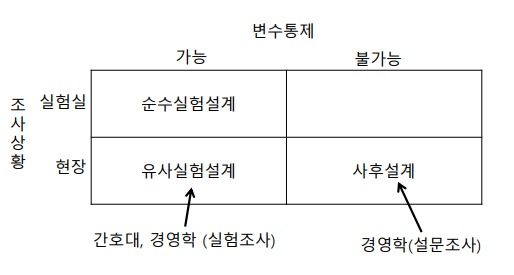
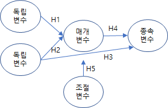

### 논문의 종류
* Emprical Study
  * 실증자료를 분석해서 결론을 도출함
  * 대표적 논문집 : 경영학저널, 품질경영학회지, MIS Quality, IEEE
  * 행태논문 (Behavioral Article)
    - 사람들의 인지적인 속성과 인과관계를 밝혀내는 연구
    - 가설과 연구모형을 정해서 이를 찾아내는 과정
    - 주로 설문지를 통해서 자료확보
    - 목차와 방법론이 대부분 비슷
  
  * 기술논문 (Technical Article)
    - 방법론이 중요하고 다르다.
    - 주로 공대,의대에 많이 적용

* Review Article
  * 기존에 발표된 연구나 논문을 평가하여 결론에 이르는 것
  * 대표적 논문집 : Harvard Business Review

* Theoretical Article
  * 새로운 연구모형을 만들고 새로운 가설까지만 정리하는 논문

### 논문 등급
* Science Citation Index(SCI)
* Science Citation Index Expanded(SCIE)
* Social Sciences Citation Index(SSCI)

### 논문의 작성과정

|구분|내용|
|-|-|
|문제제기|연구의 목적과 필요성|
|문헌조사|선행연구조사, 아이디어 독창성 확인 등, 기존논문과 차이점|
|문제정의|개념적틀, 연구모형, 가설도출|
|연구설계|-Validity -연구방법설정(실험,설문조사)등|
|자료수집 및 절차결정||
|분석방법선택||
|연구실행||
|결과분석 및 결론도출||
|제언||

### 논문목차
Ⅰ. 서론
  * 현황 , **기존논문의 문제, 한계를 언급**, 목적, 독창성

Ⅰ. 이론적배경
  * 기존문헌연구정리 ,  연구모형/가설
  * 가설나오게 되는 이유가 다나와야 함

Ⅱ. 연구방법
  * 연구수행과정, 응답률, Sampling 방법, 측정문항 개발과정

Ⅲ. 연구결과
  * 연구의 객관적 결과제시
  * 응답자 분포정리
  * 측정문항의 타당도 신뢰도 검정
  * 가설검정
  
Ⅳ. 토의
  * 연구결과에 대한 해석
  * 이러한 의미를 가지는지 하나하나씩 나열 해야 함

Ⅴ. 결론 및 한계
  * 한계점도 반드시 언급이 되어야 함
  
Ⅵ. 참고문헌

### 논문작성의 좋은 방법

* 논문의 타당도(Validity)
  * **내적타당도(Internal)** : 연구주제에 맞게 모형이 제대로 세워 진건지?
  * 외적타당도(External) : 인구 통계 등 Sampling에 대한 타당성을 확인(Random화가 잘 된건지) 하고, 모집단으로 일반화 가능한지?
  * 통계타당도(Statistical Conlunsion) : 통계기법을 제대로 사용했는지 ?
  * **구성(내용)타당도(Construct Validity)** : 안면타당도 (Face V. - 주변인에게 설문지가 이해가 되는지 확인 검사 수정)
    * 타당도 측정방법
      * 연구하고자 하는 구성(개념)을 정확하게 측정
      * 측정값이 분산이 해당 구성의 변화에 의해서 발생한 것인지
      * 탐색적/확인적 요인분석
      * 집중타당도
      * 판별타당도
      * Composite  reliablity(CR)
      * Average Variance Extracted(AVE)
      * 다속성-다측정방법

* 연구모형 만들기

* 주의사항 : 두괄식, 문장과 문장의 연결 등..
  
  
### 연구설계의 분류

|구분|종류|내용|
|-|-|-|
|변수통제가능성에 따라|실험설계|독립변수를 manipulation(독립변수의 강도 조정) 가능할 때|
||비실험설계|독립변수가 이미 노출되어서 통제할 수 없을 때|
|조사상황에 따라|실험실연구||
||현장연구||
|조사시점에 따라|Cross –sectional research(종단조사) : 한시점||
||Longitudinal research(횡단조사) : 반복조사, 패널||

### 연구설계 종류

 

### 연구모형

<table>
<thead>
<tr><th>구분</th><th>내용</th><th>종류</th></tr>
</thead>
<tbody>
<tr><td>Independent(독립변수)</td><td>H1,H2,H3</td><td rowspan="4" style="vertical:middle;"></td></tr>
<tr><td>Dependent(종속변수)</td><td>H3,H4</td></tr>
<tr><td>Mediating(매개변수)</td><td>H4</td></tr>
<tr><td>Moderating(조절변수)</td><td>H5</td></tr>
</tbody>
</table>

* 매개변수 : 중간에 거쳐가는 것, 조절변수: 중간에 변수가 조절(그룹에따라 조절, 상호작용에 의한 작용)

### 논문과 Theory

<table>
<thead>
<tr><th>구분</th><th>내용</th></tr>
</thead>
<tbody>
<tr><td>Thoory</td><td>무슨 이론을 적용 했을까? Ex) TRA,TPB</td></tr>
<tr><td>Domain</td><td>어디에 적용했을까</td></tr>
<tr><td>Methodlogy</td><td>어떤 방법을 적용했나</td></tr>
</tbody>
</table>
