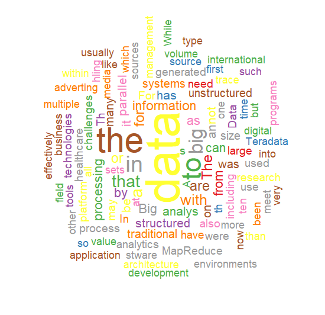

영문에 대해 간단한 텍스트 마이닝을 통해 워드 클라우드를 만드는 예제

### 1. 필요라이브러리

```{r}
> library(KoNLP)
> library(RColorBrewer)
> library(wordcloud)
```


### 2. 데이터 읽기
```{r}
> result <- file("bigdata.txt", encoding="UTF-8")

＃ readLines : 파일에서 데이터를 행 단위로 읽어 배열로 만들어주며, 행의 길이가 일정하지 않아도 문제되지 않음
＃ readLines (con = stdin( ), n = -1L, ok = TRUE, warn = TRUE, encoding = “unknown”, skipNul = FALSE)
＃ con : 압축파일, URL 링크 등과 같은 파일 형태
＃ n : 정수 값으로 행의 수를 가리키며, (-)는 행의 끝까지 읽어야 함을 의미
＃  ok : logical값으로

> result2 <- readLines(result)
> head(result2, 3)
```


-> 영문으로 된 Big Data 관련 예제문구 [파일첨부](../../images/2022-03-25-txtMining-ex1/bigdata.txt)


### 3. 필요없는 단어를 제거
```{r}
# 필요없는 단어를 제거하는 작업 garbage substitute
# 사용법: gsub(pattern, replacement, x, ignore.case = FALSE, perl = FALSE, fixed = FALSE, useBytes = FALSE)

> result2 <- gsub("and", "", result2)
> result2 <- gsub("of", "", result2)
> result2 <- gsub("is", "", result2)
```


### 4. 명사를 추출 및 확인

```{r}
# 명사추출
# USE.NAMES=T : 이름 속성도 반환, USE.NAMES=F : 이름 속성없이 반환
# extractNoun : 명사만 추출하는 Function

> result3 <- sapply(result2, extractNoun, USE.NAMES=F)
> head(unlist(result3), 20)

# 추출된 명사 확인
> write(unlist(result3), "big_word.txt")
> myword <- read.table("big_word.txt")
> nrow(myword)

```

### 5. 추출된 명사를 그래프화
```{r}
palete <- brewer.pal(9, "Set1")

# 새화면으로 뛰울 경우(공팔렛)
# x11()

wordcloud(
  names(wordcount),
  freq=wordcount,
  scale=c(5, 1),
  rot.per=0.5,
  min.freq=4,
  random.order=F,
  random.color=T,
  colors=palete
)

```

<center></center>