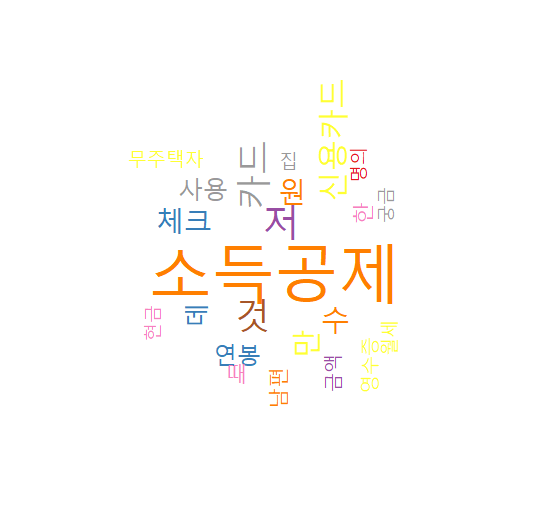

국문에 대해 간단한 텍스트 마이닝을 통해 워드 클라우드를 만드는 예제

### 1. 필요라이브러리

```{r}
> library(KoNLP)
> library(RColorBrewer)
> library(wordcloud)
```


### 2. 데이터 읽기
```{r}
> result <- file("tax.txt", encoding="UTF-8")
> result2 <- readLines(result)
> head(result2, 3)
```

-> 국문으로 된 소득공제 관련 예제문구 [파일첨부](../../images/2022-03-25-txtMining-ex2/tax.txt)


### 3. 필요없는 단어를 제거
```{r}
> result2 <- gsub("and", "", result2)
> result2 <- gsub("of", "", result2)
> result2 <- gsub("is", "", result2)
```


### 4. 명사를 추출 및 확인

```{r}


> result3 <- sapply(result2, extractNoun, USE.NAMES=F)
> head(unlist(result3), 20)

> write(unlist(result3), "tax_word.txt")
> myword <- read.table("tax_word.txt")
> nrow(myword)
> wordcount <- table(myword)
> head(sort(wordcount, decreasing=T), 20)

```

### 5. 추출된 명사를 그래프화
```{r}
palete <- brewer.pal(9, "Set1")

wordcloud(
  names(wordcount),
  freq=wordcount,
  scale=c(5, 1),
  rot.per=0.5,
  min.freq=4,
  random.order=F,
  random.color=T,
  colors=palete
)

```

<center></center>