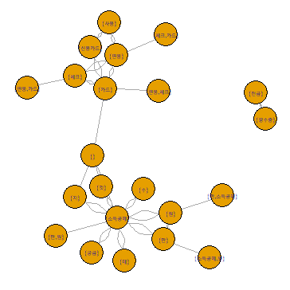
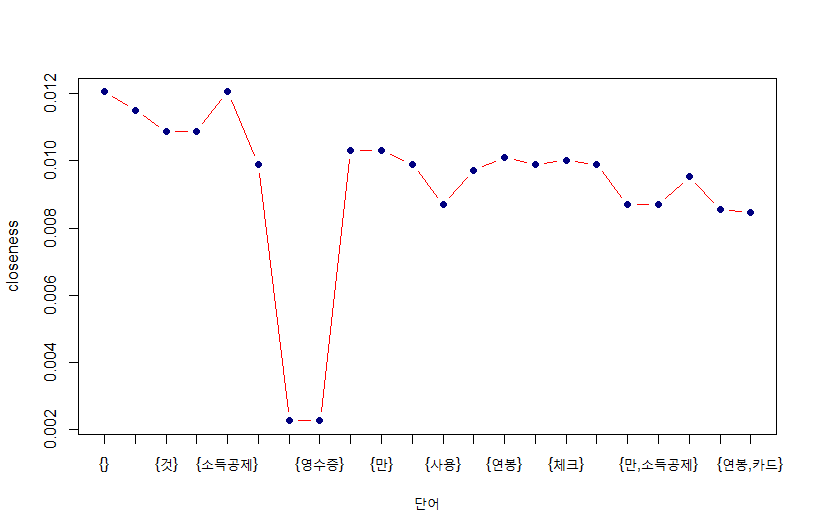

텍스트 마이닝 분석 이후 연관분석 까지 실시해서 분석 해본다.

### 1. 필요라이브러리

```{r}
> library(KoNLP)
> library(arules)
> library(igraph)
> library(combinat)
```


### 2. 데이터 읽기
```{r}
> f <- file("tax.txt", encoding="UTF-8")
> fl <- readLines(f)
> close(f)
> head(fl, 10)
```

-> 국문으로 된 소득공제 관련 예제문구 [파일첨부](../../images/2022-03-25-txtMining-ex2/tax.txt)


### 3. 중복성 제거 및 명사추출
```{r}
# Map(.f, .x ) .x에 대해 특정함수 .f를 적용하여 결과를 리스트에 출력해준다(lapply() 함수와 유사한 성격)
> tran <- Map(extractNoun, fl)

# 중복은 제거 , a1,a2,a3 예서 a1,a2 기준으로만 unique처리 unique(a1a2a3,[,c("a1","a2")])
> tran <- unique(tran)
> tran <- sapply(tran, unique)
> tran <- sapply(tran, function(x) {Filter(function(y) {nchar(y) <= 4 && nchar(y) && is.hangul(y)},x)} )
> tran <- Filter(function(x){length(x) >= 2}, tran)
```

### 4. 연관성분석을 위한 Data의 itl(Transaction) 형으로 변경함

```{r}
# paste (..., sep = " ", collapse = NULL) 문자열을 합치는 함수 paste( 1,2,3,4) => [1] "1 2 3 4"
# tran의 필드이름을 Tr1, Tr2 ... 형식으로 변형함
> names(tran) <- paste("Tr", 1:length(tran), sep="")
> names(tran)  # inspect(wordtran)

# tran 데이터를 연관성 분석이 가능한 transactions 데이터로 변형시킴
> wordtran <- as(tran, "transactions")
> wordtran

> wordtab <- crossTable(wordtran)
> wordtab
```


### 5. 연관성분석 진행
```{r}
> ares <- apriori(wordtran, parameter=list(supp=0.07, conf=0.05))
# supply, confidence 확인하기
> inspect(ares)
```


### 6. 연관그래프 진행
* 단어간의 연관그래프
  
```{r}
> rules <- labels(ares, ruleSep=" ")
> rules <- sapply(rules, strsplit, " ", USE.NAMES=F)
> rulemat <- do.call("rbind", rules)
> ruleg <- graph.edgelist(rulemat[-c(1:16),],directed=F)

> plot.igraph(ruleg, vertex.label=V(ruleg)$name,
            vertex.label.cex=0.5, vertex.size=20,
            layout=layout.fruchterman.reingold.grid)

```

<center></center>


* 단어의 친밀도 그래프
```{r}
> closen <- closeness(ruleg)
> plot(closen, col="red",xaxt="n", lty="solid", type="b", xlab="단어", ylab="closeness")
> axis(1, seq(1, length(closen)), V(ruleg)$name, cex=5)
```

<center></center>