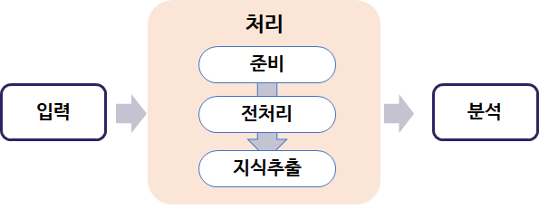

### 개념
* 인간의 언어로 이루어진 비정형 텍스트 데이터들을 자연어 처리(Natural Language Processing)방식을 이용하여 대규모 문서에서 정보 추출, 연계성 파악, 분류 및 군집화, 요약 등을 통해 데이터에 숨겨진 의미를 발견하는 기법

    > ※ [참고] 비정형 데이터분석 : 미리 정의된 모델(구조)을 가지고 있지 않는 데이터로 불규칙 정도에 따라 반정형(html 문서 등) 데이터로 구분된다.
    > 주요분야로는 텍스트마이닝, 웹마이닝, 오피니언마이닝, 소셜마이닝 등이 있다

### 텍스트 마이닝 관련 사용기법
* 정보 검색 기법(information retrieval)
* 자연어 처리(natural language processing) 기법

  -> 의사소통언어처리기법, 구어처리기법
* 특징 추출(feature selection) 기법
* 텍스트 범주화(text categorization) 기법
* 군집화(Clustering) 기법
* 연결분석(text link analysis) 등의 기법

### 텍스트 마이닝 방법
* Eliminate commonly used words (불필요한 단어 제거)
* Replace words with their stems or roots(stemming algorithms, 단어를 어근으로 대체)
* Consider synonyms and phrases ( 동의어 및 구문  고려 )
* Calculate the weights of the remaining terms ( 남은  단어에 대핸  가중치 계산 )
  
  
### 텍스트 마이닝 과정

※ 전처리 : 전과정의  70~80% 정도 차지, 비정형데이터를 정형화된 표현 양식으로 만듦

### 기타 분석 기법

* 웹마이닝
  * 인터넷을 통해 웹 서비스를 이용하면서 웹의 패턴을 발견하는 것
  * 데이터, 정보, 지식을 마이닝하고 추출하는 **웹 콘텐츠(Web content)마이닝** 과 웹사이트의 노드와 연결구조를 분석하는 **웹 사용(Web usage) 마이닝** , 그 외 **웹 구조(Web structure) 마이닝** 등이 있다.
  * 주로 응용 분야는 Cross marketing, 감성캠페인 평가, Target 광고, 소비자 행동 예측 등

* 오피니언 마이닝
  * 어떤 사안이나 인물, 이슈, 이벤트 등과 관련 원천데이터에서 평가,태도,감정 등과 같은 주관적인 정보를 식별 추출 하는것
  * 주로 평판, 정서분석을 말하며 긍정,부정,중립 등 텍스트의 특성을 분류하게 된다.
  * 주로 응용 분야는 상품평 데이터에 순위 결정, 영화 후기에 대한 요약 및 평가, 오피니언들을 조기감지 등에 응용된다.
