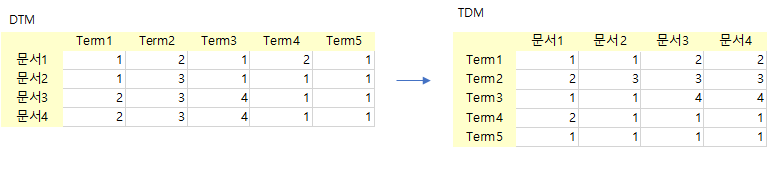
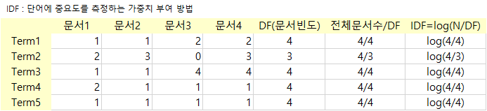
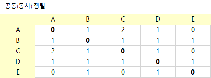

텍스트 문서를 컴퓨터가 인식할 수 있는 다양한 방법에 대해서 알아 보기로 함

### 원-핫 인코딩(one-hot encoding)
* 행에서 n번째 단어가 무엇인지 알려 주는 것으로 하나의 행은 해당열이 1이고  나머지는 0으로 구성됨
* 단어가 많아지는 경우 matrix가 너무 커져서 비효율화 됨 -> 이에 대안으로 빈도정보, 의미정보를 활용
* 예제) {james, hellow, james}
<table>
  <thead>
    <th></th><th>james</th><th>hellow</th>
  </thead>
  <tbody>
    <tr><th>james</th><td>1</td><td>0</td></tr>
    <tr><th>hellow</th><td>0</td><td>1</td></tr>
    <tr><th>james</th><td>1</td><td>0</td></tr>    
  </tbody>  
</table>
* one-hot vector 파이썬 구현 
<pre>
  import numpy as np
  sentence = "Apple Inc. is an American multinational technology company that specializes in consumer electronics"
  sentence.split()

  # 토큰화
  token_sequence = str.split(sentence) 

  # 토큰에거 중복단어 제거 및 정렬
  vocab = sorted(set(token_sequence))

  # 영행렬 생성
  onehot_vectors = np.zeros((len(token_sequence), len(vocab) ), int) 

  # 카운트
  for i, word in enumerate(token_sequence):
      onehot_vectors[i, vocab.index(word)] = 1
  onehot_vectors

  # data frame 변환
  import pandas as pd
  df=pd.DataFrame(onehot_vectors, columns=vocab)
  df
</pre>

### 빈도 벡터 함수 (bag of words)
* 문장에서 단어와 순서 문법을 무시하고 단어빈도(모음)으로만 문장의미를 파악
* 원-핫벡터와 달리 출현 횟수만 있기 때문 문서 재생은 어려움
* 예를 들어 환율 주가 단어가 많이 출현하면 경제학 관련, 등 으로 분류 하는 방법
* 기본적으로 이진 단어 모음 벡터가 있음
* 이진 단어 모음벡터 만들기
<pre>
  corpus = "Apple Inc. is an American multinational technology company that specializes in consumer electronics, software and online services headquartered in Cupertino, California, United States. Apple is the largest technology company by revenue (totaling US$365.8 billion in 2021) and as of June 2022, it is the world's biggest company by market capitalization, the fourth-largest personal computer vendor by unit sales and second-largest mobile phone manufacturer. It is one of the Big Five American information technology companies, alongside Alphabet, Amazon, Meta, and Microsoft"
  corpus_bow = {}
  for token in corpus.split():
      corpus_bow[token] = 1
  sorted(corpus_bow.items())

  # 각 단어에 숫자 1 할당하고 데이터프레임 형태로 만들기 (T는 transpose)
  import pandas as pd
  df = pd.DataFrame(pd.Series(dict([(token, 1) for token in corpus.split()])), columns=['corpus1']).T
  df
</pre>
* bag of words 만들기
<pre>
  # (1) 문장 안의 단어 추출
  from nltk.tokenize import TreebankWordTokenizer
  corpus = "Apple Inc. is an American multinational technology company that specializes in consumer electronics, software and online services headquartered in Cupertino, California, United States. Apple is the largest technology company by revenue (totaling US$365.8 billion in 2021) and as of June 2022, it is the world's biggest company by market capitalization, the fourth-largest personal computer vendor by unit sales and second-largest mobile phone manufacturer. It is one of the Big Five American information technology companies, alongside Alphabet, Amazon, Meta, and Microsoft"
  tokenizer = TreebankWordTokenizer()
  tokenize = tokenizer.tokenize
  tokens = tokenize(corpus.lower())

  # (2) 문장 안의 단어 수 세기
  from collections import Counter
  bow = Counter(tokens)

  print(bow)
</pre>

* CountVectorizer 클래스로 bag of words 만들기
<pre>
  from sklearn.feature_extraction.text import CountVectorizer

  corpus = ["Apple Inc. is an American multinational technology company that specializes in consumer electronics, software and online services headquartered in Cupertino, California, United States. Apple is the largest technology company by revenue (totaling US$365.8 billion in 2021) and as of June 2022, it is the world's biggest company by market capitalization, the fourth-largest personal computer vendor by unit sales and second-largest mobile phone manufacturer. It is one of the Big Five American information technology companies, alongside Alphabet, Amazon, Meta, and Microsoft"]
  vector = CountVectorizer()

  # 빈도수 출력
  print('bag of words vector :', vector.fit_transform(corpus).toarray()) 

  # 인텍스 출력
  print('vocabulary :',vector.vocabulary_)
</pre>

* 불용어 제거 bag of words 만들기
<pre>
  from sklearn.feature_extraction.text import CountVectorizer

  corpus = ["Apple Inc. is an American multinational technology company that specializes in consumer electronics, software and online services headquartered in Cupertino, California, United States. Apple is the largest technology company by revenue (totaling US$365.8 billion in 2021) and as of June 2022, it is the world's biggest company by market capitalization, the fourth-largest personal computer vendor by unit sales and second-largest mobile phone manufacturer. It is one of the Big Five American information technology companies, alongside Alphabet, Amazon, Meta, and Microsoft"]
  vector = CountVectorizer(stop_words=["the", "a", "an", "is", "not"])

  # 빈도수 출력
  print('bag of words vector :', vector.fit_transform(corpus).toarray()) 

  # 인텍스 출력
  print('vocabulary :',vector.vocabulary_)
</pre>

### 빈도정보를 활용
#### DTM, TDM Matrix (DTM을 transepose하면 TDM)
* 문서에 단의 빈도를 Matrix로 표현하여 독립변수로 활용하게 됨.
 
  

  * 사이킷런 CountVectorizer을 이용한 DTM
<pre>
  from sklearn.feature_extraction.text import CountVectorizer
  corpus = [
  'you know I want your love',
  'I like you'
  ]
  vector = CountVectorizer()

  # DTM Matrix
  print(vector.fit_transform(corpus).toarray()) 

  # 각 단어의 인덱스가 어떻게 부여되었는지를 보여준다.
  print(vector.vocabulary_) 

  # data frame 변환 해서 확인
  import pandas as pd
  df=pd.DataFrame(vector.fit_transform(corpus).toarray(), columns=sorted( vector.vocabulary_.keys()))
  df
</pre>

#### TF-IDF 변환
* <b>문서에 자주 나타나지만 의미에 도움이 않는 경우 낮은 가중치를 부여 하기 위함</b>
* DF가 낮을 수록 중요도는 증가
* IDF 가 클수록 중요도 증가
* TF-IDF : (TF-IDF)(t, d)=TF(t, d) x IDF(t)  - 빈도 와 IDF 가중치의 곱

* TF-IDF의 경우 길이가 긴 문서일 수록 출현빈도가 높기 때문에 이에 대한 보완으로 표준화 또는 정규화를 적용함
* TF-IDF 단점은 비슷한 의미라도 TF-IDF 벡터 공간에서 가깝지 않을 수 있음 ( 즉 의미에 대한 정보가 반영되기 어려움)

* 사이킷런 TfidfVectorizer을 이용한 TD-IDF
<pre>
  from sklearn.feature_extraction.text import TfidfVectorizer
  corpus = [
  'you know I want your love',
  'I like you'
  ]
  tfidfv = TfidfVectorizer().fit(corpus)
  print(tfidfv.transform(corpus).toarray())
  print(tfidfv.vocabulary_)
</pre>

#### 공동(동시, co-occurrence) 출현 행렬
* 특정 문맥에서 단어들이 동시에 등장하는 횟수를 세는방법
* 소셜 네트워크 분석시 활용 가능
* 예) doc1 : A,B,C / doc2: A,D,C / doc3: B,D,E 
